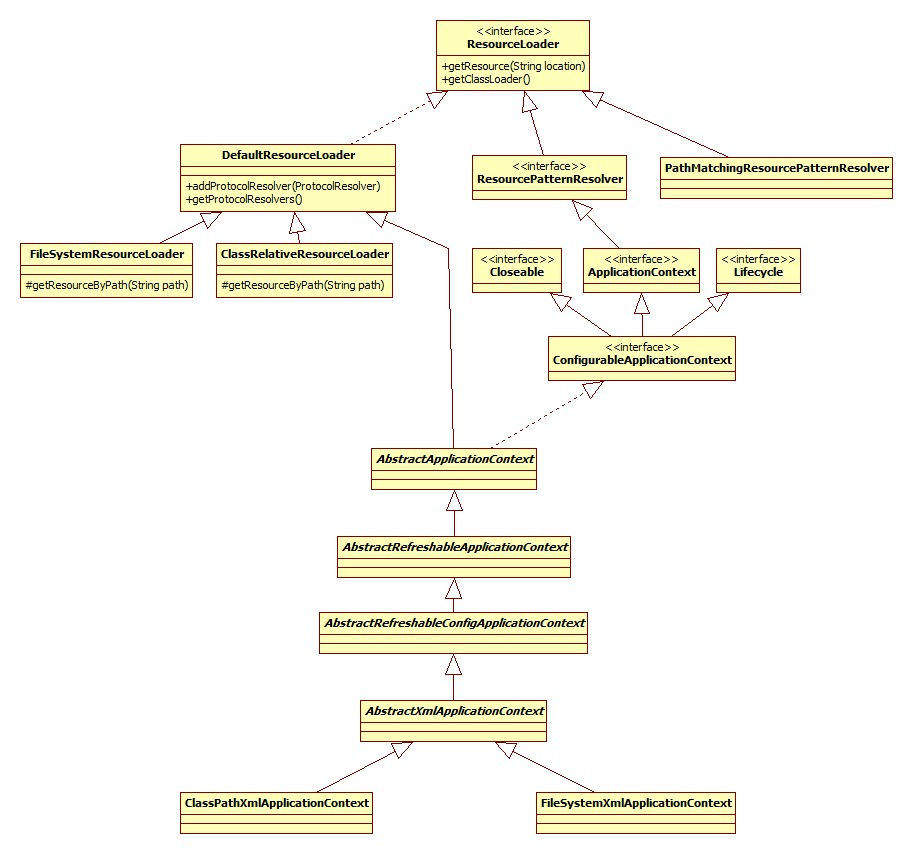
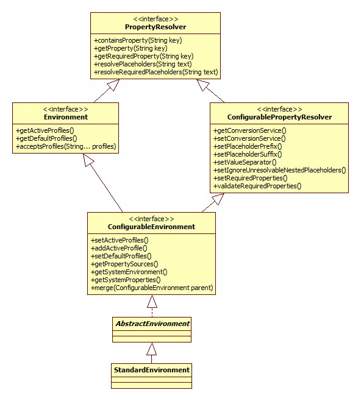
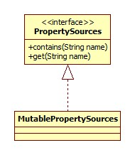
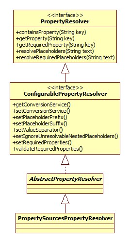

# 基本

本部分从最基本的Spring开始。配置文件:

```xml
<?xml version="1.0" encoding="UTF-8"?>    
<beans>    
  	<bean class="base.SimpleBean"></bean>
</beans>
```

启动代码:

```java
public static void main(String[] args) {
	ClassPathXmlApplicationContext context = new ClassPathXmlApplicationContext("config.xml");
	SimpleBean bean = context.getBean(SimpleBean.class);
	bean.send();
	context.close();
}
```

SimpleBean:

```java
public class SimpleBean {
	public void send() {
		System.out.println("I am send method from SimpleBean!");
	}
}
```

## ClassPathXmlApplicationContext

整个继承体系如下:



ResourceLoader代表了**加载资源的一种方式，正是策略模式的实现**。

构造器源码:

```java
public ClassPathXmlApplicationContext(String[] configLocations, boolean refresh, ApplicationContext 	         parent) {
  	//null
	super(parent);
	setConfigLocations(configLocations);
  	//默认true
	if (refresh) {
		refresh();
	}
}
```

### 构造器

首先看父类构造器，沿着继承体系一直向上调用，直到AbstractApplicationContext:

```java
public AbstractApplicationContext(ApplicationContext parent) {
	this();
	setParent(parent);
}
public AbstractApplicationContext() {
	this.resourcePatternResolver = getResourcePatternResolver();
}
```

getResourcePatternResolver:

```java
protected ResourcePatternResolver getResourcePatternResolver() {
	return new PathMatchingResourcePatternResolver(this);
}
```

PathMatchingResourcePatternResolver支持Ant风格的路径解析。

### 设置配置文件路径

即AbstractRefreshableConfigApplicationContext.setConfigLocations:

```java
public void setConfigLocations(String... locations) {
	if (locations != null) {
		Assert.noNullElements(locations, "Config locations must not be null");
		this.configLocations = new String[locations.length];
		for (int i = 0; i < locations.length; i++) {
			this.configLocations[i] = resolvePath(locations[i]).trim();
		}
	} else {
		this.configLocations = null;
	}
}
```

resolvePath:

```java
protected String resolvePath(String path) {
	return getEnvironment().resolveRequiredPlaceholders(path);
}
```

此方法的目的在于将占位符(placeholder)解析成实际的地址。比如可以这么写: `new ClassPathXmlApplicationContext("classpath:config.xml");`那么classpath:就是需要被解析的。

getEnvironment方法来自于ConfigurableApplicationContext接口，源码很简单，如果为空就调用createEnvironment创建一个。AbstractApplicationContext.createEnvironment:

```java
protected ConfigurableEnvironment createEnvironment() {
	return new StandardEnvironment();
}
```

#### Environment接口

继承体系:



Environmen接口**代表了当前应用所处的环境。**从此接口的方法可以看出，其主要和profile、Property相关。

##### Profile

Spring Profile特性是从3.1开始的，其主要是为了解决这样一种问题: 线上环境和测试环境使用不同的配置或是数据库或是其它。有了Profile便可以在 不同环境之间无缝切换。**Spring容器管理的所有bean都是和一个profile绑定在一起的。**使用了Profile的配置文件示例:

```xml
<beans profile="develop">  
	<context:property-placeholder location="classpath*:jdbc-develop.properties"/>  
</beans>  
<beans profile="production">  
	<context:property-placeholder location="classpath*:jdbc-production.properties"/>  
</beans>  
<beans profile="test">  
	<context:property-placeholder location="classpath*:jdbc-test.properties"/>  
</beans>
```

在启动代码中可以用如下代码设置活跃(当前使用的)Profile:

```java
context.getEnvironment().setActiveProfiles("dev");
```

当然使用的方式还有很多(比如注解)，参考:

[spring3.1 profile 配置不同的环境](http://radiumxie.iteye.com/blog/1851919)

[Spring Profiles example](http://www.mkyong.com/spring/spring-profiles-example/)

##### Property

这里的Property指的是程序运行时的一些参数，引用注释:

> > properties files, JVM system properties, system environment variables, JNDI, servlet context parameters, ad-hoc Properties objects,Maps, and so on.

#### Environment构造器

```java
private final MutablePropertySources propertySources = new MutablePropertySources(this.logger);
public AbstractEnvironment() {
	customizePropertySources(this.propertySources);
}
```

#####  PropertySources接口

继承体系:



此接口实际上是PropertySource的容器，默认的MutablePropertySources实现内部含有一个CopyOnWriteArrayList作为存储载体。

StandardEnvironment.customizePropertySources:

```java
@Override
protected void customizePropertySources(MutablePropertySources propertySources) {
	propertySources.addLast(new MapPropertySource
		(SYSTEM_PROPERTIES_PROPERTY_SOURCE_NAME, getSystemProperties()));
	propertySources.addLast(new SystemEnvironmentPropertySource
		(SYSTEM_ENVIRONMENT_PROPERTY_SOURCE_NAME, getSystemEnvironment()));
}
```

##### PropertySource接口

PropertySource接口代表了键值对的Property来源。继承体系：


#### 路径解析

AbstractEnvironment.resolveRequiredPlaceholders:

```java
@Override
public String resolveRequiredPlaceholders(String text) throws IllegalArgumentException {
  	//text即配置文件路径，比如classpath:config.xml
	return this.propertyResolver.resolveRequiredPlaceholders(text);
}
```

propertyResolver是一个PropertySourcesPropertyResolver对象:

```java
private final ConfigurablePropertyResolver propertyResolver =
			new PropertySourcesPropertyResolver(this.propertySources);
```

PropertyResolver继承体系(排除Environment分支):



