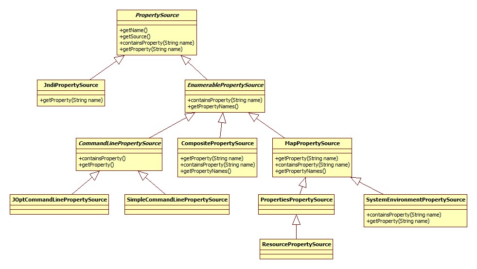
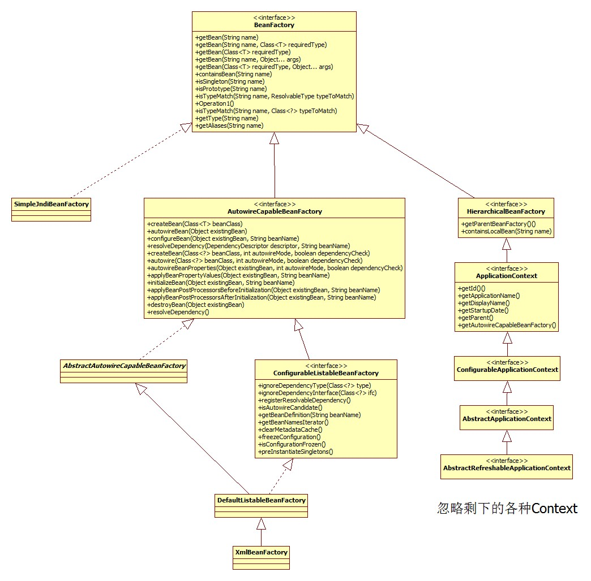
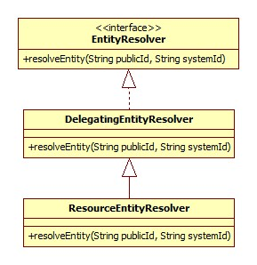
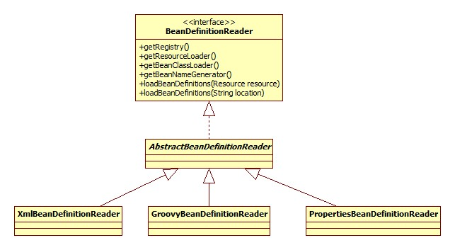

# 基本

本部分从最基本的Spring开始。配置文件:

```xml
<?xml version="1.0" encoding="UTF-8"?>    
<beans>    
  	<bean class="base.SimpleBean"></bean>
</beans>
```

启动代码:

```java
public static void main(String[] args) {
	ClassPathXmlApplicationContext context = new ClassPathXmlApplicationContext("config.xml");
	SimpleBean bean = context.getBean(SimpleBean.class);
	bean.send();
	context.close();
}
```

SimpleBean:

```java
public class SimpleBean {
	public void send() {
		System.out.println("I am send method from SimpleBean!");
	}
}
```

## ClassPathXmlApplicationContext

整个继承体系如下:


ResourceLoader代表了**加载资源的一种方式，正是策略模式的实现**。

构造器源码:

```java
public ClassPathXmlApplicationContext(String[] configLocations, boolean refresh, ApplicationContext 	         parent) {
  	//null
	super(parent);
	setConfigLocations(configLocations);
  	//默认true
	if (refresh) {
		refresh();
	}
}
```

### 构造器

首先看父类构造器，沿着继承体系一直向上调用，直到AbstractApplicationContext:

```java
public AbstractApplicationContext(ApplicationContext parent) {
	this();
	setParent(parent);
}
public AbstractApplicationContext() {
	this.resourcePatternResolver = getResourcePatternResolver();
}
```

getResourcePatternResolver:

```java
protected ResourcePatternResolver getResourcePatternResolver() {
	return new PathMatchingResourcePatternResolver(this);
}
```

PathMatchingResourcePatternResolver支持Ant风格的路径解析。

### 设置配置文件路径

即AbstractRefreshableConfigApplicationContext.setConfigLocations:

```java
public void setConfigLocations(String... locations) {
	if (locations != null) {
		Assert.noNullElements(locations, "Config locations must not be null");
		this.configLocations = new String[locations.length];
		for (int i = 0; i < locations.length; i++) {
			this.configLocations[i] = resolvePath(locations[i]).trim();
		}
	} else {
		this.configLocations = null;
	}
}
```

resolvePath:

```java
protected String resolvePath(String path) {
	return getEnvironment().resolveRequiredPlaceholders(path);
}
```

此方法的目的在于将占位符(placeholder)解析成实际的地址。比如可以这么写: `new ClassPathXmlApplicationContext("classpath:config.xml");`那么classpath:就是需要被解析的。

getEnvironment方法来自于ConfigurableApplicationContext接口，源码很简单，如果为空就调用createEnvironment创建一个。AbstractApplicationContext.createEnvironment:

```java
protected ConfigurableEnvironment createEnvironment() {
	return new StandardEnvironment();
}
```

#### Environment接口

继承体系:


Environmen接口**代表了当前应用所处的环境。**从此接口的方法可以看出，其主要和profile、Property相关。

##### Profile

Spring Profile特性是从3.1开始的，其主要是为了解决这样一种问题: 线上环境和测试环境使用不同的配置或是数据库或是其它。有了Profile便可以在 不同环境之间无缝切换。**Spring容器管理的所有bean都是和一个profile绑定在一起的。**使用了Profile的配置文件示例:

```xml
<beans profile="develop">  
	<context:property-placeholder location="classpath*:jdbc-develop.properties"/>  
</beans>  
<beans profile="production">  
	<context:property-placeholder location="classpath*:jdbc-production.properties"/>  
</beans>  
<beans profile="test">  
	<context:property-placeholder location="classpath*:jdbc-test.properties"/>  
</beans>
```

在启动代码中可以用如下代码设置活跃(当前使用的)Profile:

```java
context.getEnvironment().setActiveProfiles("dev");
```

当然使用的方式还有很多(比如注解)，参考:

[spring3.1 profile 配置不同的环境](http://radiumxie.iteye.com/blog/1851919)

[Spring Profiles example](http://www.mkyong.com/spring/spring-profiles-example/)

##### Property

这里的Property指的是程序运行时的一些参数，引用注释:

> > properties files, JVM system properties, system environment variables, JNDI, servlet context parameters, ad-hoc Properties objects,Maps, and so on.

#### Environment构造器

```java
private final MutablePropertySources propertySources = new MutablePropertySources(this.logger);
public AbstractEnvironment() {
	customizePropertySources(this.propertySources);
}
```

#####  PropertySources接口

继承体系:


此接口实际上是PropertySource的容器，默认的MutablePropertySources实现内部含有一个CopyOnWriteArrayList作为存储载体。

StandardEnvironment.customizePropertySources:

```java
/** System environment property source name: {@value} */
public static final String SYSTEM_ENVIRONMENT_PROPERTY_SOURCE_NAME = "systemEnvironment";
/** JVM system properties property source name: {@value} */
public static final String SYSTEM_PROPERTIES_PROPERTY_SOURCE_NAME = "systemProperties";
@Override
protected void customizePropertySources(MutablePropertySources propertySources) {
	propertySources.addLast(new MapPropertySource
		(SYSTEM_PROPERTIES_PROPERTY_SOURCE_NAME, getSystemProperties()));
	propertySources.addLast(new SystemEnvironmentPropertySource
		(SYSTEM_ENVIRONMENT_PROPERTY_SOURCE_NAME, getSystemEnvironment()));
}
```

##### PropertySource接口

PropertySource接口代表了键值对的Property来源。继承体系：



AbstractEnvironment.getSystemProperties:

```java
@Override
public Map<String, Object> getSystemProperties() {
	try {
		return (Map) System.getProperties();
	}
	catch (AccessControlException ex) {
		return (Map) new ReadOnlySystemAttributesMap() {
			@Override
			protected String getSystemAttribute(String attributeName) {
				try {
					return System.getProperty(attributeName);
				}
				catch (AccessControlException ex) {
					if (logger.isInfoEnabled()) {
						logger.info(format("Caught AccessControlException when accessing system " +
								"property [%s]; its value will be returned [null]. Reason: %s",
								attributeName, ex.getMessage()));
					}
					return null;
				}
			}
		};
	}
}
```

这里的实现很有意思，如果安全管理器阻止获取全部的系统属性，那么会尝试获取单个属性的可能性，如果还不行就抛异常了。

getSystemEnvironment方法也是一个套路，不过最终调用的是System.getenv，可以获取jvm和OS的一些版本信息。

#### 路径解析

AbstractEnvironment.resolveRequiredPlaceholders:

```java
@Override
public String resolveRequiredPlaceholders(String text) throws IllegalArgumentException {
  	//text即配置文件路径，比如classpath:config.xml
	return this.propertyResolver.resolveRequiredPlaceholders(text);
}
```

propertyResolver是一个PropertySourcesPropertyResolver对象:

```java
private final ConfigurablePropertyResolver propertyResolver =
			new PropertySourcesPropertyResolver(this.propertySources);
```

##### PropertyResolver接口

PropertyResolver继承体系(排除Environment分支):


此接口正是用来解析PropertyResource。

##### 解析

AbstractPropertyResolver.resolveRequiredPlaceholders:

```java
@Override
public String resolveRequiredPlaceholders(String text) throws IllegalArgumentException {
	if (this.strictHelper == null) {
		this.strictHelper = createPlaceholderHelper(false);
	}
	return doResolvePlaceholders(text, this.strictHelper);
}
```

```java
private PropertyPlaceholderHelper createPlaceholderHelper(boolean ignoreUnresolvablePlaceholders) {
  	//三个参数分别是${, }, :
	return new PropertyPlaceholderHelper(this.placeholderPrefix, this.placeholderSuffix,
		this.valueSeparator, ignoreUnresolvablePlaceholders);
}
```

doResolvePlaceholders：

```java
private String doResolvePlaceholders(String text, PropertyPlaceholderHelper helper) {
  	//PlaceholderResolver接口依然是策略模式的体现
	return helper.replacePlaceholders(text, new PropertyPlaceholderHelper.PlaceholderResolver() {
		@Override
		public String resolvePlaceholder(String placeholderName) {
			return getPropertyAsRawString(placeholderName);
		}
	});
}
```

其实代码执行到这里的时候还没有进行xml配置文件的解析，那么这里的解析placeHolder是什么意思呢，原因在于可以这么写:

```java
System.setProperty("spring", "classpath");
ClassPathXmlApplicationContext context = new ClassPathXmlApplicationContext("${spring}:config.xml");
SimpleBean bean = context.getBean(SimpleBean.class);
```

这样就可以正确解析。placeholder的替换其实就是字符串操作，这里只说一下正确的属性是怎么来的。实现的关键在于PropertySourcesPropertyResolver.getProperty:

```java
@Override
protected String getPropertyAsRawString(String key) {
	return getProperty(key, String.class, false);
}
protected <T> T getProperty(String key, Class<T> targetValueType, boolean resolveNestedPlaceholders) {
	if (this.propertySources != null) {
		for (PropertySource<?> propertySource : this.propertySources) {
			Object value = propertySource.getProperty(key);
			return value;
		}
	}
	return null;
}
```

很明显了，就是从System.getProperty和System.getenv获取，但是由于环境变量是无法自定义的，所以其实此处只能通过System.setProperty指定。

注意，classpath:XXX这种写法的classpath前缀到目前为止还没有被处理。

## refresh

Spring bean解析就在此方法，所以单独提出来。

AbstractApplicationContext.refresh:

```java
@Override
public void refresh() throws BeansException, IllegalStateException {
	synchronized (this.startupShutdownMonitor) {
		// Prepare this context for refreshing.
		prepareRefresh();
		// Tell the subclass to refresh the internal bean factory.
		ConfigurableListableBeanFactory beanFactory = obtainFreshBeanFactory();
		// Prepare the bean factory for use in this context.
		prepareBeanFactory(beanFactory);
		try {
			// Allows post-processing of the bean factory in context subclasses.
			postProcessBeanFactory(beanFactory);
			// Invoke factory processors registered as beans in the context.
			invokeBeanFactoryPostProcessors(beanFactory);
			// Register bean processors that intercept bean creation.
			registerBeanPostProcessors(beanFactory);
			// Initialize message source for this context.
			initMessageSource();
			// Initialize event multicaster for this context.
			initApplicationEventMulticaster();
			// Initialize other special beans in specific context subclasses.
			onRefresh();
			// Check for listener beans and register them.
			registerListeners();
			// Instantiate all remaining (non-lazy-init) singletons.
			finishBeanFactoryInitialization(beanFactory);
			// Last step: publish corresponding event.
			finishRefresh();
		} catch (BeansException ex) {
			// Destroy already created singletons to avoid dangling resources.
			destroyBeans();
			// Reset 'active' flag.
			cancelRefresh(ex);
			// Propagate exception to caller.
			throw ex;
		} finally {
			// Reset common introspection caches in Spring's core, since we
			// might not ever need metadata for singleton beans anymore...
			resetCommonCaches();
		}
	}
}
```

### prepareRefresh

```java
protected void prepareRefresh() {
	this.startupDate = System.currentTimeMillis();
	this.closed.set(false);
	this.active.set(true);
	// Initialize any placeholder property sources in the context environment
  	//空实现
	initPropertySources();
	// Validate that all properties marked as required are resolvable
	// see ConfigurablePropertyResolver#setRequiredProperties
	getEnvironment().validateRequiredProperties();
	// Allow for the collection of early ApplicationEvents,
	// to be published once the multicaster is available...
	this.earlyApplicationEvents = new LinkedHashSet<ApplicationEvent>();
}
```

#### 属性校验

AbstractEnvironment.validateRequiredProperties:

```java
@Override
public void validateRequiredProperties() throws MissingRequiredPropertiesException {
	this.propertyResolver.validateRequiredProperties();
}
```

AbstractPropertyResolver.validateRequiredProperties:

```java
@Override
public void validateRequiredProperties() {
	MissingRequiredPropertiesException ex = new MissingRequiredPropertiesException();
	for (String key : this.requiredProperties) {
		if (this.getProperty(key) == null) {
			ex.addMissingRequiredProperty(key);
		}
	}
	if (!ex.getMissingRequiredProperties().isEmpty()) {
		throw ex;
	}
}
```

requiredProperties是通过setRequiredProperties方法设置的，保存在一个list里面，默认是空的，也就是不需要校验任何属性。

### BeanFactory创建

AbstractRefreshableApplicationContext.refreshBeanFactory:

```java
@Override
protected final void refreshBeanFactory() throws BeansException {
  	//如果已经存在，那么销毁之前的
	if (hasBeanFactory()) {
		destroyBeans();
		closeBeanFactory();
	}
    //创建了一个DefaultListableBeanFactory对象
    DefaultListableBeanFactory beanFactory = createBeanFactory();
    beanFactory.setSerializationId(getId());
    customizeBeanFactory(beanFactory);
    loadBeanDefinitions(beanFactory);
    synchronized (this.beanFactoryMonitor) {
    	this.beanFactory = beanFactory;
    }
}
```

#### BeanFactory接口

此接口实际上就是Bean容器，其继承体系:



#### BeanFactory定制

AbstractRefreshableApplicationContext.customizeBeanFactory方法用于给子类提供一个自由配置的机会，默认实现:

```java
protected void customizeBeanFactory(DefaultListableBeanFactory beanFactory) {
	if (this.allowBeanDefinitionOverriding != null) {
      	//默认false，不允许覆盖
		beanFactory.setAllowBeanDefinitionOverriding(this.allowBeanDefinitionOverriding);
	}
	if (this.allowCircularReferences != null) {
      	//默认false，不允许循环引用
		beanFactory.setAllowCircularReferences(this.allowCircularReferences);
	}
}
```

#### Bean加载

AbstractXmlApplicationContext.loadBeanDefinitions，这个便是核心的bean加载了:

```java
@Override
protected void loadBeanDefinitions(DefaultListableBeanFactory beanFactory) {
	// Create a new XmlBeanDefinitionReader for the given BeanFactory.
	XmlBeanDefinitionReader beanDefinitionReader = new XmlBeanDefinitionReader(beanFactory);
	// Configure the bean definition reader with this context's
	// resource loading environment.
	beanDefinitionReader.setEnvironment(this.getEnvironment());
	beanDefinitionReader.setResourceLoader(this);
	beanDefinitionReader.setEntityResolver(new ResourceEntityResolver(this));
	// Allow a subclass to provide custom initialization of the reader,
	// then proceed with actually loading the bean definitions.
  	//默认空实现
	initBeanDefinitionReader(beanDefinitionReader);
	loadBeanDefinitions(beanDefinitionReader);
}
```

##### EntityResolver

此处只说明用到的部分继承体系:



EntityResolver接口在org.xml.sax中定义。DelegatingEntityResolver用于schema和dtd的解析。

##### BeanDefinitionReader

继承体系:




##### 加载

```java
protected void loadBeanDefinitions(XmlBeanDefinitionReader reader) {
	Resource[] configResources = getConfigResources();
	if (configResources != null) {
		reader.loadBeanDefinitions(configResources);
	}
	String[] configLocations = getConfigLocations();
  	//here
	if (configLocations != null) {
		reader.loadBeanDefinitions(configLocations);
	}
}
```

AbstractBeanDefinitionReader.loadBeanDefinitions:

```java
@Override
public int loadBeanDefinitions(String... locations) throws BeanDefinitionStoreException {
	Assert.notNull(locations, "Location array must not be null");
	int counter = 0;
	for (String location : locations) {
		counter += loadBeanDefinitions(location);
	}
	return counter;
}
```

之后调用:

```java
//第二个参数为空
public int loadBeanDefinitions(String location, Set<Resource> actualResources) {
	ResourceLoader resourceLoader = getResourceLoader();
  	//参见ResourceLoader类图，ClassPathXmlApplicationContext实现了此接口
	if (resourceLoader instanceof ResourcePatternResolver) {
		// Resource pattern matching available.
		try {
			Resource[] resources = ((ResourcePatternResolver) resourceLoader).getResources(location);
			int loadCount = loadBeanDefinitions(resources);
			if (actualResources != null) {
				for (Resource resource : resources) {
					actualResources.add(resource);
				}
			}
			return loadCount;
		}
		catch (IOException ex) {
			throw new BeanDefinitionStoreException(
					"Could not resolve bean definition resource pattern [" + location + "]", ex);
		}
	}
	else {
		// Can only load single resources by absolute URL.
		Resource resource = resourceLoader.getResource(location);
		int loadCount = loadBeanDefinitions(resource);
		if (actualResources != null) {
			actualResources.add(resource);
		}
		return loadCount;
	}
}
```

getResource的实现在AbstractApplicationContext：

```java
@Override
public Resource[] getResources(String locationPattern) throws IOException {
  	//构造器中初始化，PathMatchingResourcePatternResolver对象
	return this.resourcePatternResolver.getResources(locationPattern);
}
```

PathMatchingResourcePatternResolver是ResourceLoader继承体系的一部分。

```java
@Override
public Resource[] getResources(String locationPattern) throws IOException {
	Assert.notNull(locationPattern, "Location pattern must not be null");
  	//classpath:
	if (locationPattern.startsWith(CLASSPATH_ALL_URL_PREFIX)) {
		// a class path resource (multiple resources for same name possible)
		if (getPathMatcher().isPattern(locationPattern
			.substring(CLASSPATH_ALL_URL_PREFIX.length()))) {
			// a class path resource pattern
			return findPathMatchingResources(locationPattern);
		} else {
			// all class path resources with the given name
			return findAllClassPathResources(locationPattern
				.substring(CLASSPATH_ALL_URL_PREFIX.length()));
		}
	} else {
		// Only look for a pattern after a prefix here
		// (to not get fooled by a pattern symbol in a strange prefix).
		int prefixEnd = locationPattern.indexOf(":") + 1;
		if (getPathMatcher().isPattern(locationPattern.substring(prefixEnd))) {
			// a file pattern
			return findPathMatchingResources(locationPattern);
		}
		else {
			// a single resource with the given name
			return new Resource[] {getResourceLoader().getResource(locationPattern)};
		}
	}
}
```


