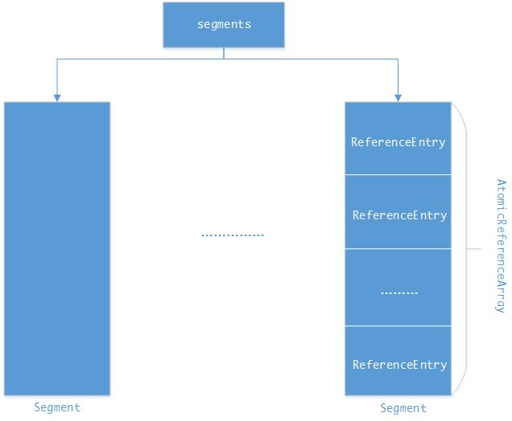
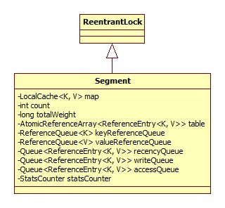
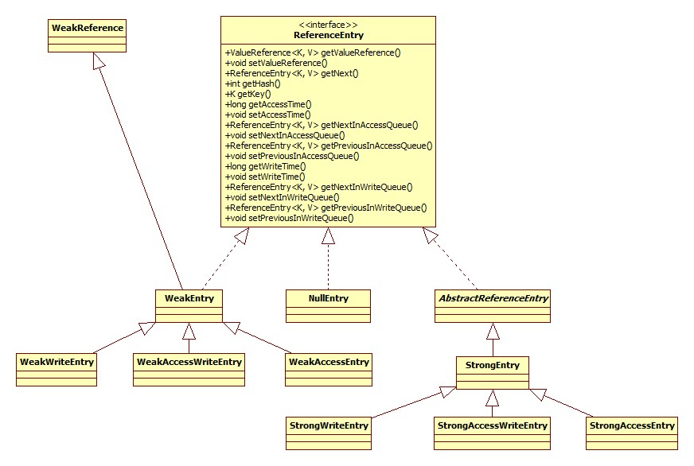
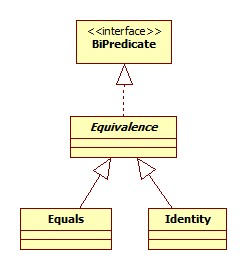
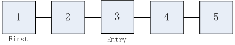
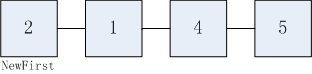

<!-- START doctoc generated TOC please keep comment here to allow auto update -->
<!-- DON'T EDIT THIS SECTION, INSTEAD RE-RUN doctoc TO UPDATE -->
**Table of Contents**  *generated with [DocToc](https://github.com/thlorenz/doctoc)*

- [创建](#%E5%88%9B%E5%BB%BA)
  - [数据结构](#%E6%95%B0%E6%8D%AE%E7%BB%93%E6%9E%84)
    - [segments](#segments)
    - [ReferenceEntry](#referenceentry)
  - [初始化](#%E5%88%9D%E5%A7%8B%E5%8C%96)
    - [ReferenceEntry数组](#referenceentry%E6%95%B0%E7%BB%84)
    - [引用队列](#%E5%BC%95%E7%94%A8%E9%98%9F%E5%88%97)
- [put](#put)
  - [Hash算法](#hash%E7%AE%97%E6%B3%95)
  - [ReHash](#rehash)
  - [Segment选取](#segment%E9%80%89%E5%8F%96)
  - [Segment.put](#segmentput)
    - [线程安全性](#%E7%BA%BF%E7%A8%8B%E5%AE%89%E5%85%A8%E6%80%A7)
    - [过期/垃圾缓存清理](#%E8%BF%87%E6%9C%9F%E5%9E%83%E5%9C%BE%E7%BC%93%E5%AD%98%E6%B8%85%E7%90%86)
      - [垃圾缓存](#%E5%9E%83%E5%9C%BE%E7%BC%93%E5%AD%98)
        - [善后](#%E5%96%84%E5%90%8E)
        - [writeQueue移除](#writequeue%E7%A7%BB%E9%99%A4)
        - [accessQueue移除](#accessqueue%E7%A7%BB%E9%99%A4)
        - [加载终止](#%E5%8A%A0%E8%BD%BD%E7%BB%88%E6%AD%A2)
        - [移除算法](#%E7%A7%BB%E9%99%A4%E7%AE%97%E6%B3%95)
      - [过期缓存](#%E8%BF%87%E6%9C%9F%E7%BC%93%E5%AD%98)
    - [扩容](#%E6%89%A9%E5%AE%B9)
    - [设值](#%E8%AE%BE%E5%80%BC)
- [get(key)](#getkey)
  - [get(key,hash,loader)](#getkeyhashloader)
- [参考](#%E5%8F%82%E8%80%83)
- [总结](#%E6%80%BB%E7%BB%93)

<!-- END doctoc generated TOC please keep comment here to allow auto update -->

# 创建

以CacheLoader的方式为例:

```java
LoadingCache<String, String> cache = CacheBuilder.newBuilder().maximumSize(2)
    .build(new CacheLoader<String, String>() {
        @Override
         public String load(String s) throws Exception {
            return "Hello: " + s;
        }
    });
```

创建的关键便在于build方法,build方法的核心逻辑位于LocalCache构造器，构造器完成了两件事:

- 将设置的属性从CacheBuilder复制到LocalCache。
- 构造缓存存储的数据结构，此数据结构可以理解为一个自己实现的ConcurrentHashMap(分段锁)。

数据结构的示意图:



## 数据结构

###  segments

Segment代表了其中的一段。其类图(部分):



此类继承ReentrantLock的目的在于方便的进行加锁操作。

那么Segment的个数是如何确定的呢?

**取最小的大于等于目的并行度的2的整次幂，如果设置了按权重大小的淘汰策略，那么还应注意总的权重值不超过给定的上限，每个Segment的权重按20计**。

相关源码:

```java
LocalCache(
      CacheBuilder<? super K, ? super V> builder, @Nullable CacheLoader<? super K, V> loader) {
    concurrencyLevel = Math.min(builder.getConcurrencyLevel(), MAX_SEGMENTS);
    int segmentCount = 1;
    while (segmentCount < concurrencyLevel && (!evictsBySize() || segmentCount * 20 <= maxWeight)) {
      ++segmentShift;
      segmentCount <<= 1;
    }
}
```

并行度即并发修改缓存值的线程数，可以通过CacheBuilder的concurrencyLevel方法进行设置，默认4.

### ReferenceEntry

ReferenceEntry是guava-cache中实际进行存储的数据结构，其类图:



那么在初始状态下，每个Segment中有多少个ReferenceEntry呢?

**取最小的大于等于(initialCapacity / segmentCount)的2的整次幂的值**。关键代码:

```java
LocalCache(
      CacheBuilder<? super K, ? super V> builder, @Nullable CacheLoader<? super K, V> loader) {
    int segmentCapacity = initialCapacity / segmentCount;
    if (segmentCapacity * segmentCount < initialCapacity) {
      ++segmentCapacity;
    }
    int segmentSize = 1;
    while (segmentSize < segmentCapacity) {
        segmentSize <<= 1;
    }
}
```

initialCapacity由CacheBuilder的同名方法进行设置，默认16.

## 初始化

关键代码:

```java
LocalCache(
      CacheBuilder<? super K, ? super V> builder, @Nullable CacheLoader<? super K, V> loader) {
    if (evictsBySize()) {
        // Ensure sum of segment max weights = overall max weights
        long maxSegmentWeight = maxWeight / segmentCount + 1;
        long remainder = maxWeight % segmentCount;
        for (int i = 0; i < this.segments.length; ++i) {
            if (i == remainder) {
                maxSegmentWeight--;
            }
            this.segments[i] =
                createSegment(segmentSize, maxSegmentWeight, builder.getStatsCounterSupplier().get());
        }
    } else {
        for (int i = 0; i < this.segments.length; ++i) {
         this.segments[i] =
            createSegment(segmentSize, UNSET_INT, builder.getStatsCounterSupplier().get());
        }
    }
}
```

可以看出，初始化根据是否启用了权重大小限制分为了两种情况，两种情况的区别在于maxSegmentWeight参数，用以指定此Segment的权重上限。

createSegment其实就是对Segment构造器的调用，此构造器主要做了两件事:

- 初始化ReferenceEntry数组数据结构。
- 初始化引用队列。

下面分开对其进行说明。

###  ReferenceEntry数组

关键代码:

```java
Segment(LocalCache<K, V> map, int initialCapacity, long maxSegmentWeight, StatsCounter statsCounter) {
     initTable(newEntryArray(initialCapacity));
}
```

newEntryArray方法只是创建了一个initialCapacity大小的数组，关键在于initTable:

```java
void initTable(AtomicReferenceArray<ReferenceEntry<K, V>> newTable) {
  this.threshold = newTable.length() * 3 / 4; // 0.75
  if (!map.customWeigher() && this.threshold == maxSegmentWeight) {
    // prevent spurious expansion before eviction
    this.threshold++;
  }
  this.table = newTable;
}
```

这里完成的是对临界值的设置，超过此值数据将进行扩张。

### 引用队列

关键代码:

```java
Segment(LocalCache<K, V> map, int initialCapacity, long maxSegmentWeight, StatsCounter statsCounter) {
    //当不是强引用的时候成立
    keyReferenceQueue = map.usesKeyReferences() ? new ReferenceQueue<K>() : null;
    valueReferenceQueue = map.usesValueReferences() ? new ReferenceQueue<V>() : null;
    recencyQueue =
        map.usesAccessQueue()
        ? new ConcurrentLinkedQueue<ReferenceEntry<K, V>>()
        : LocalCache.<ReferenceEntry<K, V>>discardingQueue();
    writeQueue =
        map.usesWriteQueue()
        ? new WriteQueue<K, V>()
        : LocalCache.<ReferenceEntry<K, V>>discardingQueue();
    accessQueue =
        map.usesAccessQueue()
        ? new AccessQueue<K, V>()
        : LocalCache.<ReferenceEntry<K, V>>discardingQueue();
}
```

keyReferenceQueue和valueReferenceQueue用于结合软引用、弱引用以及虚引用使用，关于java中四种引用的区别以及ReferenceQueue的用途，参考:

[Java对象的强、软、弱和虚引用原理+结合ReferenceQueue对象构造Java对象的高速缓存器](http://blog.csdn.net/lyfi01/article/details/6415726)

usesKeyReferences源码:

```java
boolean usesKeyReferences() {
    return keyStrength != Strength.STRONG;
}
```

keyStrength通过CacheBuilder.getKeyStrength获取:

```java
Strength getKeyStrength() {
    return MoreObjects.firstNonNull(keyStrength, Strength.STRONG);
}
```

可以看出，**默认采用强引用的方式**。我们可以通过CacheBuilder的softValues、weakKeys，weakValues方法对其进行设置。

recencyQueue等队列将在后面结合get方法进行说明。

# put

LocalCache.put:

```java
@Override
public V put(K key, V value) {
    checkNotNull(key);
    checkNotNull(value);
    int hash = hash(key);
    return segmentFor(hash).put(key, hash, value, false);
}
```

## Hash算法

LocalCache.hash:

```java
int hash(@Nullable Object key) {
    int h = keyEquivalence.hash(key);
    return rehash(h);
}
```

keyEquivalence是策略模式的体现，针对不同的引用方式(LocalCache.Strength)提供不同的hash算法实现。

Equivalence接口类图:



keyEquivalence属性由CacheBuilder的getKeyEquivalence方法获得:

```java
Equivalence<Object> getKeyEquivalence() {
    return MoreObjects.firstNonNull(keyEquivalence, getKeyStrength().defaultEquivalence());
}
```

可以看出，**使用的hash算法与Strength相关联**。Strength部分源码(仅展示defaultEquivalence方法):

```java
enum Strength {
    STRONG {
        @Override
        Equivalence<Object> defaultEquivalence() {
            return Equivalence.equals();
        }
    },
    SOFT {
        @Override
        Equivalence<Object> defaultEquivalence() {
            return Equivalence.identity();
        }
    },
    WEAK {
        @Override
        Equivalence<Object> defaultEquivalence() {
            return Equivalence.identity();
        }
    }
};
```

以强引用为例。Equivalence.equals()返回的其实是一个单例的Equals对象，由上面类图可以看出，Equals是Equivalence的子类，源码:

```java
static final class Equals extends Equivalence<Object> implements Serializable {

    static final Equals INSTANCE = new Equals();

    @Override
    protected boolean doEquivalent(Object a, Object b) {
        return a.equals(b);
    }

    @Override
    protected int doHash(Object o) {
        return o.hashCode();
    }

    private Object readResolve() {
        return INSTANCE;
    }
}
```

可以看出，对于强引用来说，其哈希算法就是JDK Object的hashCode方法。

而对于weak和soft引用来说，对应的是Identity实例，源码:

```java
static final class Identity extends Equivalence<Object> implements Serializable {
    static final Identity INSTANCE = new Identity();
    @Override
    protected boolean doEquivalent(Object a, Object b) {
        return false;
    }
    @Override
    protected int doHash(Object o) {
        return System.identityHashCode(o);
    }
    private Object readResolve() {
        return INSTANCE;
    }
}
```

identityHashCode返回的是**默认hashCode方法的计算结果，即根据内存地址计算而来的结果**。

至于为什么要分开处理，暂时未知。

## ReHash

guava cache采用了和ConcurrentHashMap同样的算法。

## Segment选取

LocalCache.segmentFor:

```java
Segment<K, V> segmentFor(int hash) {
    return segments[(hash >>> segmentShift) & segmentMask];
}
```

segmentShift和segmentMask的取值，LocalCache构造器源码:

```java
int segmentShift = 0;
int segmentCount = 1;
while (segmentCount < concurrencyLevel && (!evictsBySize() || segmentCount * 20 <= maxWeight)) {
    ++segmentShift;
    segmentCount <<= 1;
}
this.segmentShift = 32 - segmentShift;
segmentMask = segmentCount - 1;
```

可以看出，寻找Segment的过程其实是对**hashCode先取高n位，再取余的过程**。

## Segment.put

源码很长，下面分部分说明。

### 线程安全性

部分源码:

```java
@Nullable
V put(K key, int hash, V value, boolean onlyIfAbsent) {
    lock();
    try {
        //...
    } finally {
        unlock();
        postWriteCleanup();
    }
}
```

可见，核心逻辑都位于锁的保护之中。

### 过期/垃圾缓存清理

相关源码:

```java
long now = map.ticker.read();
preWriteCleanup(now);
```

ticker.read方法返回的实际上就是System.nanoTime的值。preWriteCleanup最终调用runLockedCleanup方法:

```java
void runLockedCleanup(long now) {
    //必定通过
    if (tryLock()) {
        try {
            drainReferenceQueues();
            expireEntries(now); // calls drainRecencyQueue
            readCount.set(0);
        } finally {
            unlock();
        }
    }
}
```

#### 垃圾缓存

当引用类型是弱引用或是虚引用，垃圾缓存才会存在，当JVM对这些缓存进行回收时，会将已经失效的**引用对象**放到特定的ReferenceQueue中，清理便是针对此队列进行，防止无用的引用对象浪费内存空间。

drainReferenceQueues:

```java
@GuardedBy("this")
void drainReferenceQueues() {
    if (map.usesKeyReferences()) {
        drainKeyReferenceQueue();
    }
    if (map.usesValueReferences()) {
        drainValueReferenceQueue();
    }
}
```

以drainKeyReferenceQueue为例:

```java
@GuardedBy("this")
void drainKeyReferenceQueue() {
    Reference<? extends K> ref;
    int i = 0;
    while ((ref = keyReferenceQueue.poll()) != null) {
        @SuppressWarnings("unchecked")
        ReferenceEntry<K, V> entry = (ReferenceEntry<K, V>) ref;
        map.reclaimKey(entry);
        if (++i == DRAIN_MAX) {
            break;
        }
    }
}
```

DRAIN_MAX取值16，猜测这样做的目的在于降低开销，防止一次put操作耗费过多的时间。

reclaimKey用于清理ReferenceEntry对象，因为**keyReference和valueReference是保存在此类中的**。

```java
boolean reclaimKey(ReferenceEntry<K, V> entry, int hash) {
    lock();
    try {
        int newCount = count - 1;
        AtomicReferenceArray<ReferenceEntry<K, V>> table = this.table;
        int index = hash & (table.length() - 1);
        ReferenceEntry<K, V> first = table.get(index);

        for (ReferenceEntry<K, V> e = first; e != null; e = e.getNext()) {
            if (e == entry) {
                ++modCount;
                ReferenceEntry<K, V> newFirst =
                    removeValueFromChain(
                        first,
                        e,
                        e.getKey(),
                        hash,
                        e.getValueReference().get(),
                        e.getValueReference(),
                        RemovalCause.COLLECTED);
                newCount = this.count - 1;
                table.set(index, newFirst);
                this.count = newCount; // write-volatile
                return true;
            }
        }
        return false;
    } finally {
        unlock();
        postWriteCleanup();
    }
}
```

注意两点:

- guava cache也是**采用链表的形式解决hash冲突的**。源码中for循环便是遍历链表寻找指定的引用的过程。
- removeValueFromChain方法真正的完成移除value的操作。

removeValueFromChain:

```java
ReferenceEntry<K, V> removeValueFromChain(
    ReferenceEntry<K, V> first,
    ReferenceEntry<K, V> entry,
    @Nullable K key,
    int hash, V value, ValueReference<K, V> valueReference, RemovalCause cause) {
        enqueueNotification(key, hash, value, valueReference.getWeight(), cause);
        writeQueue.remove(entry);
        accessQueue.remove(entry);
        if (valueReference.isLoading()) {
            valueReference.notifyNewValue(null);
            return first;
        } else {
            return removeEntryFromChain(first, entry);
        }
}
```

##### 善后

enqueueNotification用于进行一些移除之后的善后工作(然而却是在 移除之前执行的):

```java
@GuardedBy("this")
void enqueueNotification(@Nullable K key, int hash, @Nullable V value, int weight, RemovalCause cause) {
    //减少权重
    totalWeight -= weight;
    //分析统计
    if (cause.wasEvicted()) {
        statsCounter.recordEviction();
    }
    if (map.removalNotificationQueue != DISCARDING_QUEUE) {
        RemovalNotification<K, V> notification = RemovalNotification.create(key, value, cause);
        map.removalNotificationQueue.offer(notification);
    }
}
```

加入removalNotificationQueue的目的在于通知我们自定义的**移除监听器**，LocalCache构造器相关源码回顾:

```java
//...
removalListener = builder.getRemovalListener();
    removalNotificationQueue =
        (removalListener == NullListener.INSTANCE)
            ? LocalCache.<RemovalNotification<K, V>>discardingQueue()
            : new ConcurrentLinkedQueue<RemovalNotification<K, V>>();
//...
```

可以通过CacheBuilder的removalListener方法指定监听器。

##### writeQueue移除

初始化在Segment构造器，相关源码:

```java
 writeQueue =
          map.usesWriteQueue()
              ? new WriteQueue<K, V>()
              : LocalCache.<ReferenceEntry<K, V>>discardingQueue();
```

usesWriteQueue最终的逻辑在expiresAfterWrite:

```java
boolean expiresAfterWrite() {
    return expireAfterWriteNanos > 0;
}
```

这其实是guava cache提供的一种缓存淘汰策略，即**记录最后一次执行写入的时间，按照此时间间隔进行淘汰**，WriteQueue用于按照写入的顺序进行排序，直接继承自JDK的AbstractQueue。

此策略可以通过CacheBuilder的expireAfterWrite方法进行开启。

WriteQueue利用了双端队列实现了时间轴的概念，即**每次在队列前段插入新节点**，示意:

>  ----进入时间最短-----Enter-->--D-->--C-->--B-->--A-->--进入时间最久-----

当需要进行回收的时候，只需要从前往后遍历队列，只要找到一个过期的缓存，那么可以保证**此缓存后续的所有缓存都已过期.**

##### accessQueue移除

原理和writeQueue一样，此策略通过CacheBuilder的expireAfterAccess方法进行开启。

##### 加载终止

如果已被回收的key对应的value尚处于正在加载的状态，那么将终止加载过程。有意义的实现位于LoadingValueReference
(其它类均是空实现):

```java
@Override
public void notifyNewValue(@Nullable V newValue) {
    if (newValue != null) {
        // The pending load was clobbered by a manual write.
        // Unblock all pending gets, and have them return the new value.
        set(newValue);
    } else {
        // The pending load was removed. Delay notifications until loading completes.
        oldValue = unset();
    }
    // TODO(fry): could also cancel loading if we had a handle on its future
}
```

unset方法返回一个占位符对象，此对象用以说明此ValueReference将被加载。

##### 移除算法

真正的移除位于removeEntryFromChain方法中:

```java
@GuardedBy("this")
@Nullable
ReferenceEntry<K, V> removeEntryFromChain(ReferenceEntry<K, V> first, ReferenceEntry<K, V> entry) {
    int newCount = count;
    ReferenceEntry<K, V> newFirst = entry.getNext();
    for (ReferenceEntry<K, V> e = first; e != entry; e = e.getNext()) {
        ReferenceEntry<K, V> next = copyEntry(e, newFirst);
        if (next != null) {
            newFirst = next;
        } else {
            removeCollectedEntry(e);
            newCount--;
        }
    }
    this.count = newCount;
    return newFirst;
}
```

移除算法并未采用从前往后遍历的方式，下面以图来说明。

假设链表最初的结构如下所示:



处理之后的结构:



结合源码看出，**节点移除实际上导致了一条新的链表的创建**，那么为什么不采用直接将2和4连接的方式呢?

WeakEntry部分源码:

```java
final int hash;
final ReferenceEntry<K, V> next;
volatile ValueReference<K, V> valueReference = unset();
```

可以看出，next指针被定义为final，这样可以保证**即使有读线程在并发(读操作是没有加锁的)地读取，也可以读取到数据，只不过是过期的数据**，这里是CopyOnWrite思想的体现。

#### 过期缓存

expireEntries:

```java
@GuardedBy("this")
void expireEntries(long now) {
    //recencyQueue和accessQueue区分不清，暂且跳过
    drainRecencyQueue();
    ReferenceEntry<K, V> e;
    while ((e = writeQueue.peek()) != null && map.isExpired(e, now)) {
        if (!removeEntry(e, e.getHash(), RemovalCause.EXPIRED)) {
            throw new AssertionError();
        }
    }
    while ((e = accessQueue.peek()) != null && map.isExpired(e, now)) {
        if (!removeEntry(e, e.getHash(), RemovalCause.EXPIRED)) {
            throw new AssertionError();
        }
    }
}
```

逻辑到这里就很明确了。

### 扩容

相关源码:

```java
int newCount = this.count + 1;
if (newCount > this.threshold) { // ensure capacity
    expand();
    newCount = this.count + 1;
}
```

guava cache扩容仍然采用了ConcurrentHashMap的思想。**扩容是针对Segment进行的，而不是整个Map，这样可以保证一个Segment的扩容不会对其它的Segment访问造成影响。**

**扩容都是在原来的基础上进行两倍扩容**，ConcurrentHashMap针对此特性做出了一定的优化措施，以原长度为16，扩容到32为例:

16的Mask:

 01111

32的Mask:

11111

也就是说，如果对象的hashCode的高一位是0，那么其在新数组中的位置其实是不变的，这些也就无需复制。

源码不再贴出。

### 设值

。。。

# get(key)

即LocalLoadingCache.get:

```java
@Override
public V get(K key) throws ExecutionException {
    return localCache.getOrLoad(key);
}
```

LocalCache.getOrLoad:

```java
V getOrLoad(K key) throws ExecutionException {
    return get(key, defaultLoader);
}
```

defaultLoader便是在构造时指定的CacheLoader对象。

LocalCache.get:

```java
V get(K key, CacheLoader<? super K, V> loader) throws ExecutionException {
    int hash = hash(checkNotNull(key));
    return segmentFor(hash).get(key, hash, loader);
}
```

## get(key,hash,loader)

Segment.get简略版源码:

```java
V get(K key, int hash, CacheLoader<? super K, V> loader) throws ExecutionException {
  try {
    //快速判断
    if (count != 0) { // read-volatile
      //遍历寻找
      ReferenceEntry<K, V> e = getEntry(key, hash);
      if (e != null) {
        long now = map.ticker.read();
        //判断Entry是否已经过期、被回收或是正在加载，如果是，返回null
        V value = getLiveValue(e, now);
        if (value != null) {
          recordRead(e, now);
          statsCounter.recordHits(1);
          return scheduleRefresh(e, key, hash, value, now, loader);
        }
        ValueReference<K, V> valueReference = e.getValueReference();
        if (valueReference.isLoading()) {
          //阻塞等待直到加载完成
          return waitForLoadingValue(e, key, valueReference);
        }
      }
    }
    // at this point e is either null or expired;
    //加锁再次遍历或是加载
    return lockedGetOrLoad(key, hash, loader);
  } catch (ExecutionException ee) {
    throw ee;
  } finally {
    postReadCleanup();
  }
}
```

逻辑注释里已经很清楚了，这里只需要补充一点，scheduleRefresh方法:

```java
V scheduleRefresh(ReferenceEntry<K, V> entry,K key,int hash,V oldValue,long now,CacheLoader<? super K, V> loader) {
    if (map.refreshes()
        && (now - entry.getWriteTime() > map.refreshNanos)
        && !entry.getValueReference().isLoading()) {
        V newValue = refresh(key, hash, loader, true);
        if (newValue != null) {
            return newValue;
        }
    }
    return oldValue;
}
```

refreshes()方法的条件是refreshNanos > 0，这其实是guava cache提供的自动刷新机制，可以通过CacheBuilder的refreshAfterWrite方法进行设置。

# 参考

很好的两篇博客:

[为什么ConcurrentHashMap可以这么快？](http://www.cnblogs.com/cm4j/p/cc_1.html)

[高并发下数据写入与过期](http://www.cnblogs.com/cm4j/p/cc_2.html)

# 总结

Guava cache其实是在ConcurrentHashMap的基础上加入了过期、权重、自动刷新等特性。

