<!-- START doctoc generated TOC please keep comment here to allow auto update -->
<!-- DON'T EDIT THIS SECTION, INSTEAD RE-RUN doctoc TO UPDATE -->
**Table of Contents**  *generated with [DocToc](https://github.com/thlorenz/doctoc)*

- [开头](#%E5%BC%80%E5%A4%B4)
- [aop:config](#aopconfig)
  - [解析](#%E8%A7%A3%E6%9E%90)
    - [proxy-target-class & expose-proxy](#proxy-target-class--expose-proxy)
    - [aop:pointcut](#aoppointcut)
    - [aop:advisor](#aopadvisor)
    - [aop:aspect](#aopaspect)
      - [aop:declare-parents](#aopdeclare-parents)
      - [其它](#%E5%85%B6%E5%AE%83)
        - [MethodLocatingFactoryBean](#methodlocatingfactorybean)
        - [SimpleBeanFactoryAwareAspectInstanceFactory](#simplebeanfactoryawareaspectinstancefactory)
      - [总结](#%E6%80%BB%E7%BB%93)
  - [代理子类生成](#%E4%BB%A3%E7%90%86%E5%AD%90%E7%B1%BB%E7%94%9F%E6%88%90)
    - [入口](#%E5%85%A5%E5%8F%A3)
    - [postProcessBeforeInstantiation](#postprocessbeforeinstantiation)
      - [调用时机](#%E8%B0%83%E7%94%A8%E6%97%B6%E6%9C%BA)
      - [源码](#%E6%BA%90%E7%A0%81)
      - [应该代理 ?](#%E5%BA%94%E8%AF%A5%E4%BB%A3%E7%90%86-)
        - [基础类检测](#%E5%9F%BA%E7%A1%80%E7%B1%BB%E6%A3%80%E6%B5%8B)
        - [跳过类检测](#%E8%B7%B3%E8%BF%87%E7%B1%BB%E6%A3%80%E6%B5%8B)
          - [AOP逻辑](#aop%E9%80%BB%E8%BE%91)
          - [Advisor寻找](#advisor%E5%AF%BB%E6%89%BE)
          - [适用性检测](#%E9%80%82%E7%94%A8%E6%80%A7%E6%A3%80%E6%B5%8B)
        - [检测结果缓存](#%E6%A3%80%E6%B5%8B%E7%BB%93%E6%9E%9C%E7%BC%93%E5%AD%98)
      - [TargetSource](#targetsource)
    - [postProcessAfterInitialization](#postprocessafterinitialization)
      - [Advisor寻找](#advisor%E5%AF%BB%E6%89%BE-1)
        - [适用性判断](#%E9%80%82%E7%94%A8%E6%80%A7%E5%88%A4%E6%96%AD)
          - [引入](#%E5%BC%95%E5%85%A5)
          - [其它](#%E5%85%B6%E5%AE%83-1)
        - [Advisor扩展](#advisor%E6%89%A9%E5%B1%95)
        - [排序](#%E6%8E%92%E5%BA%8F)
      - [创建](#%E5%88%9B%E5%BB%BA)
        - [JDK动态代理 or Cglib](#jdk%E5%8A%A8%E6%80%81%E4%BB%A3%E7%90%86-or-cglib)
        - [JDK动态代理](#jdk%E5%8A%A8%E6%80%81%E4%BB%A3%E7%90%86)
          - [equals & hashCode](#equals--hashcode)
          - [链式调用](#%E9%93%BE%E5%BC%8F%E8%B0%83%E7%94%A8)
        - [Cglib](#cglib)
- [aop:scoped-proxy](#aopscoped-proxy)
  - [解析](#%E8%A7%A3%E6%9E%90-1)
    - [入口](#%E5%85%A5%E5%8F%A3-1)
    - [装饰](#%E8%A3%85%E9%A5%B0)
  - [代理生成](#%E4%BB%A3%E7%90%86%E7%94%9F%E6%88%90)
    - [Advisor](#advisor)
    - [引入](#%E5%BC%95%E5%85%A5-1)
  - [例子](#%E4%BE%8B%E5%AD%90)
    - [自定义Scope](#%E8%87%AA%E5%AE%9A%E4%B9%89scope)
    - [配置](#%E9%85%8D%E7%BD%AE)
    - [测试](#%E6%B5%8B%E8%AF%95)
  - [原理](#%E5%8E%9F%E7%90%86)
    - [doGetBean](#dogetbean)
    - [代理子类](#%E4%BB%A3%E7%90%86%E5%AD%90%E7%B1%BB)
    - [CallbackFilter & Callback](#callbackfilter--callback)
      - [Callback](#callback)
      - [CallbackFilter](#callbackfilter)
    - [回调](#%E5%9B%9E%E8%B0%83)
- [aop:aspectj-autoproxy](#aopaspectj-autoproxy)
  - [属性](#%E5%B1%9E%E6%80%A7)
    - [proxy-target-class](#proxy-target-class)
    - [expose-proxy](#expose-proxy)
  - [栗子](#%E6%A0%97%E5%AD%90)
    - [切面](#%E5%88%87%E9%9D%A2)
    - [被代理类](#%E8%A2%AB%E4%BB%A3%E7%90%86%E7%B1%BB)
    - [配置](#%E9%85%8D%E7%BD%AE-1)
  - [解析](#%E8%A7%A3%E6%9E%90-2)
  - [原理](#%E5%8E%9F%E7%90%86-1)
  - [总结](#%E6%80%BB%E7%BB%93-1)
- [拾遗](#%E6%8B%BE%E9%81%97)
  - [AOP切面的坑](#aop%E5%88%87%E9%9D%A2%E7%9A%84%E5%9D%91)
    - [总结](#%E6%80%BB%E7%BB%93-2)

<!-- END doctoc generated TOC please keep comment here to allow auto update -->

# 开头

aop部分的解析器由AopNamespaceHandler注册，其init方法:

```java
@Override
public void init() {
    registerBeanDefinitionParser("config", new ConfigBeanDefinitionParser());
    registerBeanDefinitionParser("aspectj-autoproxy", new AspectJAutoProxyBeanDefinitionParser());
    registerBeanDefinitionDecorator("scoped-proxy", new ScopedProxyBeanDefinitionDecorator());
}
```

# aop:config

此标签用以配置pointcut, advisor, aspect，实例:

```xml
<aop:config>
    <aop:pointcut expression="execution(* exam.service..*.*(..))" id="transaction"/>
    <aop:advisor advice-ref="txAdvice" pointcut-ref="transaction"/>
    <aop:aspect ref="" />
</aop:config>
```

ConfigBeanDefinitionParser.parse:

```java
@Override
public BeanDefinition parse(Element element, ParserContext parserContext) {
    CompositeComponentDefinition compositeDef =
            new CompositeComponentDefinition(element.getTagName(), 
            parserContext.extractSource(element));
    parserContext.pushContainingComponent(compositeDef);
    // 是否生成代理类
    configureAutoProxyCreator(parserContext, element);
    List<Element> childElts = DomUtils.getChildElements(element);
    for (Element elt: childElts) {
        String localName = parserContext.getDelegate().getLocalName(elt);
        if (POINTCUT.equals(localName)) {
            parsePointcut(elt, parserContext);
        } else if (ADVISOR.equals(localName)) {
            parseAdvisor(elt, parserContext);
        } else if (ASPECT.equals(localName)) {
            parseAspect(elt, parserContext);
        }
    }
    parserContext.popAndRegisterContainingComponent();
    return null;
}
```

## 解析

解析的过程主要分为以下几个部分。

### proxy-target-class & expose-proxy

对应着aop:config的两个属性，前者代表是否为被代理这生成CGLIB子类，默认false，只为接口生成代理子类(话说如果不生成子类那么怎么拦截?)。后者代表是否将代理bean暴露给用户，如果暴露，可以通过Spring AopContext类获得，默认不暴露。

解析的过程无非就是属性的读取，不再详细说明。

### aop:pointcut

pointcut的解析是一个生成一个BeanDefinition并将其id, expression等属性保存在BeanDefinition中。注意以下几点:

- BeanDefinition的ID来自于id属性，如果没有，那么自动生成。
- BeanDefinition的class是AspectJExpressionPointcut。
- BeanDefinition的scope为prototype。

AspectJExpressionPointcut类图:

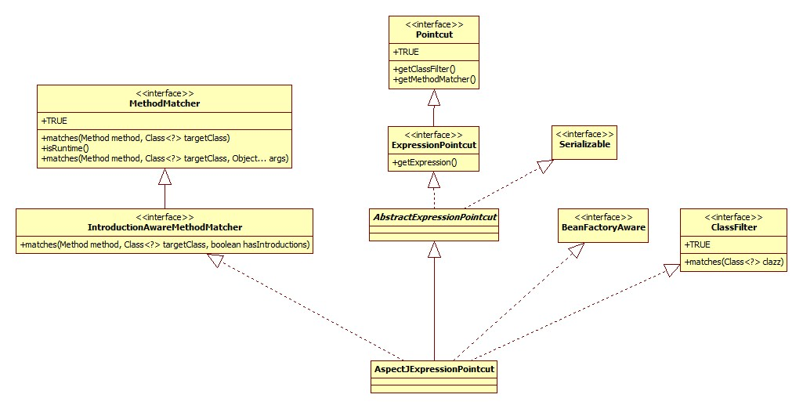

### aop:advisor

首先是其所有属性的示例:

```xml
<aop:advisor id="" order="" advice-ref="aopAdvice" pointcut="" pointcut-ref="" />
```

advisor概念是Spring独有的，来自于上古时代，应该是较早时候的aop概念的实现: [AOP Alliance (Java/J2EE AOP standards)](http://aopalliance.sourceforge.net/)。Spring官方的说法: [aop-schema-advisors](http://docs.spring.io/spring/docs/current/spring-framework-reference/html/aop.html#aop-schema-advisors)。

其相关的包/类就在spring-aop下:

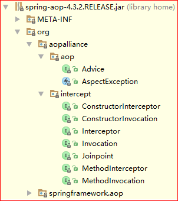

advice-ref是必须的属性，**并且这里的advice必须实现org.aopalliance.aop.Advice的子接口**。这些子接口指的什么呢，见Spring官方文档: [aop-api-advice-types](http://docs.spring.io/spring/docs/current/spring-framework-reference/html/aop-api.html#aop-api-advice-types)。比如org.aopalliance.intercept.MethodInterceptor。

最常见的用途就是结合事务使用:

```xml
<tx:advice id="txAdvice" transaction-manager="transactionManager">
    <tx:attributes>
        <tx:method name="get*" read-only="true" propagation="NOT_SUPPORTED"/>
        <tx:method name="find*" read-only="true" propagation="NOT_SUPPORTED"/>
        <tx:method name="*" propagation="REQUIRED"/>
    </tx:attributes>
</tx:advice>

<aop:config>
    <aop:pointcut expression="execution(* exam.service..*.*(..))" id="transaction"/>
    <aop:advisor advice-ref="txAdvice" pointcut-ref="transaction"/>
</aop:config>
```

解析的套路和楼上类似，只不过此处的beanClass是DefaultBeanFactoryPointcutAdvisor，其类图:

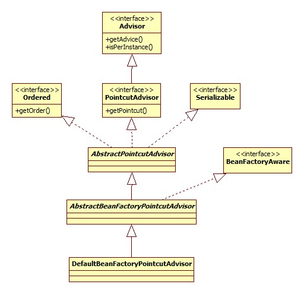

另外注意对于pointcut和pointcut-ref两者处理的区别，对于pointcut属性，Spring会同样创建一个AspectJExpressionPointcut类型的BeanDefinition，对于pointcut-ref会生成一个RuntimeBeanReference对象指向原pointcut的引用。此类的类图:

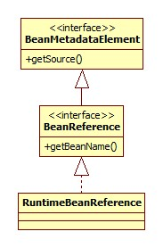

可以看出，这种aop的实现需要实现各种接口，所以不应该再使用此种方式进行aop，除了Spring内部的实现。

### aop:aspect

配置举例:

```xml
<bean id="aopAdvice" class="base.aop.AopDemoAdvice" />
<!-- 必须配置，因为被代理的对象必须在Spring容器中 -->
<bean id="aopDemo" class="base.aop.AopDemo" />
<aop:config>
    <aop:pointcut id="pointcut" expression="execution(* base.aop.AopDemo.send())" />
    <aop:aspect ref="aopAdvice">
        <aop:before method="beforeSend" pointcut-ref="pointcut" />
        <aop:after method="afterSend" pointcut-ref="pointcut" />
    </aop:aspect>
</aop:config>
```

解析形成的BeanDefinition结构如下:

```html
AspectComponentDefinition
    beanRefArray
        RuntimeBeanReference(aop:aspect的ref属性)
    beanDefArray
        // 被注册
        RootBeanDefinition(aop:declare-parents)
            beanClass: DeclareParentsAdvisor
            ConstructorArg
                implement-interface
                types-matching
                default-impl
                delegate-ref
        // 被注册
        RootBeanDefinition(aop:before,aop:after...)
            beanClass: AspectJPointcutAdvisor
            ConstructorArg
                RootBeanDefinition
                    beanClass: 由子标签决定
                    ConstructorArg
                        RootBeanDefinition
                            beanClass: MethodLocatingFactoryBean
                            properties
                                targetBeanName: aspectName
                                methodName: method属性
                        RootBeanDefinition
                            beanClass: SimpleBeanFactoryAwareAspectInstanceFactory
                            properties
                                aspectBeanName: aspectName
                        //还有pointcut定义和引用...
```

结构图里面的aspectName来自于aop:aspect的ref属性，此属性是必须配置的，因为Spring要知道aop:before等标签指定的方法是哪个bean/类/对象的方法。

#### aop:declare-parents

对于aop:declare-parents子标签，其决定的是代理子类应该实现哪些接口:

```xml
<aop:declare-parents types-matching="" implement-interface="" />
```

此标签最终被解析成为beanClass为DeclareParentsAdvisor的BeanDefinition，并注册到容器中。其类图:

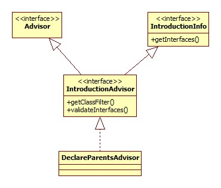

#### 其它

此处的其它指的是aop:before, aop:after等最核心的标签。其最终被解析为beanClass为AspectJPointcutAdvisor的BeanDefinition，类图:

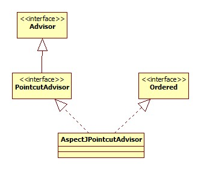

正如上面结构图里所描述的，其构造参数为一个BeanDefintion，此对象的beanClass是不确定的，由aop:before/after中的before和after决定，代码:

```java
private Class<?> getAdviceClass(Element adviceElement, ParserContext parserContext) {
    String elementName = parserContext.getDelegate().getLocalName(adviceElement);
    if (BEFORE.equals(elementName)) {
        return AspectJMethodBeforeAdvice.class;
    } else if (AFTER.equals(elementName)) {
        return AspectJAfterAdvice.class;
    } else if (AFTER_RETURNING_ELEMENT.equals(elementName)) {
        return AspectJAfterReturningAdvice.class;
    } else if (AFTER_THROWING_ELEMENT.equals(elementName)) {
        return AspectJAfterThrowingAdvice.class;
    } else if (AROUND.equals(elementName)) {
        return AspectJAroundAdvice.class;
    }
}
```

而此BeanDefintion的构造参数又由以下三个部分组成:

##### MethodLocatingFactoryBean

第一个便是beanClass为此类型的BeanDefinition。其内部有一个methodName属性，存储的便是标签的method属性的值。其类图:

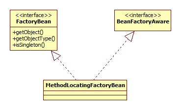

这个东西是干什么用的呢?其实是用于在指定的advice(aop:aspect的ref属性)中得到Method对象。入口在setBeanFactory方法:

```java
@Override
public void setBeanFactory(BeanFactory beanFactory) {
    Class<?> beanClass = beanFactory.getType(this.targetBeanName);
    this.method = BeanUtils.resolveSignature(this.methodName, beanClass);
}
```

##### SimpleBeanFactoryAwareAspectInstanceFactory

其类图:

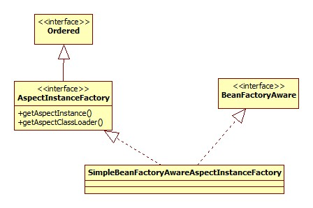

此类用于在BeanFactory中定位aspect bean，这个bean指的是谁?

```xml
<bean id="aopAdvice" class="base.aop.AopDemoAdvice" />
```

就是它!查找很简单:

```java
@Override
public Object getAspectInstance() {
    return this.beanFactory.getBean(this.aspectBeanName);
}
```

#### 总结

从整个aop:aspect标签最终被解析为一个AspectJPointcutAdvisor来看，Spring在实现上仍将其作为Advisor的概念。

## 代理子类生成

关键在于AspectJAwareAdvisorAutoProxyCreator，此对象在ConfigBeanDefinitionParser的configureAutoProxyCreator方法中注册，其类图:

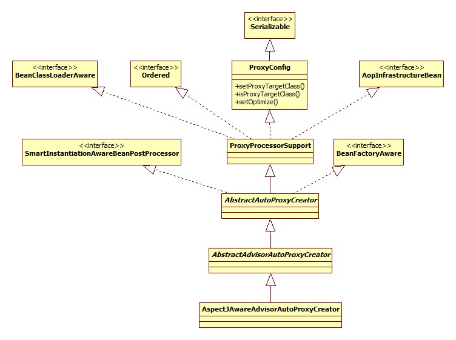

那么子类生成的入口在哪里呢?

### 入口

从AspectJAwareAdvisorAutoProxyCreator的类图中可以看出，此类实现了SmartInstantiationAwareBeanPostProcessor接口，所以很容易想到入口应该位于此接口及其父接口(BeanPostProcessor)的相关方法中。实际上确实是这样的。

### postProcessBeforeInstantiation

#### 调用时机

先来回顾一下此方法在Bean创建的过程中的调用时机。

AbstractAutowireCapableBeanFactory.createBean部分源码:

```java
//// Give BeanPostProcessors a chance to return a proxy instead of the target bean instance.
Object bean = resolveBeforeInstantiation(beanName, mbdToUse);
if (bean != null) {
    return bean;
}
Object beanInstance = doCreateBean(beanName, mbdToUse, args);
```

可以看出，调用发生在Bean实例的创建之前。

#### 源码

AbstractAutoProxyCreator.postProcessBeforeInstantiation:

```java
@Override
public Object postProcessBeforeInstantiation(Class<?> beanClass, String beanName) {
    Object cacheKey = getCacheKey(beanClass, beanName);
    if (beanName == null || !this.targetSourcedBeans.contains(beanName)) {
        if (this.advisedBeans.containsKey(cacheKey)) {
            return null;
        }
        if (isInfrastructureClass(beanClass) || shouldSkip(beanClass, beanName)) {
            this.advisedBeans.put(cacheKey, Boolean.FALSE);
            return null;
        }
    }
    if (beanName != null) {
        TargetSource targetSource = getCustomTargetSource(beanClass, beanName);
        if (targetSource != null) {
            this.targetSourcedBeans.add(beanName);
            Object[] specificInterceptors = 
                getAdvicesAndAdvisorsForBean(beanClass, beanName, targetSource);
            Object proxy = createProxy(beanClass, beanName, specificInterceptors, targetSource);
            this.proxyTypes.put(cacheKey, proxy.getClass());
            return proxy;
        }
    }
    return null;
}
```

下面分部分对其进行说明。

#### 应该代理 ?

Spring首先会对当前的beanClass进行检查(是否应该/可以对其进行代理)。

不应该代理的类分为两种情况: 

- 用于实现AOP的Spring基础类，此种情况在isInfrastructureClass方法中完成检测(单词Infrastructure正是基础设施的意思)。
- 子类定义的应该跳过的类，默认AbstractAutoProxyCreator的实现直接返回false，即都不应该跳过。

##### 基础类检测

AbstractAutoProxyCreator.isInfrastructureClass:

```java
protected boolean isInfrastructureClass(Class<?> beanClass) {
    boolean retVal = Advice.class.isAssignableFrom(beanClass) ||
            Pointcut.class.isAssignableFrom(beanClass) ||
            Advisor.class.isAssignableFrom(beanClass) ||
            AopInfrastructureBean.class.isAssignableFrom(beanClass);
    return retVal;
}
```

可以看出，任何Advice、Pointcut、Advisor、AopInfrastructureBean的子类都被当做Spring实现AOP的基础设施类。

##### 跳过类检测

即shouldSkip方法。前面提到了，AbstractAutoProxyCreator的默认实现直接返回fasle，这一特性被子类AspectJAwareAdvisorAutoProxyCreator重写:

```java
@Override
protected boolean shouldSkip(Class<?> beanClass, String beanName) {
    List<Advisor> candidateAdvisors = findCandidateAdvisors();
    for (Advisor advisor : candidateAdvisors) {
        if (advisor instanceof AspectJPointcutAdvisor) {
            if (((AbstractAspectJAdvice) advisor.getAdvice()).getAspectName().equals(beanName)) {
                return true;
            }
        }
    }
    return super.shouldSkip(beanClass, beanName);
}
```

那么此方法跳过的是谁呢？

其实就是我们通过aop:aspect标签配置的切面，即:

```xml
<bean id="aopAdvice" class="base.aop.AopDemoAdvice" />
<aop:config>
    <aop:aspect ref="aopAdvice">
    </aop:aspect>
</aop:config>
```

里的aopAdvice。

从前面的aop:aspect一节中可以知道，Spring对于aop:config的解析其实是把aop:before/after等标签解析成为了AspectJPointcutAdvisor类型的BeanDefinition，而aopAdvice以AbstractAspectJAdvice的类型保存在其中。

所以可以得出结论: **Spring跳过的是适用于当前bean的Advisor的Advice/Aspect对象**。

###### AOP逻辑

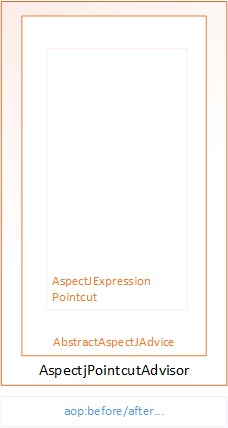

那么Spring又是如何找到适用于当前bean的Advisor的呢?

###### Advisor寻找

关键便是findCandidateAdvisors方法，此方法将逻辑委托给BeanFactoryAdvisorRetrievalHelper.findAdvisorBeans:

```java
public List<Advisor> findAdvisorBeans() {
    String[] advisorNames = null;
    synchronized (this) {
         // 结果缓存
        advisorNames = this.cachedAdvisorBeanNames;
        if (advisorNames == null) {
             // 去容器中寻找
            advisorNames = BeanFactoryUtils.beanNamesForTypeIncludingAncestors(
                    this.beanFactory, Advisor.class, true, false);
            this.cachedAdvisorBeanNames = advisorNames;
        }
    }
    if (advisorNames.length == 0) {
        return new LinkedList<Advisor>();
    }
    List<Advisor> advisors = new LinkedList<Advisor>();
    for (String name : advisorNames) {
        if (isEligibleBean(name)) {
            if (!this.beanFactory.isCurrentlyInCreation(name)) {
                advisors.add(this.beanFactory.getBean(name, Advisor.class));
            }
        }
    }
    return advisors;
}
```

可以看出，首先是从容器中获取到所有的Advisor示例，然后调用isEligibleBean方法逐一判断Advisor是否适用于当前bean。

###### 适用性检测

指的便是isEligibleBean方法。最终调用的是AbstractAdvisorAutoProxyCreator的同名方法:

```java
protected boolean isEligibleAdvisorBean(String beanName) {
    return true;
}
```

而AbstractAdvisorAutoProxyCreator的子类AspectJAwareAdvisorAutoProxyCreator并没有覆盖此方法，所以此处会对**容器中所有的Advisor的Advice进行跳过**。

##### 检测结果缓存

因为postProcessBeforeInstantiation方法会在每个bean初始化之前被调用，所以没有必要每次都真的进行基础类检测和跳过类检测，Spring使用了advisedBeans作为缓存用以提高性能。

#### TargetSource

从源码中可以看出，对于自定义的TargetSource，Spring会立即执行代理子类的创建。Spring的代理其实是针对TargetSource的，其类图:

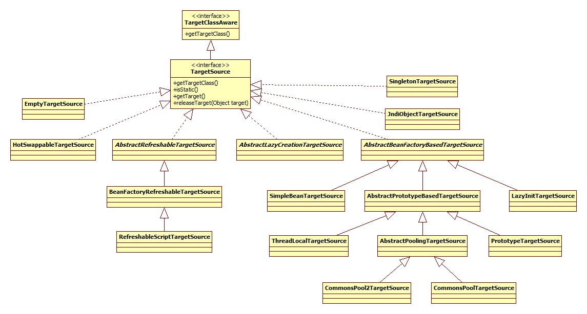

关于此接口在此不展开叙述。

### postProcessAfterInitialization

AbstractAutoProxyCreator.postProcessAfterInitialization:

```java
@Override
public Object postProcessAfterInitialization(Object bean, String beanName) {
    if (bean != null) {
        Object cacheKey = getCacheKey(bean.getClass(), beanName);
        if (!this.earlyProxyReferences.contains(cacheKey)) {
            return wrapIfNecessary(bean, beanName, cacheKey);
        }
    }
    return bean;
}
```

关键便在于wrapIfNecessary方法:

```java
protected Object wrapIfNecessary(Object bean, String beanName, Object cacheKey) {
    //自定义TargetSource，已经进行过代理子类生成
    if (beanName != null && this.targetSourcedBeans.contains(beanName)) {
        return bean;
    }
    if (Boolean.FALSE.equals(this.advisedBeans.get(cacheKey))) {
        return bean;
    }
    if (isInfrastructureClass(bean.getClass()) || shouldSkip(bean.getClass(), beanName)) {
        this.advisedBeans.put(cacheKey, Boolean.FALSE);
        return bean;
    }
    // Create proxy if we have advice.
    Object[] specificInterceptors = getAdvicesAndAdvisorsForBean(bean.getClass(), beanName, null);
    if (specificInterceptors != DO_NOT_PROXY) {
        this.advisedBeans.put(cacheKey, Boolean.TRUE);
        // 创建
        Object proxy = createProxy(
                bean.getClass(), beanName, specificInterceptors, new SingletonTargetSource(bean));
        this.proxyTypes.put(cacheKey, proxy.getClass());
        return proxy;
    }
    this.advisedBeans.put(cacheKey, Boolean.FALSE);
    return bean;
}
```

可以看出，在此方法的开头又进行了基础类以及跳过类的检测，再次不再赘述。

#### Advisor寻找

即getAdvicesAndAdvisorsForBean方法，这里进行的便是去容器中寻找适用于当前bean的Advisor，最终调用的是

AbstractAdvisorAutoProxyCreator.findEligibleAdvisors:

```java
protected List<Advisor> findEligibleAdvisors(Class<?> beanClass, String beanName) {
    List<Advisor> candidateAdvisors = findCandidateAdvisors();
    List<Advisor> eligibleAdvisors = findAdvisorsThatCanApply(candidateAdvisors, beanClass, beanName);
    extendAdvisors(eligibleAdvisors);
    if (!eligibleAdvisors.isEmpty()) {
        eligibleAdvisors = sortAdvisors(eligibleAdvisors);
    }
    return eligibleAdvisors;
}
```

findCandidateAdvisors前面已经说过了。

##### 适用性判断

findAdvisorsThatCanApply最终调用AopUtils.findAdvisorsThatCanApply:

```java
public static List<Advisor> findAdvisorsThatCanApply(List<Advisor> candidateAdvisors, Class<?> clazz) {
    if (candidateAdvisors.isEmpty()) {
        return candidateAdvisors;
    }
    List<Advisor> eligibleAdvisors = new LinkedList<Advisor>();
    for (Advisor candidate : candidateAdvisors) {
        if (candidate instanceof IntroductionAdvisor && canApply(candidate, clazz)) {
            eligibleAdvisors.add(candidate);
        }
    }
    boolean hasIntroductions = !eligibleAdvisors.isEmpty();
    for (Advisor candidate : candidateAdvisors) {
        if (candidate instanceof IntroductionAdvisor) {
            // already processed
            continue;
        }
        if (canApply(candidate, clazz, hasIntroductions)) {
            eligibleAdvisors.add(candidate);
        }
    }
    return eligibleAdvisors;
}
```

关键在于canApply方法，从源码中可以看出，对于Advisor的判断分为了IntroductionAdvisor以及非IntroductionAdvisor两种情况。

这种分开处理导致了**IntroductionAdvisor在Advisor链中总是位于非IntroductionAdvisor前面**。

canApply(candidate, clazz)其实等价于canApply(candidate, clazz, false):

```java
public static boolean canApply(Advisor advisor, Class<?> targetClass, boolean hasIntroductions) {
    if (advisor instanceof IntroductionAdvisor) {
        return ((IntroductionAdvisor) advisor).getClassFilter().matches(targetClass);
    }
    else if (advisor instanceof PointcutAdvisor) {
        PointcutAdvisor pca = (PointcutAdvisor) advisor;
        return canApply(pca.getPointcut(), targetClass, hasIntroductions);
    }
    else {
        // It doesn't have a pointcut so we assume it applies.
        return true;
    }
}
```

很明显，对于引入Advisor与其它Advisor是两种不同的判断方式。

###### 引入

引入的概念在下面aop:scoped-proxy中有提到。因为引入的目的在于动态地向一个类添加另一种功能(接口)，所以只要判断给定的类是否是要引入到的类即可。

###### 其它

AopUtils.canApply:

```java
public static boolean canApply(Pointcut pc, Class<?> targetClass, boolean hasIntroductions) {
    //是否Pointcut可以匹配当前类
    if (!pc.getClassFilter().matches(targetClass)) {
        return false;
    }
    MethodMatcher methodMatcher = pc.getMethodMatcher();
    //是否Pointcut可以匹配所有方法
    if (methodMatcher == MethodMatcher.TRUE) {
        // No need to iterate the methods if we're matching any method anyway...
        return true;
    }
    IntroductionAwareMethodMatcher introductionAwareMethodMatcher = null;
    if (methodMatcher instanceof IntroductionAwareMethodMatcher) {
        introductionAwareMethodMatcher = (IntroductionAwareMethodMatcher) methodMatcher;
    }
    Set<Class<?>> classes = new LinkedHashSet<Class<?>>
        (ClassUtils.getAllInterfacesForClassAsSet(targetClass));
    classes.add(targetClass);
    for (Class<?> clazz : classes) {
        Method[] methods = ReflectionUtils.getAllDeclaredMethods(clazz);
        for (Method method : methods) {
            if ((introductionAwareMethodMatcher != null &&
                    introductionAwareMethodMatcher
                        .matches(method, targetClass, hasIntroductions)) ||
                    methodMatcher.matches(method, targetClass)) {
                return true;
            }
        }
    }
    return false;
}
```

Spring的Pointcut由ClassFilter和MethodMatcher两部分组成，其中前者用以判断给定的类是否在Pointcut的匹配范围内，后者用以在ClassFilter匹配满足的情况下判断给定的方法是否在Pointcut匹配的范围内。

从源码中可以看出，如果ClassFilter匹配得到满足并且Pointcut并不能匹配此类的任意方法，便会**用反射的方法获取targetClass(被检测类)的全部方法逐一交由Pointcut的MethodMatcher进行检测**。

关于Pointcut表达式是如何解析及存储的在此不再展开。

##### Advisor扩展

AbstractAdvisorAutoProxyCreator.extendAdvisors允许子类向Advisor链表中添加自己的Advisor。子类AspectJAwareAdvisorAutoProxyCreator重写了此方法，其逻辑是:

如果Advisor链表中的Advisor含有AspectJ Advice，那么将会把一个ExposeInvocationInterceptor添加到链表的表头，目的在于将MethodInvocation以ThreadLocal的方式暴露给后面所有的Advisor，暂不知道具体的用途。

##### 排序

即sortAdvisors方法，用于对实现了Ordered接口的Advisor进行排序。

#### 创建

AbstractAutoProxyCreator.createProxy(略去非关键代码):

```java
protected Object createProxy(
        Class<?> beanClass, String beanName, Object[] specificInterceptors, TargetSource targetSource) {
    ProxyFactory proxyFactory = new ProxyFactory();
    proxyFactory.copyFrom(this);
    //将interceptor适配为Advisor
    Advisor[] advisors = buildAdvisors(beanName, specificInterceptors);
    for (Advisor advisor : advisors) {
        proxyFactory.addAdvisor(advisor);
    }
    return proxyFactory.getProxy(getProxyClassLoader());
}
```

##### JDK动态代理 or Cglib

由DefaultAopProxyFactory.createAopProxy方法决定使用何种方式创建代理子类。

```java
@Override
public AopProxy createAopProxy(AdvisedSupport config) throws AopConfigException {
    if (config.isOptimize() || config.isProxyTargetClass() ||
            hasNoUserSuppliedProxyInterfaces(config)) {
        Class<?> targetClass = config.getTargetClass();
        if (targetClass.isInterface() || Proxy.isProxyClass(targetClass)) {
            return new JdkDynamicAopProxy(config);
        }
        return new ObjenesisCglibAopProxy(config);
    } else {
        return new JdkDynamicAopProxy(config);
    }
}
```

逻辑很明显，如果指定了(proxy-target-classs设为true)使用Cglib，那么就会使用Cglib的方式，如果没有指定(或为false)，那么先回检测被代理类是否实现了自己的接口，如果实现了，那么就采用JDK动态代理的方式。

##### JDK动态代理

JdkDynamicAopProxy.getProxy:

```java
@Override
public Object getProxy(ClassLoader classLoader) {
    //找到可以用来进行代理的接口
    Class<?>[] proxiedInterfaces = AopProxyUtils.completeProxiedInterfaces(this.advised, true);
    //用来代理的接口中是否定义了equals或者是hashCode方法?
    //结果保存在内部equalsDefined和hashCodeDefined两个成员变量中
    findDefinedEqualsAndHashCodeMethods(proxiedInterfaces);
    return Proxy.newProxyInstance(classLoader, proxiedInterfaces, this);
}
```

可以看出，关键的InvocationHandler参数其实就是JdkDynamicAopProxy自身。

其invoke方法较长，源码就不贴了，下面进行分部分说明。

###### equals & hashCode

如果被代理类实现了equals或者是hashCode方法，那么生成的代理子类的equals、hashCode方法实际上执行的是JdkDynamicAopProxy相应方法的逻辑。

invoke方法部分源码:

```java
if (!this.equalsDefined && AopUtils.isEqualsMethod(method)) {
    // The target does not implement the equals(Object) method itself.
    return equals(args[0]);
}
```

###### 链式调用

对于切点方法，比如前面aop:aspect示例配置中的beforeSend

```xml
<aop:before method="beforeSend" pointcut-ref="pointcut" />
```

Spring会创建一个MethodInvocation对象对所有相关的Advisor进行链式调用。invoke相关源码:

```java
List<Object> chain = this.advised.getInterceptorsAndDynamicInterceptionAdvice(method, targetClass);
invocation = new ReflectiveMethodInvocation(proxy, target, method, args, targetClass, chain);
Object retVal = invocation.proceed();
```

##### Cglib

同样是对于Advisor的链式调用，不再详细展开。

# aop:scoped-proxy

此配置一般是这样使用:

```xml
<bean id="userPreferences" class="com.foo.UserPreferences" scope="session">
    <aop:scoped-proxy/>
</bean>
<bean id="userManager" class="com.foo.UserManager">
    <property name="userPreferences" ref="userPreferences"/>
</bean>
```

对于ref属性，**只会在userManager初始化时注入一次**。这会造成什么问题呢?以session的Scope为例，因为只会注入一次，所以，**userManager引用的始终是同一个userPreferences对象，即使现在可能已经过时了**。此配置便可以使userManager引用的其实是一个对代理的引用，所以可以始终获取到最新的userPreferences。

其作用和注解@ScopedProxy相同。

其解析由ScopedProxyBeanDefinitionDecorator完成，类图:

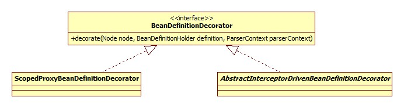

## 解析

### 入口

从类图可以看出，ScopedProxyBeanDefinitionDecorator和之前的解析器都不同，它的调用入口不同以往:

DefaultBeanDefinitionDocumentReader.processBeanDefinition:

```java
protected void processBeanDefinition(Element ele, BeanDefinitionParserDelegate delegate) {
    BeanDefinitionHolder bdHolder = delegate.parseBeanDefinitionElement(ele);
    if (bdHolder != null) {
         // 装饰
        bdHolder = delegate.decorateBeanDefinitionIfRequired(ele, bdHolder);
    }
}
```

BeanDefinitionParserDelegate.decorateIfRequired:

```java
public BeanDefinitionHolder decorateIfRequired(
        Node node, BeanDefinitionHolder originalDef, BeanDefinition containingBd) {
    String namespaceUri = getNamespaceURI(node);
    if (!isDefaultNamespace(namespaceUri)) {
        NamespaceHandler handler = this.readerContext.getNamespaceHandlerResolver()
            .resolve(namespaceUri);
        if (handler != null) {
            return handler.
                decorate(node, originalDef, new ParserContext(this.readerContext, this, containingBd));
        }
    }
    return originalDef;
}
```

一目了然。

这么做(装饰)的原因就是此标签是用在bean内部的，从decorate的方法签名可以看出，第二个便是父(bean)BeanDefinition，所以叫做装饰。

### 装饰

```java
@Override
public BeanDefinitionHolder decorate(Node node, BeanDefinitionHolder definition, ParserContext parserContext) {
    boolean proxyTargetClass = true;
    if (node instanceof Element) {
        Element ele = (Element) node;
        if (ele.hasAttribute(PROXY_TARGET_CLASS)) {
            proxyTargetClass = Boolean.valueOf(ele.getAttribute(PROXY_TARGET_CLASS));
        }
    }
    BeanDefinitionHolder holder =
            ScopedProxyUtils.
            createScopedProxy(definition, parserContext.getRegistry(), proxyTargetClass);
    String targetBeanName = ScopedProxyUtils.getTargetBeanName(definition.getBeanName());
    // 空实现
    parserContext.getReaderContext().fireComponentRegistered(
            new BeanComponentDefinition(definition.getBeanDefinition(), targetBeanName));
    return holder;
}
```

核心便是createScopedProxy方法，其源码较长，但是这个套路之前见识过了，就是一个偷天换日: 创建一个新的BeanDefinition对象，beanName为被代理的bean的名字，被代理的bean名字为scopedTarget.原名字。被代理的bean扔将被注册到容器中。

新的BeanDefintion的beanClass为ScopedProxyFactoryBean，其类图:

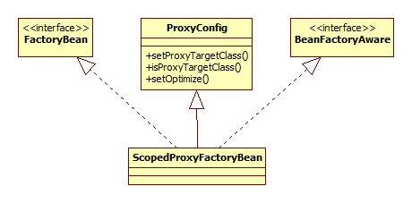

## 代理生成

入口便是setBeanFactory方法:

```java
@Override
public void setBeanFactory(BeanFactory beanFactory) {
    ConfigurableBeanFactory cbf = (ConfigurableBeanFactory) beanFactory;
    this.scopedTargetSource.setBeanFactory(beanFactory);
    ProxyFactory pf = new ProxyFactory();
    pf.copyFrom(this);
    pf.setTargetSource(this.scopedTargetSource);

    Class<?> beanType = beanFactory.getType(this.targetBeanName);
    if (!isProxyTargetClass() || beanType.isInterface() || 
        Modifier.isPrivate(beanType.getModifiers())) {
         // JDK动态代理可用的接口
        pf.setInterfaces(ClassUtils.getAllInterfacesForClass(beanType, cbf.getBeanClassLoader()));
    }
    // Add an introduction that implements only the methods on ScopedObject.
    ScopedObject scopedObject = new DefaultScopedObject
        (cbf, this.scopedTargetSource.getTargetBeanName());
    pf.addAdvice(new DelegatingIntroductionInterceptor(scopedObject));
    // Add the AopInfrastructureBean marker to indicate that the scoped proxy
    // itself is not subject to auto-proxying! Only its target bean is.
    pf.addInterface(AopInfrastructureBean.class);
    this.proxy = pf.getProxy(cbf.getBeanClassLoader());
}
```

这个套路上面也见过了。

### Advisor

核心的拦截逻辑是通过DelegatingIntroductionInterceptor来完成的，其类图:

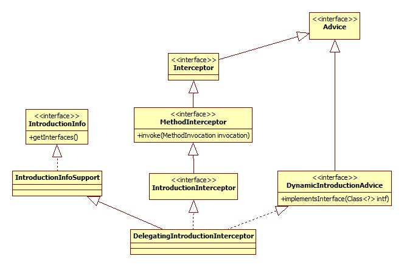

AdvisedSupport.addAdvice方法将其转化为Advisor:

```java
@Override
public void addAdvice(int pos, Advice advice) throws AopConfigException {
    if (advice instanceof IntroductionInfo) {
        // We don't need an IntroductionAdvisor for this kind of introduction:
        // It's fully self-describing.
        addAdvisor(pos, new DefaultIntroductionAdvisor(advice, (IntroductionInfo) advice));
    } else if (advice instanceof DynamicIntroductionAdvice) {
        // We need an IntroductionAdvisor for this kind of introduction.
    } else {
        addAdvisor(pos, new DefaultPointcutAdvisor(advice));
    }
}
```

显然，DelegatingIntroductionInterceptor被包装为DefaultIntroductionAdvisor对象。

DelegatingIntroductionInterceptor到底是个什么东西呢?这其实就引出了Spring的Introduction(引入)概念。

### 引入

通常意义上的Spring AOP一般是在方法层面上进行逻辑的改变，而引入指的是在不修改类源码的情况下，**直接为一个类添加新的功能**。下面是一个引入使用的例子:

[SpringAOP中的IntroductionInterceptor](http://blog.csdn.net/lzghxjt/article/details/51974336)

## 例子

### 自定义Scope

为了便于测试，我们定义一个生存周期仅仅在于一次调用的Scope，源码:

```java
public class OneScope implements Scope {

    private int index = 0;

    @Override
    public Object get(String name, ObjectFactory<?> objectFactory) {
        System.out.println("get被调用");
        return new Student("skywalker-" + (index++), index);
    }
    //忽略其它方法
}
```

将其注册到容器中，有两种方法:

- 在代码中: 

  ```java
  context.getBeanFactory().registerScope("one", new OneScope());
  ```

- 配置文件:

  ```xml
  <bean class="org.springframework.beans.factory.config.CustomScopeConfigurer">
    <property name="scopes">
        <map>
            <entry key="one">
                <bean class="base.scope.OneScope" />
            </entry>
        </map>
    </property>
  </bean>
  ```

### 配置

此时就可以使用我们自己的Scope了:

```xml
<bean class="base.SimpleBean" id="simpleBean">
    <property name="student" ref="student" />
</bean>

<bean id="student" class="base.Student" scope="one">
    <aop:scoped-proxy />
</bean>
```

### 测试

执行以下代码:

```java
SimpleBean simpleBean = context.getBean(SimpleBean.class);
System.out.println(simpleBean.getStudent().getName());
System.out.println(simpleBean.getStudent().getName());
```

可以看到以下输出:

```html
get被调用
skywalker-0
get被调用
skywalker-1
```

可以得出结论: **当调用被代理的bean的方法时才会触发Scoped的语义，只是获得其对象(getStudent)没有效果**。

## 原理

### doGetBean

从根本上来说在于AbstractBeanFactory.doGetBean，部分源码:

```java
//scope非prototype和Singleton
else {
    String scopeName = mbd.getScope();
    final Scope scope = this.scopes.get(scopeName);
    Object scopedInstance = scope.get(beanName, new ObjectFactory<Object>() {
        @Override
        public Object getObject() throws BeansException {
            beforePrototypeCreation(beanName);
            try {
                return createBean(beanName, mbd, args);
            }
            finally {
                afterPrototypeCreation(beanName);
            }
        }
    });
    bean = getObjectForBeanInstance(scopedInstance, name, beanName, mbd);
}
```

scopes是BeanFactory内部的一个 LinkedHashMap<String, Scope>类型的对象。scope.get实际上调用的就是我们的OneSocpe的get方法，没有用到ObjectFactory。

所以，**每调用一次getBean，就会导致一个新的Sudent被创建并返回**。

### 代理子类

还有一个关键的问题，从上面可以知道SimpleBean内部的student引用其实是一个CGLIB代理子类的对象，那么当调用这个代理对象的相应方法(比如getName)时，是怎样导致Student重新创建(或是getBean被调用)的?

### CallbackFilter & Callback

必须首先理解下CGLIB的这两个概念。

#### Callback

**Callback是Cglib所有自定义逻辑(增强)的共同接口**。

其简略类图:

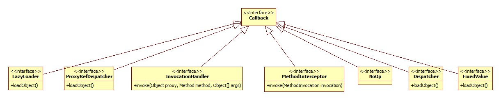

#### CallbackFilter

**在CGLib回调时可以设置对不同方法执行不同的回调逻辑，或者根本不执行回调。**

jdk并不支持这么搞，只支持设置一个InvocationHandler处理(拦截)所有的方法。其类图:

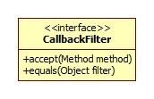

Cglib的Enhancer可以指定一个Callback数组，而accept方法的返回值是一个int值，其实就是Callback数组的下标，这样便达到了指定回调逻辑的目的。

参考:

[CGLIB介绍与原理](http://blog.csdn.net/zghwaicsdn/article/details/50957474)

### 回调

一般的方法使用的是DynamicAdvisedInterceptor作为回调逻辑，其intercept关键源码:

```java
@Override
public Object intercept(Object proxy, Method method, Object[] args, MethodProxy methodProxy) {
    Object target = getTarget();
}
```

target就是被代理对象。

getTarget:

```java
protected Object getTarget() throws Exception {
    return this.advised.getTargetSource().getTarget();
}
```

TargetSource前面说过了，默认是SimpleBeanTargetSource:

```java
@Override
public Object getTarget() throws Exception {
    return getBeanFactory().getBean(getTargetBeanName());
}
```

至此，真相大白。

# aop:aspectj-autoproxy

此标签用以开启对于@AspectJ注解风格AOP的支持。

## 属性

### proxy-target-class

你懂的。

### expose-proxy

是否应该把代理对象暴露给AopContext，默认false。

## 栗子

### 切面

```java
@Aspect
public class AspectDemo {
    @Pointcut("execution(void base.aop.AopDemo.send(..))")
    public void beforeSend() {}
    @Before("beforeSend()")
    public void before() {
        System.out.println("send之前");
    }
}
```

### 被代理类

```java
public class AopDemo implements AopDemoInter {
    public void send() {
        System.out.println("send from aopdemo");
    }
    public void receive() {
        System.out.println("receive from aopdemo");
    }
    @Override
    public void inter() {
        System.out.println("inter");
    }
}
```

### 配置

```xml
<aop:aspectj-autoproxy proxy-target-class="true" />
<bean class="base.aop.AopDemo" />
<bean class="base.aop.annotation.AspectDemo" />
```

因为AopDemo实现了AopDemoInter接口，但做实验的send方法又不在此接口里定义，所以只能用cglib的方式代理。

可以看出，**即使标注了@Aspect注解，仍然需要将切面自己配置到Spring容器中。**

## 解析

AspectJAutoProxyBeanDefinitionParser.parse:

```java
@Override
public BeanDefinition parse(Element element, ParserContext parserContext) {
    AopNamespaceUtils.
        registerAspectJAnnotationAutoProxyCreatorIfNecessary(parserContext, element);
    extendBeanDefinition(element, parserContext);
    return null;
}
```

注册最终在AopConfigUtils.registerOrEscalateApcAsRequired方法中完成，创建器实际上是一个AnnotationAwareAspectJAutoProxyCreator类的对象，此类是前面AspectJAwareAdvisorAutoProxyCreator的子类。

## 原理

既然是AspectJAwareAdvisorAutoProxyCreator的子类，那么其代理子类的创建等核心逻辑自然是一样的。这里所需要关注的地方自然是所不一样的地方: 即是如何体现其注解的特性的。

前面说过，AspectJAwareAdvisorAutoProxyCreator通过findCandidateAdvisors方法来找到适用于bean的Advisor，所以注解的特性也是通过重写此方法来体现。

AnnotationAwareAspectJAutoProxyCreator.findCandidateAdvisors:

```java
@Override
protected List<Advisor> findCandidateAdvisors() {
    List<Advisor> advisors = super.findCandidateAdvisors();
    //这里
    advisors.addAll(this.aspectJAdvisorsBuilder.buildAspectJAdvisors());
    return advisors;
}
```

buildAspectJAdvisors方法所做的便是**从容器中得到所有的bean，逐一判断是不是一个Aspect**。那么判断Aspect的依据是什么?

AbstractAspectJAdvisorFactory.isAspect:

```java
@Override
public boolean isAspect(Class<?> clazz) {
    return (hasAspectAnnotation(clazz) && !compiledByAjc(clazz));
}
```

至于其它的实现细节不再探究。

## 总结

Spring对于AspectJ风格AOP的支持停留在外表(注解)上面，内部的实现仍然是自己的东西。

# 拾遗

## AOP切面的坑

1. 定义在private方法上的切面不会被执行，这个很容易理解，毕竟子类不能覆盖父类的私有方法。
2. 同一个代理子类内部的方法相互调用不会再次执行切面。

这里以Cglib为例对第二点进行说明，cglib的相关核心组件可以参考前面CallbackFilter & Callback部分。对于配置了一个切面的典型场景，Spring内部的执行流程可总结如下图:


核心便是对目标方法的调用上，这里由CglibMethodInvocation的invokeJoinpoint实现:

```java
@Override
protected Object invokeJoinpoint() throws Throwable {
    if (this.publicMethod) {
        return this.methodProxy.invoke(this.target, this.arguments);
    } else {
        return super.invokeJoinpoint();
    }
}
```

如果是非public方法，那么Spring将使用反射的方法对其进行调用，因为反射将其可访问性设为true。MethodProxy是Cglib对方法代理的抽象，这里的关键是**方法调用的对象(目标)是我们的原生类对象，而不是Cglib代理子类的对象，这就从根本上决定了对同类方法的调用不会再次经过切面**。

### 总结

前面aop:aspectj-autoproxy-属性-expose-proxy一节提到了，Spring允许我们将代理子类暴露出来，可以进行如下配置:

```xml
<aop:config expose-proxy="true">
    <aop:advisor advice-ref="simpleMethodInterceptor" pointcut="execution(* aop.SimpleAopBean.*(..))" />
</aop:config>
```

当我们需要在一个被代理方法中调用同类的方法时(此方法也需要经过切面)，可以这样调用:

```java
public void testB() {
    System.out.println("testB执行");
    ((SimpleAopBean) AopContext.currentProxy()).testC();
}
```

这里其实是一个ThreadLocal，当Cglib代理子类创建调用链之间便会将代理类设置到其中，DynamicAdvisedInterceptor.intercept相关源码:

```java
if (this.advised.exposeProxy) {
    // Make invocation available if necessary.
    oldProxy = AopContext.setCurrentProxy(proxy);
    setProxyContext = true;
}
```

