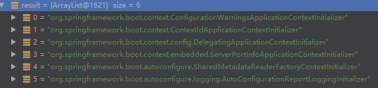
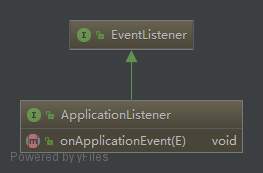
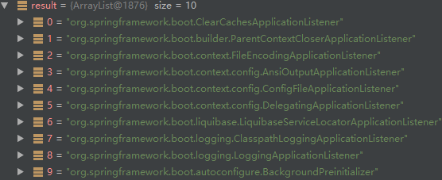
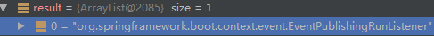
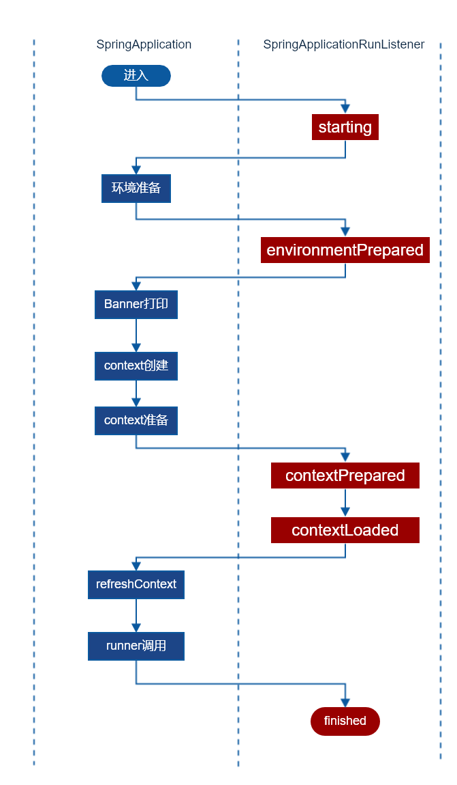
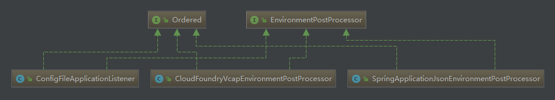

<!-- START doctoc generated TOC please keep comment here to allow auto update -->
<!-- DON'T EDIT THIS SECTION, INSTEAD RE-RUN doctoc TO UPDATE -->
**Table of Contents**  *generated with [DocToc](https://github.com/thlorenz/doctoc)*

- [SpringApplication](#springapplication)
  - [web环境检测](#web%E7%8E%AF%E5%A2%83%E6%A3%80%E6%B5%8B)
  - [ApplicationContextInitializer](#applicationcontextinitializer)
  - [ApplicationListener](#applicationlistener)
  - [SpringApplicationRunListener](#springapplicationrunlistener)
- [run](#run)
  - [starting](#starting)
  - [环境准备](#%E7%8E%AF%E5%A2%83%E5%87%86%E5%A4%87)
    - [属性来源](#%E5%B1%9E%E6%80%A7%E6%9D%A5%E6%BA%90)
    - [profile配置](#profile%E9%85%8D%E7%BD%AE)
  - [environmentPrepared](#environmentprepared)
    - [配置文件加载](#%E9%85%8D%E7%BD%AE%E6%96%87%E4%BB%B6%E5%8A%A0%E8%BD%BD)
      - [SpringApplicationJsonEnvironmentPostProcessor](#springapplicationjsonenvironmentpostprocessor)
      - [CloudFoundryVcapEnvironmentPostProcessor](#cloudfoundryvcapenvironmentpostprocessor)
      - [ConfigFileApplicationListener](#configfileapplicationlistener)

<!-- END doctoc generated TOC please keep comment here to allow auto update -->

# SpringApplication

启动程序首先初始化了一个SpringApplication对象。来看一看在它的构造器了发生了什么。

```java
public SpringApplication(ResourceLoader resourceLoader, Object... sources) {
	this.resourceLoader = resourceLoader;
	initialize(sources);
}
```

initialize方法:

```java
private void initialize(Object[] sources) {
	if (sources != null && sources.length > 0) {
		this.sources.addAll(Arrays.asList(sources));
	}
	this.webEnvironment = deduceWebEnvironment();
	setInitializers((Collection) getSpringFactoriesInstances(
			ApplicationContextInitializer.class));
	setListeners((Collection) getSpringFactoriesInstances(ApplicationListener.class));
	this.mainApplicationClass = deduceMainApplicationClass();
}
```

## web环境检测

deduceWebEnvironment方法用于检测当前是否是web工程环境，检测的标准也很简单，classpath中必须同时存在下面这两个类:

- javax.servlet.Servlet
- org.springframework.web.context.ConfigurableWebApplicationContext

## ApplicationContextInitializer

下一步便是检测应当使用哪些ApplicationContextInitializer，这货并不是spring-boot的专属，而是定义在context下，这东西是在喜闻乐见的refesh方法执行之前留给我们进行自定义初始化的钩子。典型的使用的场景是注册我们自己的属性来源、设置激活的profile。

在简单的web应用场景下(没有数据库/mybatis)，共最终引入了下列的类:



来自于三个jar包:

- spring-boot
- spring-boot-autoconfigure
- spring-beans

## ApplicationListener

这货是典型的观察者模式实现，类图:



在简单的web应用场景下，系统共初始化了这些监听器:



## SpringApplicationRunListener

就像它长得那样，就是用来监听SpringApplication的run方法的监听器。看看这货用到了哪些实现类:



# run

从这一节开始，就进入了SpringApplication的run方法的势力范围。整个方法的流程总结如下图:



## starting

SpringApplicationRunListener其实起一个广播器的作用，将消息广播给ApplicationListener一节初始化的10个Listener中的某几个。

debug可以发现，对启动事件感兴趣的只有LoggingApplicationListener一个。

 当LoggingApplicationListener监听到启动事件时，所作的主要工作便是决定采用哪一个日志框架，其判断逻辑如下:

- 如果系统变量`org.springframework.boot.logging.LoggingSystem`存在，那么由其决定。

- 依次检测classpath中这些类是否存在:

  ```java
  ch.qos.logback.core.Appender;
  org.apache.logging.log4j.core.impl.Log4jContextFactory;
  java.util.logging.LogManager;
  ```

## 环境准备

相关源码:

```java
ConfigurableEnvironment environment = prepareEnvironment(listeners, applicationArguments);
```

Spring里面的Environment到底是个什么东西，详细参考隔壁(Spring.md)Environment接口一节，总结来说，这货就是属性配置来源(比如系统变量)和profile的综合体。

### 属性来源

在web环境下共初始化了以下4个属性来源:

- System.getProperties()
- System.getenv()
- servlet-context-init-params
- servlet-config-init-params


有意思的问题：此时servlet-context-init-params和servlet-config-init-params实际上是一个占位符，无法从这两个来源获得任何真实的属性，等到refresh方法执行时才会被真实的来源替换。

### profile配置

SpringApplication.configureProfiles方法:

```java
protected void configureProfiles(ConfigurableEnvironment environment, String[] args) {
	environment.getActiveProfiles(); // ensure they are initialized
	// But these ones should go first (last wins in a property key clash)
  	// 默认空
	Set<String> profiles = new LinkedHashSet<String>(this.additionalProfiles);
	profiles.addAll(Arrays.asList(environment.getActiveProfiles()));
	environment.setActiveProfiles(profiles.toArray(new String[profiles.size()]));
}
```

active profile取自上一节中的属性来源，key为`spring.profiles.active`.

## environmentPrepared

### 配置文件加载

监听器ConfigFileApplicationListener负责spring-boot配置文件的加载，ConfigFileApplicationListener默认会从以下的位置搜索配置文件:

1. classpath下的application.properties或application.yml
2. file:./下的application.properties或application.yml
3. classpath:config目录下的application.properties或application.yml
4. file:./config目录下的application.properties或application.yml

此监听器是如何加载的?源码:

```java
private void onApplicationEnvironmentPreparedEvent(ApplicationEnvironmentPreparedEvent event) {
	List<EnvironmentPostProcessor> postProcessors = loadPostProcessors();
	postProcessors.add(this);
	AnnotationAwareOrderComparator.sort(postProcessors);
	for (EnvironmentPostProcessor postProcessor : postProcessors) {
		postProcessor.postProcessEnvironment(event.getEnvironment(),
				event.getSpringApplication());
	}
}
```

显然核心的加载操作是通过EnvironmentPostProcessor接口实现的，此接口允许我们在context刷新之前自定义配置加载，并且Spring推荐此接口的实现类同时实现Ordered接口。类图:



加上ConfigFileApplicationListener自己，spring-boot默认共初始化了三个加载器，其它两个是SpringApplicationJsonEnvironmentPostProcessor和CloudFoundryVcapEnvironmentPostProcessor，下面按照其优先级顺序进行说明。

#### SpringApplicationJsonEnvironmentPostProcessor

尝试读取spring.application.json或SPRING_APPLICATION_JSON系统指定的json配置文件，从这里加载的配置具有最高的优先级，当然，默认是没有的。

#### CloudFoundryVcapEnvironmentPostProcessor

从Cloud Foundry加载配置，这是什么东西问度娘。

#### ConfigFileApplicationListener

这里就是加载配置文件加载一节所说的配置文件的过程。


TODO: 多profile配置文件加载


