# 开头

入口方法在BeanDefinitionParserDelegate.parseCustomElement：

```java
return handler.parse(ele, new ParserContext(this.readerContext, this, containingBd));
```

parse方法由各种NamespaceHandler的父类NamespaceHandlerSupport实现:

```java
@Override
public BeanDefinition parse(Element element, ParserContext parserContext) {
	return findParserForElement(element, parserContext).parse(element, parserContext);
}
```

findParserForElement方法用以寻找适用于此元素的BeanDefinitionParser对象:

```java
private BeanDefinitionParser findParserForElement(Element element, ParserContext parserContext) {
	String localName = parserContext.getDelegate().getLocalName(element);
	BeanDefinitionParser parser = this.parsers.get(localName);
	if (parser == null) {
		parserContext.getReaderContext().fatal(
			"Cannot locate BeanDefinitionParser for element [" + localName + "]", element);
	}
	return parser;
}
```

localName是个什么东西呢，比如对于context:annotation-config标签就是annotation-config。

# annotation-config

AnnotationConfigBeanDefinitionParser.parse:

```java
@Override
public BeanDefinition parse(Element element, ParserContext parserContext) {
  	//返回null
	Object source = parserContext.extractSource(element);
	// Obtain bean definitions for all relevant BeanPostProcessors.
	Set<BeanDefinitionHolder> processorDefinitions =
			AnnotationConfigUtils.
				registerAnnotationConfigProcessors(parserContext.getRegistry(), source);
	// Register component for the surrounding <context:annotation-config> element.
	CompositeComponentDefinition compDefinition = 
		new CompositeComponentDefinition(element.getTagName(), source);
	parserContext.pushContainingComponent(compDefinition);
	// Nest the concrete beans in the surrounding component.
	for (BeanDefinitionHolder processorDefinition : processorDefinitions) {
		parserContext.registerComponent(new BeanComponentDefinition(processorDefinition));
	}
	// Finally register the composite component.
  	// 空实现
	parserContext.popAndRegisterContainingComponent();
	return null;
}
```
## BeanPostProcessor注册

AnnotationConfigUtils.registerAnnotationConfigProcessors源码:

```java
//第一个参数其实就是DefaultListableBeanFactory,第二个参数为null
public static Set<BeanDefinitionHolder> registerAnnotationConfigProcessors(
		BeanDefinitionRegistry registry, Object source) {
	//将registery强转为DefaultListableBeanFactory类型
	DefaultListableBeanFactory beanFactory = unwrapDefaultListableBeanFactory(registry);
	if (beanFactory != null) {
		if (!(beanFactory.getDependencyComparator() instanceof AnnotationAwareOrderComparator)) {
			beanFactory.setDependencyComparator(AnnotationAwareOrderComparator.INSTANCE);
		}
		if (!(beanFactory.getAutowireCandidateResolver() instanceof 
			ContextAnnotationAutowireCandidateResolver)) {
			beanFactory.setAutowireCandidateResolver(new ContextAnnotationAutowireCandidateResolver());
		}
	}

	Set<BeanDefinitionHolder> beanDefs = new LinkedHashSet<BeanDefinitionHolder>(4);

	if (!registry.containsBeanDefinition(CONFIGURATION_ANNOTATION_PROCESSOR_BEAN_NAME)) {
		RootBeanDefinition def = new RootBeanDefinition(ConfigurationClassPostProcessor.class);
		def.setSource(source);
		beanDefs.add(registerPostProcessor(registry, def,CONFIGURATION_ANNOTATION_PROCESSOR_BEAN_NAME));
	}

	if (!registry.containsBeanDefinition(AUTOWIRED_ANNOTATION_PROCESSOR_BEAN_NAME)) {
		RootBeanDefinition def = new RootBeanDefinition(AutowiredAnnotationBeanPostProcessor.class);
		def.setSource(source);
		beanDefs.add(registerPostProcessor(registry, def, AUTOWIRED_ANNOTATION_PROCESSOR_BEAN_NAME));
	}

	if (!registry.containsBeanDefinition(REQUIRED_ANNOTATION_PROCESSOR_BEAN_NAME)) {
		RootBeanDefinition def = new RootBeanDefinition(RequiredAnnotationBeanPostProcessor.class);
		def.setSource(source);
		beanDefs.add(registerPostProcessor(registry, def, REQUIRED_ANNOTATION_PROCESSOR_BEAN_NAME));
	}

	// Check for JSR-250 support, and if present add the CommonAnnotationBeanPostProcessor.
	if (jsr250Present && !registry.containsBeanDefinition(COMMON_ANNOTATION_PROCESSOR_BEAN_NAME)) {
		RootBeanDefinition def = new RootBeanDefinition(CommonAnnotationBeanPostProcessor.class);
		def.setSource(source);
		beanDefs.add(registerPostProcessor(registry, def, COMMON_ANNOTATION_PROCESSOR_BEAN_NAME));
	}

	// Check for JPA support, and if present add the PersistenceAnnotationBeanPostProcessor.
	if (jpaPresent && !registry.containsBeanDefinition(PERSISTENCE_ANNOTATION_PROCESSOR_BEAN_NAME)) {
		RootBeanDefinition def = new RootBeanDefinition();
		def.setBeanClass(ClassUtils.forName(PERSISTENCE_ANNOTATION_PROCESSOR_CLASS_NAME,
				AnnotationConfigUtils.class.getClassLoader()));
		def.setSource(source);
		beanDefs.add(registerPostProcessor(registry, def, PERSISTENCE_ANNOTATION_PROCESSOR_BEAN_NAME));
	}

	if (!registry.containsBeanDefinition(EVENT_LISTENER_PROCESSOR_BEAN_NAME)) {
		RootBeanDefinition def = new RootBeanDefinition(EventListenerMethodProcessor.class);
		def.setSource(source);
		beanDefs.add(registerPostProcessor(registry, def, EVENT_LISTENER_PROCESSOR_BEAN_NAME));
	}
	if (!registry.containsBeanDefinition(EVENT_LISTENER_FACTORY_BEAN_NAME)) {
		RootBeanDefinition def = new RootBeanDefinition(DefaultEventListenerFactory.class);
		def.setSource(source);
		beanDefs.add(registerPostProcessor(registry, def, EVENT_LISTENER_FACTORY_BEAN_NAME));
	}

	return beanDefs;
}
```

### AnnotationAwareOrderComparator

其继承体系如下:

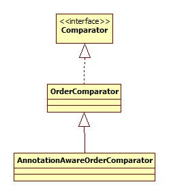

其作用是比较标注了@Order或是javax.annotation.Priority @Priority注解的元素的优先级。这两种注解的一个常用功能就是设置配置加载的优先级。例子可以参考:

[Spring 4.2新特性-使用@Order调整配置类加载顺序](http://www.tuicool.com/articles/VnqUv2)

### ContextAnnotationAutowireCandidateResolver

此类用以决定一个bean是否可以当作一个依赖的候选者。其类图:

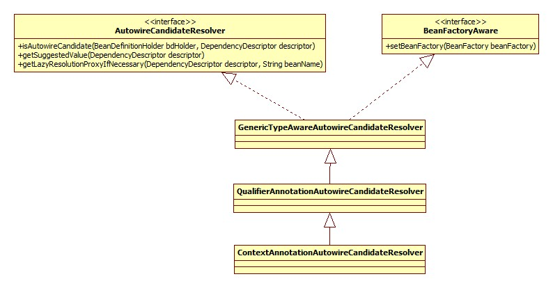

### ConfigurationClassPostProcessor

此类用于处理标注了@Configuration注解的类。类图:

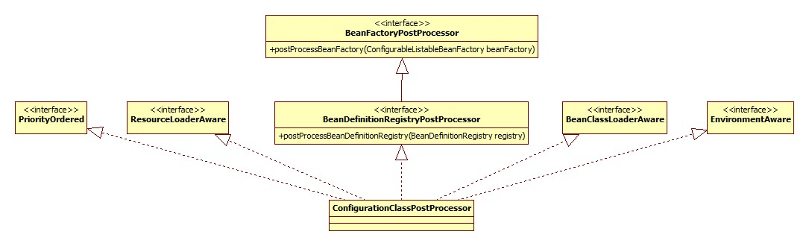

### AutowiredAnnotationBeanPostProcessor

此类便用于对标注了@Autowire等注解的bean或是方法进行注入。

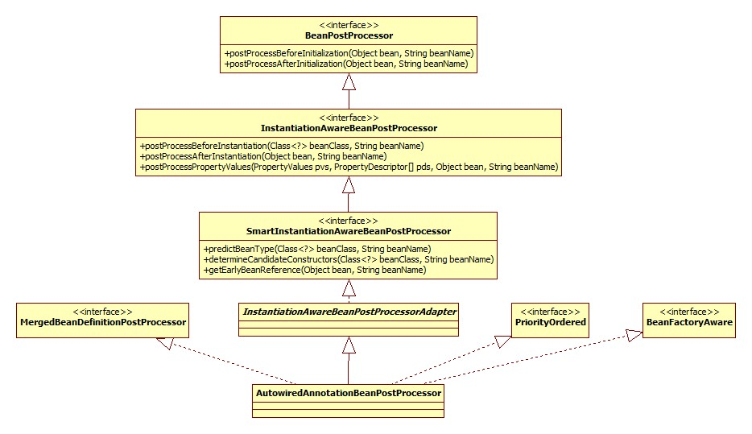

### RequiredAnnotationBeanPostProcessor

对应Spring @Require注解，此注解被用在setter方法上，意味着此setter方法对应的属性必须被Spring所注入，但是不会检查是否是null。其继承体系和上面的AutowiredAnnotationBeanPostProcessor完全一样。

### CommonAnnotationBeanPostProcessor

用于开启对JSR-250的支持，开启的先决条件是当前classpath中有其类，检测的源码:

```java
private static final boolean jsr250Present =
	ClassUtils.isPresent("javax.annotation.Resource", AnnotationConfigUtils.class.getClassLoader());
```

此注解就在rt.jar下，所以默认情况下都是开启JSR-250支持的，所以我们就可以使用喜闻乐见的@Resource注解了。其类图:

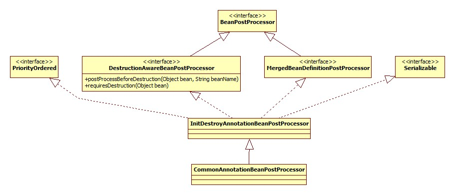

### PersistenceAnnotationBeanPostProcessor

用于提供JPA支持，开启的先决条件仍然是检测classpath下是否有其类存在，源码:

```java
private static final boolean jpaPresent =	
	ClassUtils.isPresent("javax.persistence.EntityManagerFactory", 
		AnnotationConfigUtils.class.getClassLoader()) &&
  	//org.springframework.orm包
	ClassUtils.isPresent(PERSISTENCE_ANNOTATION_PROCESSOR_CLASS_NAME, 
		AnnotationConfigUtils.class.getClassLoader());
```

rt.jar下面并没有JPA的包，所以此Processor默认是没有被注册的。其类图和上面CommonAnnotationBeanPostProcessor如出一辙。

### EventListenerMethodProcessor

提供对于注解@EventListener的支持，此注解在Spring4.2被添加，用于监听ApplicationEvent事件。其继承体系:

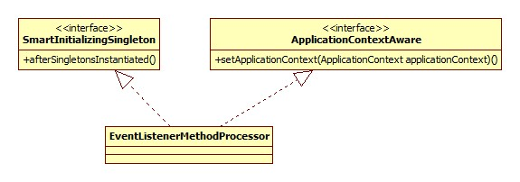

### DefaultEventListenerFactory

此类应该是和上面的配合使用，用以产生EventListener对象，也是从Spring4.2加入，类图:

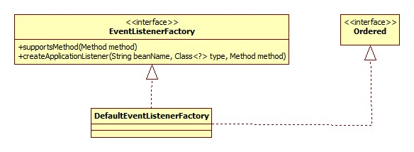

## 逻辑关系整理

普通的bean元素(XML)其实都有一个BeanDefinition对象与之对应，但是对于context开头的这种的特殊的元素，它所对应的一般不再是普通意义上的BeanDefinition，而是配合起来一起完成某种功能的组件(比如各种BeanPostProcessor)。这种组件Spring抽象成为ComponentDefinition接口，组件的集合表示成为CompositeComponentDefinition，类图:

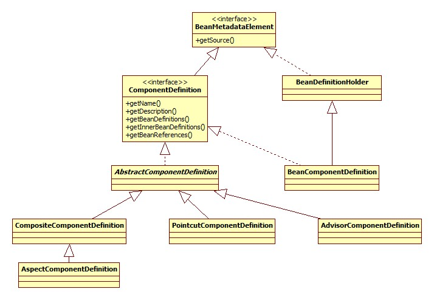

最终形成的数据结构如下图:

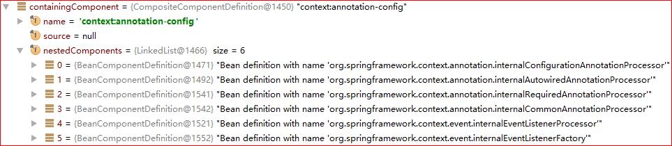

不过这个数据结构貌似也没什么用，因为调用的是XmlBeanDefinitionReader中的eventListener的componentRegistered方法，然而这里的eventListener是EmptyReaderEventListener，也就是空实现。

## 运行

### ConfigurationClassPostProcessor

本身是一个BeanFactoryPostProcessor对象，其执行入口在AbstractApplicationContext.refresh方法:

```java
invokeBeanFactoryPostProcessors(beanFactory);
```

注意，因为ConfigurationClassPostProcessor实现自BeanDefinitionRegistryPostProcessor接口，所以在此处会首先调用其postProcessBeanDefinitionRegistry方法，再调用其postProcessBeanFactory方法。

#### postProcessBeanDefinitionRegistry

此方法大体由两部分组成。

##### BeanPostProcessor注册

此部分源码:

```java
@Override
public void postProcessBeanDefinitionRegistry(BeanDefinitionRegistry registry) {
	RootBeanDefinition iabpp = new RootBeanDefinition(ImportAwareBeanPostProcessor.class);
	iabpp.setRole(BeanDefinition.ROLE_INFRASTRUCTURE);
	registry.registerBeanDefinition(IMPORT_AWARE_PROCESSOR_BEAN_NAME, iabpp);
	RootBeanDefinition ecbpp = new RootBeanDefinition(EnhancedConfigurationBeanPostProcessor.class);
	ecbpp.setRole(BeanDefinition.ROLE_INFRASTRUCTURE);
	registry.registerBeanDefinition(ENHANCED_CONFIGURATION_PROCESSOR_BEAN_NAME, ecbpp);
}
```

###### ImportAwareBeanPostProcessor

是ConfigurationClassPostProcessor的私有内部类。其类图:

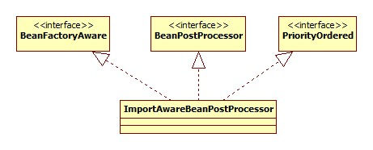

此类用于处理实现了ImportAware接口的类。ImportAware接口是做什么的要从使用java源文件作为Spring配置说起:

有一个类负责生成Student bean:

```java
@Configuration
public class StudentConfig implements ImportAware {
    @Bean
    public Student student() {
        Student student = new Student();
        student.setAge(22);
        student.setName("skywalker");
        return student;
    }
    @Override
    public void setImportMetadata(AnnotationMetadata importMetadata) {
        System.out.println("importaware");
    }
}
```

生成的bean就以所在的方法名命名。还有一个类负责生成SimpleBean:

```java
@Configuration
@Import(StudentConfig.class)
public class SimpleBeanConfig {
    @Autowired
    private StudentConfig studentConfig;
    @Bean
    public SimpleBean getSimpleBean() {
      	//bean依赖
        SimpleBean simpleBean = new SimpleBean(studentConfig.student());
        return simpleBean;
    }
}
```

启动代码:

```java
public static void main(String[] args) {
	AnnotationConfigApplicationContext context = 
		new AnnotationConfigApplicationContext(SimpleBeanConfig.class);
	SimpleBean simpleBean = context.getBean(SimpleBean.class);
	System.out.println(simpleBean.getStudent().getName());
}
```

所以ImportAware接口的作用就是**使被引用的配置类可以获得引用类的相关信息**。

###### EnhancedConfigurationBeanPostProcessor

用于为实现了EnhancedConfiguration接口的类设置BeanFactory对象，所有的@Configuration Cglib子类均实现了此接口，为什么要这么做不太明白。

##### 类解析

这里便是对标注了@Configuration注解的类及进行解析，通过调用ConfigurationClassPostProcessor的processConfigBeanDefinitions方法来实现，具体怎么解析就不详细说明了。

###### bean名字生成策略

对于配置类，Spring也会将其当作一个bean放到容器中，这就关系到bean的起名了，其实这部分对于@Component, @Controller等注解都是一样的。

ConfigurationClassPostProcessor.processConfigBeanDefinitions相关代码:

```java
// Detect any custom bean name generation strategy supplied through the enclosing application context
SingletonBeanRegistry singletonRegistry = null;
if (registry instanceof SingletonBeanRegistry) {
	singletonRegistry = (SingletonBeanRegistry) registry;
	if (!this.localBeanNameGeneratorSet && 
        //org.springframework.context.annotation.internalConfigurationBeanNameGenerator
		singletonRegistry.containsSingleton(CONFIGURATION_BEAN_NAME_GENERATOR)) {
			BeanNameGenerator generator = (BeanNameGenerator) singletonRegistry.
			getSingleton(CONFIGURATION_BEAN_NAME_GENERATOR);
		this.componentScanBeanNameGenerator = generator;
		this.importBeanNameGenerator = generator;
	}
}
```

默认是一个AnnotationBeanNameGenerator对象，其类图:

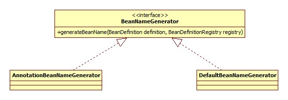

那我们可以通过向Spring容器添加一个自定义BeanNameGenerator对象的方式自定义beanName生成策略吗，答案是不可以，这也是为什么此bean的ID前面以internal开头。从代码上来看，不可以的原因在于BeanFactoryPostProcessor的触发时机: **配置解析、BeanDefinition加载之后，Singleton初始化之前**，所以即使配置了此接口的实现，但是此时此bean尚未初始化，所以根本看不到此实例。

#### postProcessBeanFactory

此方法调用了enhanceConfigurationClasses，其实就是将@Configuration的beanClass转换为CGLIB代理子类。简略版的源码:

```java
public void enhanceConfigurationClasses(ConfigurableListableBeanFactory beanFactory) {
	Map<String, AbstractBeanDefinition> configBeanDefs = 
		new LinkedHashMap<String, AbstractBeanDefinition>();
  	//寻找@Configuration的BeanDefinition
	for (String beanName : beanFactory.getBeanDefinitionNames()) {
		BeanDefinition beanDef = beanFactory.getBeanDefinition(beanName);
		if (ConfigurationClassUtils.isFullConfigurationClass(beanDef)) {
			configBeanDefs.put(beanName, (AbstractBeanDefinition) beanDef);
		}
	}
	if (configBeanDefs.isEmpty()) {
		// nothing to enhance -> return immediately
		return;
	}
	ConfigurationClassEnhancer enhancer = new ConfigurationClassEnhancer();
	for (Map.Entry<String, AbstractBeanDefinition> entry : configBeanDefs.entrySet()) {
		AbstractBeanDefinition beanDef = entry.getValue();
		// If a @Configuration class gets proxied, always proxy the target class
		beanDef.setAttribute(AutoProxyUtils.PRESERVE_TARGET_CLASS_ATTRIBUTE, Boolean.TRUE);
		// Set enhanced subclass of the user-specified bean class
		Class<?> configClass = beanDef.resolveBeanClass(this.beanClassLoader);
		Class<?> enhancedClass = enhancer.enhance(configClass, this.beanClassLoader);
		if (configClass != enhancedClass) {
          	 //替换
			beanDef.setBeanClass(enhancedClass);
		}
	}
}
```

ConfigurationClassEnhancer.newEnhancer:

```java
private Enhancer newEnhancer(Class<?> superclass, ClassLoader classLoader) {
	Enhancer enhancer = new Enhancer();
	enhancer.setSuperclass(superclass);
  	//这里印证了前面EnhancedConfigurationBeanPostProcessor的说明
	enhancer.setInterfaces(new Class<?>[] {EnhancedConfiguration.class});
	enhancer.setUseFactory(false);
	enhancer.setNamingPolicy(SpringNamingPolicy.INSTANCE);
	enhancer.setStrategy(new BeanFactoryAwareGeneratorStrategy(classLoader));
  	//关键
	enhancer.setCallbackFilter(CALLBACK_FILTER);
	enhancer.setCallbackTypes(CALLBACK_FILTER.getCallbackTypes());
	return enhancer;
}
```

CALLBACK_FILTER是个什么东西呢:

```java
private static final ConditionalCallbackFilter CALLBACK_FILTER = 
	new ConditionalCallbackFilter(CALLBACKS);

private static final Callback[] CALLBACKS = new Callback[] {
	new BeanMethodInterceptor(),
	new BeanFactoryAwareMethodInterceptor(),
	NoOp.INSTANCE
};
```

这么做的原因有两个:

- 提供Scope支持:

  我们可以使用@Scope注解来使用注解的方式配置其Scope:

  ```java
  @Bean
  @Scope("prototype")
  public Student student() {
  	Student student = new Student();
      student.setAge(22);
      student.setName("skywalker");
      return student;
  }
  ```

  Spring正是通过生成CGLIB子类的方式来提供Scope的语义。更确切的说，是上面源码里面的BeanMethodInterceptor。

- 实现EnhancedConfiguration接口

### AutowiredAnnotationBeanPostProcessor

类图见上面，由于Adapter的存在，真正实现的是postProcessMergedBeanDefinition和postProcessPropertyValues两个方法。

#### postProcessMergedBeanDefinition

##### 入口

其中前者首先被调用，时机是当BeanDefinition被合并(和父Bean)，但是还没有用来创建Bean实例时。回顾下其调用入口:

AbstractAutowireCapableBeanFactory.doCreateBean(简略):

```java
protected Object doCreateBean(final String beanName, final RootBeanDefinition mbd, final Object[] args) {
	// Instantiate the bean.
	BeanWrapper instanceWrapper = null;
	if (mbd.isSingleton()) {
		instanceWrapper = this.factoryBeanInstanceCache.remove(beanName);
	}
	if (instanceWrapper == null) {
		instanceWrapper = createBeanInstance(beanName, mbd, args);
	}
	final Object bean = (instanceWrapper != null ? instanceWrapper.getWrappedInstance() : null);
	Class<?> beanType = (instanceWrapper != null ? instanceWrapper.getWrappedClass() : null);
	// Allow post-processors to modify the merged bean definition.
	synchronized (mbd.postProcessingLock) {
		if (!mbd.postProcessed) {
			applyMergedBeanDefinitionPostProcessors(mbd, beanType, beanName);
			mbd.postProcessed = true;
		}
	}
}	
```

applyMergedBeanDefinitionPostProcessors:

```java
protected void applyMergedBeanDefinitionPostProcessors(RootBeanDefinition mbd, Class<?> beanType, 
	String beanName) {
	for (BeanPostProcessor bp : getBeanPostProcessors()) {
		if (bp instanceof MergedBeanDefinitionPostProcessor) {
			MergedBeanDefinitionPostProcessor bdp = (MergedBeanDefinitionPostProcessor) bp;
			bdp.postProcessMergedBeanDefinition(mbd, beanType, beanName);
		}
	}
}
```

##### 源码

```java
@Override
public void postProcessMergedBeanDefinition(RootBeanDefinition beanDefinition, Class<?> beanType, String 	 beanName) {
	if (beanType != null) {
		InjectionMetadata metadata = findAutowiringMetadata(beanName, beanType, null);
		metadata.checkConfigMembers(beanDefinition);
	}

}
```

findAutowiringMetadata:

```java
private InjectionMetadata findAutowiringMetadata(String beanName, Class<?> clazz, PropertyValues pvs) {
	// Fall back to class name as cache key, for backwards compatibility with custom callers.
	String cacheKey = (StringUtils.hasLength(beanName) ? beanName : clazz.getName());
	// Quick check on the concurrent map first, with minimal locking.
	InjectionMetadata metadata = this.injectionMetadataCache.get(cacheKey);
	if (InjectionMetadata.needsRefresh(metadata, clazz)) {
		synchronized (this.injectionMetadataCache) {
			metadata = this.injectionMetadataCache.get(cacheKey);
			if (InjectionMetadata.needsRefresh(metadata, clazz)) {
				if (metadata != null) {
					metadata.clear(pvs);
				}
				metadata = buildAutowiringMetadata(clazz);
				this.injectionMetadataCache.put(cacheKey, metadata);
			}
		}
	}
	return metadata;
}
```

injectionMetadataCache是一个ConcurrentHashMap对象，个人认为设置此缓存有以下几个原因:

- 假设有多线程同时调用针对某一个bean的getBean方法，那么这样可以保证只有一个线程执行一次@Autowire注解的扫描工作。
- 对于非singleton(比如prototype)类型的bean，这样同样可以保证只解析一次，防止做无用功。

可以看到，Spring使用了代价更小的ConcurrentHashMap来先做一个预检测，这样尽可能的减小锁的使用以及粒度，值得借鉴。

@Autowire注解的扫描在buildAutowiringMetadata方法:

```java
private InjectionMetadata buildAutowiringMetadata(final Class<?> clazz) {
	LinkedList<InjectionMetadata.InjectedElement> elements = 
		new LinkedList<InjectionMetadata.InjectedElement>();
	Class<?> targetClass = clazz;
  	//循环检测父类
	do {
		final LinkedList<InjectionMetadata.InjectedElement> currElements =
				new LinkedList<InjectionMetadata.InjectedElement>();
		ReflectionUtils.doWithLocalFields(targetClass, new ReflectionUtils.FieldCallback() {
			@Override
			public void doWith(Field field) throws IllegalArgumentException, IllegalAccessException {
				AnnotationAttributes ann = findAutowiredAnnotation(field);
				if (ann != null) {
                  	  //不支持静态变量
					if (Modifier.isStatic(field.getModifiers())) {
						return;
					}
					boolean required = determineRequiredStatus(ann);
					currElements.add(new AutowiredFieldElement(field, required));
				}
			}
		});
		ReflectionUtils.doWithLocalMethods(targetClass, new ReflectionUtils.MethodCallback() {
			@Override
			public void doWith(Method method) throws IllegalArgumentException, IllegalAccessException {
				Method bridgedMethod = BridgeMethodResolver.findBridgedMethod(method);
				if (!BridgeMethodResolver.isVisibilityBridgeMethodPair(method, bridgedMethod)) {
					return;
				}
				AnnotationAttributes ann = findAutowiredAnnotation(bridgedMethod);
				if (ann != null && method.equals(ClassUtils.getMostSpecificMethod(method, clazz))) {
					if (Modifier.isStatic(method.getModifiers())) {
						return;
					}
					if (method.getParameterTypes().length == 0) {
						if (logger.isWarnEnabled()) {
							logger.warn("Autowired annotation should be used on 
								methods with parameters: " + method);
						}
					}
					boolean required = determineRequiredStatus(ann);
					PropertyDescriptor pd = BeanUtils.findPropertyForMethod(bridgedMethod, clazz);
					currElements.add(new AutowiredMethodElement(method, required, pd));
				}
			}
		});
		elements.addAll(0, currElements);
		targetClass = targetClass.getSuperclass();
	}
	while (targetClass != null && targetClass != Object.class);
	return new InjectionMetadata(clazz, elements);
}
```

可以看出，Spring使用了一个do while循环来一直检测其父类，直到Object，这就说明，**Spring注入注解可以配置在此bean的父类上**。其实，最开始的时候网站的Service层和Dao层一直都是这么做的。

##### 变量扫描

之后便是逐一扫描当前类的成员变量，检测是否有@Autowire注解。

ReflectionUtils的实现其实就是访问者模式，其源码:

```java
public static void doWithLocalFields(Class<?> clazz, FieldCallback fc) {
	for (Field field : getDeclaredFields(clazz)) {
		try {
			fc.doWith(field);
		}
		catch (IllegalAccessException ex) {}
	}
}
```

determineRequiredStatus方法用以判断是否是必须的，所谓的必须是指: 如果容器里没有需要的bean，那么会抛出异常，否则就忽略了，默认是必须的。原理很简单，不说了。

##### 方法扫描

###### bridge方法

就是方法扫描的第一行源码:

```java
Method bridgedMethod = BridgeMethodResolver.findBridgedMethod(method);
```

此句代码的作用是**判断method是否是bridge方法，如果是，寻找其真正的方法。**这里的bridge方法并不是所谓的bridge模式。

有这样的demo代码:

```java
public class JavaTest {
    private class MyList extends ArrayList {
      	//注意父类的返回类型是Object
        @Override
        public String get(int index) {
            return "";
        }
    }
    public static void main(String[] args) {
        for (Method method : MyList.class.getDeclaredMethods()) {
            System.out.println("name: " + method.getName() + ", return: " + method.getReturnType());
        }
    }
}
```

子类重写父类的方法但是返回值不同在java语言里是合法的。此程序的输出:

```html
name: get, return: class java.lang.String
name: get, return: class java.lang.Object
```

通过javap反编译命令也可以看到有两个get方法。其中返回Object的便是bridge方法。jdk从1.5开始便提供了方法判断是否是此种方法: Method:

```java
/**
 * Returns {@code true} if this method is a bridge
 * method; returns {@code false} otherwise.
 *
 * @return true if and only if this method is a bridge
 * method as defined by the Java Language Specification.
 * @since 1.5
 */
public boolean isBridge() {
	return (getModifiers() & Modifier.BRIDGE) != 0;
}
```

可以看出，bridge和static之类一样，在java内部也是有一个修饰符的，只不过只在jvm内部可见。

可以参考: [Java那些不为人知的特殊方法](http://ifeve.com/syntethic-and-bridge-methods/)

到这里寻找真正方法的原理也好理解了，就是在所有Method中寻找方法名相同、参数列表相同但返回值不同的。

###### PropertyDescriptor

用于描述java bean，如果被标注@Autowire的方法是一个getter或setter方法，那么Spring会保存下来其PropertyDescriptor对象，如果不是，那么就是空。

#### postProcessPropertyValues

##### 入口

AbstractAutowireCapableBeanFactory.populateBean方法，执行时机是在bean的属性都已经计算(根据xml配置进行完autowire)完毕，设置到bean实例之前。

##### 注入

源码:

```java
public void processInjection(Object bean) throws BeansException {
	Class<?> clazz = bean.getClass();
  	 // 查找缓存
	InjectionMetadata metadata = findAutowiringMetadata(clazz.getName(), clazz, null);
	metadata.inject(bean, null, null);
}
```

根据上面postProcessMergedBeanDefinition一节的说明，解析的结果最终保存为一个InjectionMetadata对象，其内部含有一个InjectionMetadata.InjectedElement类型的List，所以注入的过程实际上便是遍历此List调用每一个InjectionMetadata.InjectedElement的inject的过程。

###### Field注入

实现类是AutowiredFieldElement。注入的原理就是从容器中查找相关的依赖，用反射的方法调用Field的set方法，不在详细说了。

###### 方法注入

实现类是AutowiredMethodElement。注入的原理是遍历此方法的参数列表，针对每一个参数都去容器中寻找相应的bean，之后调用Method的invoke方法即可。

### RequiredAnnotationBeanPostProcessor

上面提到了，此类的类图和上面的邻居类似，所以调用的方法的顺序、时机都是一样，所以不再赘述。

#### postProcessMergedBeanDefinition

空实现，就是这么任性:

```java
@Override
public void postProcessMergedBeanDefinition(RootBeanDefinition beanDefinition, Class<?> beanType, String 	beanName) {
}
```

#### postProcessPropertyValues

源码:

```java
@Override
public PropertyValues postProcessPropertyValues(
		PropertyValues pvs, PropertyDescriptor[] pds, Object bean, String beanName)
		throws BeansException {
	if (!this.validatedBeanNames.contains(beanName)) {
		if (!shouldSkip(this.beanFactory, beanName)) {
			List<String> invalidProperties = new ArrayList<String>();
			for (PropertyDescriptor pd : pds) {
				if (isRequiredProperty(pd) && !pvs.contains(pd.getName())) {
					invalidProperties.add(pd.getName());
				}
			}
			if (!invalidProperties.isEmpty()) {
				throw new BeanInitializationException(buildExceptionMessage
					(invalidProperties, beanName));
			}
		}
		this.validatedBeanNames.add(beanName);
	}
	return pvs;
}
```

##### 结果缓存

validatedBeanNames是一个Set<String>类型，对于已经检查过的bean，将其name加入Set，防止做无用功。

##### PropertyDescriptor

从源码可以看出，校验是通过PropertyDescriptor完成的，那么这个数组是从哪里来的呢?

AbstractAutowireCapableBeanFactory.populateBean相关代码:

```java
PropertyDescriptor[] filteredPds = filterPropertyDescriptorsForDependencyCheck(bw, mbd.allowCaching);
if (hasInstAwareBpps) {
	for (BeanPostProcessor bp : getBeanPostProcessors()) {
		if (bp instanceof InstantiationAwareBeanPostProcessor) {
			InstantiationAwareBeanPostProcessor ibp = (InstantiationAwareBeanPostProcessor) bp;
			pvs = ibp.postProcessPropertyValues(pvs, filteredPds, bw.getWrappedInstance(), beanName);
			if (pvs == null) {
				return;
			}
		}
	}
}
```

filterPropertyDescriptorsForDependencyCheck单参数方法:

```java
protected PropertyDescriptor[] filterPropertyDescriptorsForDependencyCheck(BeanWrapper bw) {
	List<PropertyDescriptor> pds =
			new LinkedList<PropertyDescriptor>(Arrays.asList(bw.getPropertyDescriptors()));
	for (Iterator<PropertyDescriptor> it = pds.iterator(); it.hasNext();) {
		PropertyDescriptor pd = it.next();
		if (isExcludedFromDependencyCheck(pd)) {
			it.remove();
		}
	}
	return pds.toArray(new PropertyDescriptor[pds.size()]);
}
```

可以看出，最终来自于BeanWrapper。那么BeanWrapper又是从哪里弄来的呢?

BeanWrapperImpl.getPropertyDescriptors:

```java
@Override
public PropertyDescriptor[] getPropertyDescriptors() {
	return getCachedIntrospectionResults().getPropertyDescriptors();
}
private CachedIntrospectionResults getCachedIntrospectionResults() {
	Assert.state(getWrappedInstance() != null, "BeanWrapper does not hold a bean instance");
	if (this.cachedIntrospectionResults == null) {
		this.cachedIntrospectionResults = CachedIntrospectionResults.forClass(getWrappedClass());
	}
	return this.cachedIntrospectionResults;
}
```

所以，这时BeanWrapper便会把自己"内省"一遍。这从侧面说明@Reqired注解只对setter方法有效。

##### 测试

有一个bean如下:

```java
@Component("simpleBean")
public class SimpleBean {
    @Autowired(required = false)
	private Student student;

    public SimpleBean() {}

	public SimpleBean(Student student) {
		this.student = student;
	}
	public Student getStudent() {
		return student;
	}
    @Required
	public void setStudent(Student student) {
		this.student = student;
	}
}
```

注意先关闭@Autowire的检测，否则用不到@Required注解便会报错。运行之后的结果:

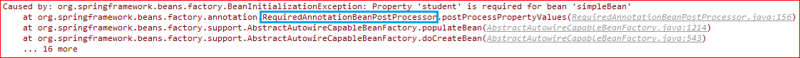

### CommonAnnotationBeanPostProcessor

从其类图可以看出，此类主要是整合了MergedBeanDefinitionPostProcessor和DestructionAwareBeanPostProcessor的功能

