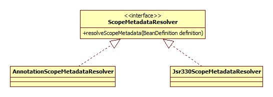
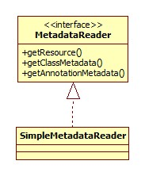
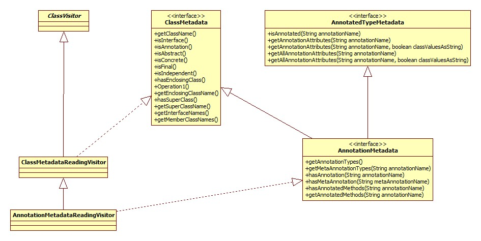
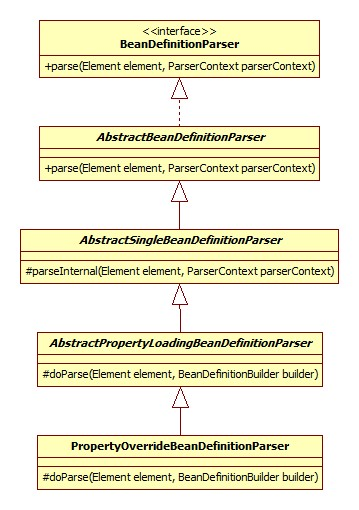
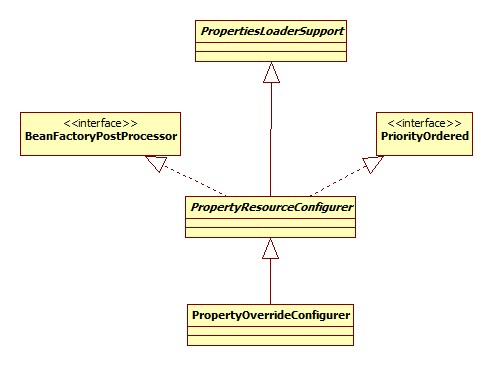
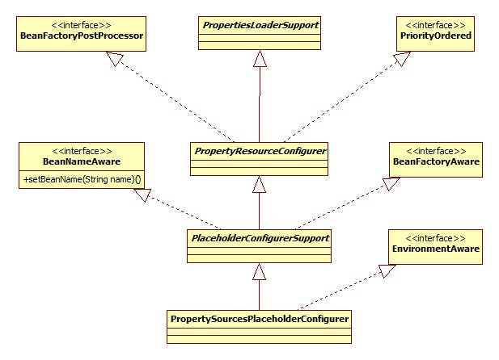

# 开头

入口方法在BeanDefinitionParserDelegate.parseCustomElement：

```java
return handler.parse(ele, new ParserContext(this.readerContext, this, containingBd));
```

parse方法由各种NamespaceHandler的父类NamespaceHandlerSupport实现:

```java
@Override
public BeanDefinition parse(Element element, ParserContext parserContext) {
	return findParserForElement(element, parserContext).parse(element, parserContext);
}
```

findParserForElement方法用以寻找适用于此元素的BeanDefinitionParser对象:

```java
private BeanDefinitionParser findParserForElement(Element element, ParserContext parserContext) {
	String localName = parserContext.getDelegate().getLocalName(element);
	BeanDefinitionParser parser = this.parsers.get(localName);
	if (parser == null) {
		parserContext.getReaderContext().fatal(
			"Cannot locate BeanDefinitionParser for element [" + localName + "]", element);
	}
	return parser;
}
```

localName是个什么东西呢，比如对于context:annotation-config标签就是annotation-config。

# annotation-config

AnnotationConfigBeanDefinitionParser.parse:

```java
@Override
public BeanDefinition parse(Element element, ParserContext parserContext) {
  	//返回null
	Object source = parserContext.extractSource(element);
	// Obtain bean definitions for all relevant BeanPostProcessors.
	Set<BeanDefinitionHolder> processorDefinitions =
			AnnotationConfigUtils.
				registerAnnotationConfigProcessors(parserContext.getRegistry(), source);
	// Register component for the surrounding <context:annotation-config> element.
	CompositeComponentDefinition compDefinition = 
		new CompositeComponentDefinition(element.getTagName(), source);
	parserContext.pushContainingComponent(compDefinition);
	// Nest the concrete beans in the surrounding component.
	for (BeanDefinitionHolder processorDefinition : processorDefinitions) {
		parserContext.registerComponent(new BeanComponentDefinition(processorDefinition));
	}
	// Finally register the composite component.
  	// 空实现
	parserContext.popAndRegisterContainingComponent();
	return null;
}
```
## BeanPostProcessor注册

AnnotationConfigUtils.registerAnnotationConfigProcessors源码:

```java
//第一个参数其实就是DefaultListableBeanFactory,第二个参数为null
public static Set<BeanDefinitionHolder> registerAnnotationConfigProcessors(
		BeanDefinitionRegistry registry, Object source) {
	//将registery强转为DefaultListableBeanFactory类型
	DefaultListableBeanFactory beanFactory = unwrapDefaultListableBeanFactory(registry);
	if (beanFactory != null) {
		if (!(beanFactory.getDependencyComparator() instanceof AnnotationAwareOrderComparator)) {
			beanFactory.setDependencyComparator(AnnotationAwareOrderComparator.INSTANCE);
		}
		if (!(beanFactory.getAutowireCandidateResolver() instanceof 
			ContextAnnotationAutowireCandidateResolver)) {
			beanFactory.setAutowireCandidateResolver(new ContextAnnotationAutowireCandidateResolver());
		}
	}

	Set<BeanDefinitionHolder> beanDefs = new LinkedHashSet<BeanDefinitionHolder>(4);

	if (!registry.containsBeanDefinition(CONFIGURATION_ANNOTATION_PROCESSOR_BEAN_NAME)) {
		RootBeanDefinition def = new RootBeanDefinition(ConfigurationClassPostProcessor.class);
		def.setSource(source);
		beanDefs.add(registerPostProcessor(registry, def,CONFIGURATION_ANNOTATION_PROCESSOR_BEAN_NAME));
	}

	if (!registry.containsBeanDefinition(AUTOWIRED_ANNOTATION_PROCESSOR_BEAN_NAME)) {
		RootBeanDefinition def = new RootBeanDefinition(AutowiredAnnotationBeanPostProcessor.class);
		def.setSource(source);
		beanDefs.add(registerPostProcessor(registry, def, AUTOWIRED_ANNOTATION_PROCESSOR_BEAN_NAME));
	}

	if (!registry.containsBeanDefinition(REQUIRED_ANNOTATION_PROCESSOR_BEAN_NAME)) {
		RootBeanDefinition def = new RootBeanDefinition(RequiredAnnotationBeanPostProcessor.class);
		def.setSource(source);
		beanDefs.add(registerPostProcessor(registry, def, REQUIRED_ANNOTATION_PROCESSOR_BEAN_NAME));
	}

	// Check for JSR-250 support, and if present add the CommonAnnotationBeanPostProcessor.
	if (jsr250Present && !registry.containsBeanDefinition(COMMON_ANNOTATION_PROCESSOR_BEAN_NAME)) {
		RootBeanDefinition def = new RootBeanDefinition(CommonAnnotationBeanPostProcessor.class);
		def.setSource(source);
		beanDefs.add(registerPostProcessor(registry, def, COMMON_ANNOTATION_PROCESSOR_BEAN_NAME));
	}

	// Check for JPA support, and if present add the PersistenceAnnotationBeanPostProcessor.
	if (jpaPresent && !registry.containsBeanDefinition(PERSISTENCE_ANNOTATION_PROCESSOR_BEAN_NAME)) {
		RootBeanDefinition def = new RootBeanDefinition();
		def.setBeanClass(ClassUtils.forName(PERSISTENCE_ANNOTATION_PROCESSOR_CLASS_NAME,
				AnnotationConfigUtils.class.getClassLoader()));
		def.setSource(source);
		beanDefs.add(registerPostProcessor(registry, def, PERSISTENCE_ANNOTATION_PROCESSOR_BEAN_NAME));
	}

	if (!registry.containsBeanDefinition(EVENT_LISTENER_PROCESSOR_BEAN_NAME)) {
		RootBeanDefinition def = new RootBeanDefinition(EventListenerMethodProcessor.class);
		def.setSource(source);
		beanDefs.add(registerPostProcessor(registry, def, EVENT_LISTENER_PROCESSOR_BEAN_NAME));
	}
	if (!registry.containsBeanDefinition(EVENT_LISTENER_FACTORY_BEAN_NAME)) {
		RootBeanDefinition def = new RootBeanDefinition(DefaultEventListenerFactory.class);
		def.setSource(source);
		beanDefs.add(registerPostProcessor(registry, def, EVENT_LISTENER_FACTORY_BEAN_NAME));
	}

	return beanDefs;
}
```

### AnnotationAwareOrderComparator

其继承体系如下:


其作用是比较标注了@Order或是javax.annotation.Priority @Priority注解的元素的优先级。这两种注解的一个常用功能就是设置配置加载的优先级。例子可以参考:

[Spring 4.2新特性-使用@Order调整配置类加载顺序](http://www.tuicool.com/articles/VnqUv2)

### ContextAnnotationAutowireCandidateResolver

此类用以决定一个bean是否可以当作一个依赖的候选者。其类图:


### ConfigurationClassPostProcessor

此类用于处理标注了@Configuration注解的类。类图:


### AutowiredAnnotationBeanPostProcessor

此类便用于对标注了@Autowire等注解的bean或是方法进行注入。


### RequiredAnnotationBeanPostProcessor

对应Spring @Require注解，此注解被用在setter方法上，意味着此setter方法对应的属性必须被Spring所注入，但是不会检查是否是null。其继承体系和上面的AutowiredAnnotationBeanPostProcessor完全一样。

### CommonAnnotationBeanPostProcessor

用于开启对JSR-250的支持，开启的先决条件是当前classpath中有其类，检测的源码:

```java
private static final boolean jsr250Present =
	ClassUtils.isPresent("javax.annotation.Resource", AnnotationConfigUtils.class.getClassLoader());
```

此注解就在rt.jar下，所以默认情况下都是开启JSR-250支持的，所以我们就可以使用喜闻乐见的@Resource注解了。其类图:


### PersistenceAnnotationBeanPostProcessor

用于提供JPA支持，开启的先决条件仍然是检测classpath下是否有其类存在，源码:

```java
private static final boolean jpaPresent =	
	ClassUtils.isPresent("javax.persistence.EntityManagerFactory", 
		AnnotationConfigUtils.class.getClassLoader()) &&
  	//org.springframework.orm包
	ClassUtils.isPresent(PERSISTENCE_ANNOTATION_PROCESSOR_CLASS_NAME, 
		AnnotationConfigUtils.class.getClassLoader());
```

rt.jar下面并没有JPA的包，所以此Processor默认是没有被注册的。其类图和上面CommonAnnotationBeanPostProcessor如出一辙。

### EventListenerMethodProcessor

提供对于注解@EventListener的支持，此注解在Spring4.2被添加，用于监听ApplicationEvent事件。其继承体系:


### DefaultEventListenerFactory

此类应该是和上面的配合使用，用以产生EventListener对象，也是从Spring4.2加入，类图:


## 逻辑关系整理

普通的bean元素(XML)其实都有一个BeanDefinition对象与之对应，但是对于context开头的这种的特殊的元素，它所对应的一般不再是普通意义上的BeanDefinition，而是配合起来一起完成某种功能的组件(比如各种BeanPostProcessor)。这种组件Spring抽象成为ComponentDefinition接口，组件的集合表示成为CompositeComponentDefinition，类图:


最终形成的数据结构如下图:


不过这个数据结构貌似也没什么用，因为调用的是XmlBeanDefinitionReader中的eventListener的componentRegistered方法，然而这里的eventListener是EmptyReaderEventListener，也就是空实现。

## 运行

### ConfigurationClassPostProcessor

本身是一个BeanFactoryPostProcessor对象，其执行入口在AbstractApplicationContext.refresh方法:

```java
invokeBeanFactoryPostProcessors(beanFactory);
```

注意，因为ConfigurationClassPostProcessor实现自BeanDefinitionRegistryPostProcessor接口，所以在此处会首先调用其postProcessBeanDefinitionRegistry方法，再调用其postProcessBeanFactory方法。

#### postProcessBeanDefinitionRegistry

此方法大体由两部分组成。

##### BeanPostProcessor注册

此部分源码:

```java
@Override
public void postProcessBeanDefinitionRegistry(BeanDefinitionRegistry registry) {
	RootBeanDefinition iabpp = new RootBeanDefinition(ImportAwareBeanPostProcessor.class);
	iabpp.setRole(BeanDefinition.ROLE_INFRASTRUCTURE);
	registry.registerBeanDefinition(IMPORT_AWARE_PROCESSOR_BEAN_NAME, iabpp);
	RootBeanDefinition ecbpp = new RootBeanDefinition(EnhancedConfigurationBeanPostProcessor.class);
	ecbpp.setRole(BeanDefinition.ROLE_INFRASTRUCTURE);
	registry.registerBeanDefinition(ENHANCED_CONFIGURATION_PROCESSOR_BEAN_NAME, ecbpp);
}
```

###### ImportAwareBeanPostProcessor

是ConfigurationClassPostProcessor的私有内部类。其类图:


此类用于处理实现了ImportAware接口的类。ImportAware接口是做什么的要从使用java源文件作为Spring配置说起:

有一个类负责生成Student bean:

```java
@Configuration
public class StudentConfig implements ImportAware {
    @Bean
    public Student student() {
        Student student = new Student();
        student.setAge(22);
        student.setName("skywalker");
        return student;
    }
    @Override
    public void setImportMetadata(AnnotationMetadata importMetadata) {
        System.out.println("importaware");
    }
}
```

生成的bean就以所在的方法名命名。还有一个类负责生成SimpleBean:

```java
@Configuration
@Import(StudentConfig.class)
public class SimpleBeanConfig {
    @Autowired
    private StudentConfig studentConfig;
    @Bean
    public SimpleBean getSimpleBean() {
      	//bean依赖
        SimpleBean simpleBean = new SimpleBean(studentConfig.student());
        return simpleBean;
    }
}
```

启动代码:

```java
public static void main(String[] args) {
	AnnotationConfigApplicationContext context = 
		new AnnotationConfigApplicationContext(SimpleBeanConfig.class);
	SimpleBean simpleBean = context.getBean(SimpleBean.class);
	System.out.println(simpleBean.getStudent().getName());
}
```

所以ImportAware接口的作用就是**使被引用的配置类可以获得引用类的相关信息**。

###### EnhancedConfigurationBeanPostProcessor

用于为实现了EnhancedConfiguration接口的类设置BeanFactory对象，所有的@Configuration Cglib子类均实现了此接口，为什么要这么做不太明白。

##### 类解析

这里便是对标注了@Configuration注解的类及进行解析，通过调用ConfigurationClassPostProcessor的processConfigBeanDefinitions方法来实现，具体怎么解析就不详细说明了。

###### bean名字生成策略

对于配置类，Spring也会将其当作一个bean放到容器中，这就关系到bean的起名了，其实这部分对于@Component, @Controller等注解都是一样的。

ConfigurationClassPostProcessor.processConfigBeanDefinitions相关代码:

```java
// Detect any custom bean name generation strategy supplied through the enclosing application context
SingletonBeanRegistry singletonRegistry = null;
if (registry instanceof SingletonBeanRegistry) {
	singletonRegistry = (SingletonBeanRegistry) registry;
	if (!this.localBeanNameGeneratorSet && 
        //org.springframework.context.annotation.internalConfigurationBeanNameGenerator
		singletonRegistry.containsSingleton(CONFIGURATION_BEAN_NAME_GENERATOR)) {
			BeanNameGenerator generator = (BeanNameGenerator) singletonRegistry.
			getSingleton(CONFIGURATION_BEAN_NAME_GENERATOR);
		this.componentScanBeanNameGenerator = generator;
		this.importBeanNameGenerator = generator;
	}
}
```

默认是一个AnnotationBeanNameGenerator对象，其类图:


那我们可以通过向Spring容器添加一个自定义BeanNameGenerator对象的方式自定义beanName生成策略吗，答案是不可以，这也是为什么此bean的ID前面以internal开头。从代码上来看，不可以的原因在于BeanFactoryPostProcessor的触发时机: **配置解析、BeanDefinition加载之后，Singleton初始化之前**，所以即使配置了此接口的实现，但是此时此bean尚未初始化，所以根本看不到此实例。

#### postProcessBeanFactory

此方法调用了enhanceConfigurationClasses，其实就是将@Configuration的beanClass转换为CGLIB代理子类。简略版的源码:

```java
public void enhanceConfigurationClasses(ConfigurableListableBeanFactory beanFactory) {
	Map<String, AbstractBeanDefinition> configBeanDefs = 
		new LinkedHashMap<String, AbstractBeanDefinition>();
  	//寻找@Configuration的BeanDefinition
	for (String beanName : beanFactory.getBeanDefinitionNames()) {
		BeanDefinition beanDef = beanFactory.getBeanDefinition(beanName);
		if (ConfigurationClassUtils.isFullConfigurationClass(beanDef)) {
			configBeanDefs.put(beanName, (AbstractBeanDefinition) beanDef);
		}
	}
	if (configBeanDefs.isEmpty()) {
		// nothing to enhance -> return immediately
		return;
	}
	ConfigurationClassEnhancer enhancer = new ConfigurationClassEnhancer();
	for (Map.Entry<String, AbstractBeanDefinition> entry : configBeanDefs.entrySet()) {
		AbstractBeanDefinition beanDef = entry.getValue();
		// If a @Configuration class gets proxied, always proxy the target class
		beanDef.setAttribute(AutoProxyUtils.PRESERVE_TARGET_CLASS_ATTRIBUTE, Boolean.TRUE);
		// Set enhanced subclass of the user-specified bean class
		Class<?> configClass = beanDef.resolveBeanClass(this.beanClassLoader);
		Class<?> enhancedClass = enhancer.enhance(configClass, this.beanClassLoader);
		if (configClass != enhancedClass) {
          	 //替换
			beanDef.setBeanClass(enhancedClass);
		}
	}
}
```

ConfigurationClassEnhancer.newEnhancer:

```java
private Enhancer newEnhancer(Class<?> superclass, ClassLoader classLoader) {
	Enhancer enhancer = new Enhancer();
	enhancer.setSuperclass(superclass);
  	//这里印证了前面EnhancedConfigurationBeanPostProcessor的说明
	enhancer.setInterfaces(new Class<?>[] {EnhancedConfiguration.class});
	enhancer.setUseFactory(false);
	enhancer.setNamingPolicy(SpringNamingPolicy.INSTANCE);
	enhancer.setStrategy(new BeanFactoryAwareGeneratorStrategy(classLoader));
  	//关键
	enhancer.setCallbackFilter(CALLBACK_FILTER);
	enhancer.setCallbackTypes(CALLBACK_FILTER.getCallbackTypes());
	return enhancer;
}
```

CALLBACK_FILTER是个什么东西呢:

```java
private static final ConditionalCallbackFilter CALLBACK_FILTER = 
	new ConditionalCallbackFilter(CALLBACKS);

private static final Callback[] CALLBACKS = new Callback[] {
	new BeanMethodInterceptor(),
	new BeanFactoryAwareMethodInterceptor(),
	NoOp.INSTANCE
};
```

这么做的原因有两个:

- 提供Scope支持:

  我们可以使用@Scope注解来使用注解的方式配置其Scope:

  ```java
  @Bean
  @Scope("prototype")
  public Student student() {
  	Student student = new Student();
      student.setAge(22);
      student.setName("skywalker");
      return student;
  }
  ```

  Spring正是通过生成CGLIB子类的方式来提供Scope的语义。更确切的说，是上面源码里面的BeanMethodInterceptor。

- 实现EnhancedConfiguration接口

### AutowiredAnnotationBeanPostProcessor

类图见上面，由于Adapter的存在，真正实现的是postProcessMergedBeanDefinition和postProcessPropertyValues两个方法。

#### postProcessMergedBeanDefinition

##### 入口

其中前者首先被调用，时机是当BeanDefinition被合并(和父Bean)，但是还没有用来创建Bean实例时。回顾下其调用入口:

AbstractAutowireCapableBeanFactory.doCreateBean(简略):

```java
protected Object doCreateBean(final String beanName, final RootBeanDefinition mbd, final Object[] args) {
	// Instantiate the bean.
	BeanWrapper instanceWrapper = null;
	if (mbd.isSingleton()) {
		instanceWrapper = this.factoryBeanInstanceCache.remove(beanName);
	}
	if (instanceWrapper == null) {
		instanceWrapper = createBeanInstance(beanName, mbd, args);
	}
	final Object bean = (instanceWrapper != null ? instanceWrapper.getWrappedInstance() : null);
	Class<?> beanType = (instanceWrapper != null ? instanceWrapper.getWrappedClass() : null);
	// Allow post-processors to modify the merged bean definition.
	synchronized (mbd.postProcessingLock) {
		if (!mbd.postProcessed) {
			applyMergedBeanDefinitionPostProcessors(mbd, beanType, beanName);
			mbd.postProcessed = true;
		}
	}
}	
```

applyMergedBeanDefinitionPostProcessors:

```java
protected void applyMergedBeanDefinitionPostProcessors(RootBeanDefinition mbd, Class<?> beanType, 
	String beanName) {
	for (BeanPostProcessor bp : getBeanPostProcessors()) {
		if (bp instanceof MergedBeanDefinitionPostProcessor) {
			MergedBeanDefinitionPostProcessor bdp = (MergedBeanDefinitionPostProcessor) bp;
			bdp.postProcessMergedBeanDefinition(mbd, beanType, beanName);
		}
	}
}
```

##### 源码

```java
@Override
public void postProcessMergedBeanDefinition(RootBeanDefinition beanDefinition, Class<?> beanType, String 	 beanName) {
	if (beanType != null) {
		InjectionMetadata metadata = findAutowiringMetadata(beanName, beanType, null);
		metadata.checkConfigMembers(beanDefinition);
	}

}
```

findAutowiringMetadata:

```java
private InjectionMetadata findAutowiringMetadata(String beanName, Class<?> clazz, PropertyValues pvs) {
	// Fall back to class name as cache key, for backwards compatibility with custom callers.
	String cacheKey = (StringUtils.hasLength(beanName) ? beanName : clazz.getName());
	// Quick check on the concurrent map first, with minimal locking.
	InjectionMetadata metadata = this.injectionMetadataCache.get(cacheKey);
	if (InjectionMetadata.needsRefresh(metadata, clazz)) {
		synchronized (this.injectionMetadataCache) {
			metadata = this.injectionMetadataCache.get(cacheKey);
			if (InjectionMetadata.needsRefresh(metadata, clazz)) {
				if (metadata != null) {
					metadata.clear(pvs);
				}
				metadata = buildAutowiringMetadata(clazz);
				this.injectionMetadataCache.put(cacheKey, metadata);
			}
		}
	}
	return metadata;
}
```

injectionMetadataCache是一个ConcurrentHashMap对象，个人认为设置此缓存有以下几个原因:

- 假设有多线程同时调用针对某一个bean的getBean方法，那么这样可以保证只有一个线程执行一次@Autowire注解的扫描工作。
- 对于非singleton(比如prototype)类型的bean，这样同样可以保证只解析一次，防止做无用功。

可以看到，Spring使用了代价更小的ConcurrentHashMap来先做一个预检测，这样尽可能的减小锁的使用以及粒度，值得借鉴。

@Autowire注解的扫描在buildAutowiringMetadata方法:

```java
private InjectionMetadata buildAutowiringMetadata(final Class<?> clazz) {
	LinkedList<InjectionMetadata.InjectedElement> elements = 
		new LinkedList<InjectionMetadata.InjectedElement>();
	Class<?> targetClass = clazz;
  	//循环检测父类
	do {
		final LinkedList<InjectionMetadata.InjectedElement> currElements =
				new LinkedList<InjectionMetadata.InjectedElement>();
		ReflectionUtils.doWithLocalFields(targetClass, new ReflectionUtils.FieldCallback() {
			@Override
			public void doWith(Field field) throws IllegalArgumentException, IllegalAccessException {
				AnnotationAttributes ann = findAutowiredAnnotation(field);
				if (ann != null) {
                  	  //不支持静态变量
					if (Modifier.isStatic(field.getModifiers())) {
						return;
					}
					boolean required = determineRequiredStatus(ann);
					currElements.add(new AutowiredFieldElement(field, required));
				}
			}
		});
		ReflectionUtils.doWithLocalMethods(targetClass, new ReflectionUtils.MethodCallback() {
			@Override
			public void doWith(Method method) throws IllegalArgumentException, IllegalAccessException {
				Method bridgedMethod = BridgeMethodResolver.findBridgedMethod(method);
				if (!BridgeMethodResolver.isVisibilityBridgeMethodPair(method, bridgedMethod)) {
					return;
				}
				AnnotationAttributes ann = findAutowiredAnnotation(bridgedMethod);
				if (ann != null && method.equals(ClassUtils.getMostSpecificMethod(method, clazz))) {
					if (Modifier.isStatic(method.getModifiers())) {
						return;
					}
					if (method.getParameterTypes().length == 0) {
						if (logger.isWarnEnabled()) {
							logger.warn("Autowired annotation should be used on 
								methods with parameters: " + method);
						}
					}
					boolean required = determineRequiredStatus(ann);
					PropertyDescriptor pd = BeanUtils.findPropertyForMethod(bridgedMethod, clazz);
					currElements.add(new AutowiredMethodElement(method, required, pd));
				}
			}
		});
		elements.addAll(0, currElements);
		targetClass = targetClass.getSuperclass();
	}
	while (targetClass != null && targetClass != Object.class);
	return new InjectionMetadata(clazz, elements);
}
```

可以看出，Spring使用了一个do while循环来一直检测其父类，直到Object，这就说明，**Spring注入注解可以配置在此bean的父类上**。其实，最开始的时候网站的Service层和Dao层一直都是这么做的。

##### 变量扫描

之后便是逐一扫描当前类的成员变量，检测是否有@Autowire注解。

ReflectionUtils的实现其实就是访问者模式，其源码:

```java
public static void doWithLocalFields(Class<?> clazz, FieldCallback fc) {
	for (Field field : getDeclaredFields(clazz)) {
		try {
			fc.doWith(field);
		}
		catch (IllegalAccessException ex) {}
	}
}
```

determineRequiredStatus方法用以判断是否是必须的，所谓的必须是指: 如果容器里没有需要的bean，那么会抛出异常，否则就忽略了，默认是必须的。原理很简单，不说了。

##### 方法扫描

###### bridge方法

就是方法扫描的第一行源码:

```java
Method bridgedMethod = BridgeMethodResolver.findBridgedMethod(method);
```

此句代码的作用是**判断method是否是bridge方法，如果是，寻找其真正的方法。**这里的bridge方法并不是所谓的bridge模式。

有这样的demo代码:

```java
public class JavaTest {
    private class MyList extends ArrayList {
      	//注意父类的返回类型是Object
        @Override
        public String get(int index) {
            return "";
        }
    }
    public static void main(String[] args) {
        for (Method method : MyList.class.getDeclaredMethods()) {
            System.out.println("name: " + method.getName() + ", return: " + method.getReturnType());
        }
    }
}
```

子类重写父类的方法但是返回值不同在java语言里是合法的。此程序的输出:

```html
name: get, return: class java.lang.String
name: get, return: class java.lang.Object
```

通过javap反编译命令也可以看到有两个get方法。其中返回Object的便是bridge方法。jdk从1.5开始便提供了方法判断是否是此种方法: Method:

```java
/**
 * Returns {@code true} if this method is a bridge
 * method; returns {@code false} otherwise.
 *
 * @return true if and only if this method is a bridge
 * method as defined by the Java Language Specification.
 * @since 1.5
 */
public boolean isBridge() {
	return (getModifiers() & Modifier.BRIDGE) != 0;
}
```

可以看出，bridge和static之类一样，在java内部也是有一个修饰符的，只不过只在jvm内部可见。

可以参考: [Java那些不为人知的特殊方法](http://ifeve.com/syntethic-and-bridge-methods/)

到这里寻找真正方法的原理也好理解了，就是在所有Method中寻找方法名相同、参数列表相同但返回值不同的。

###### PropertyDescriptor

用于描述java bean，如果被标注@Autowire的方法是一个getter或setter方法，那么Spring会保存下来其PropertyDescriptor对象，如果不是，那么就是空。

#### postProcessPropertyValues

##### 入口

AbstractAutowireCapableBeanFactory.populateBean方法，执行时机是在bean的属性都已经计算(根据xml配置进行完autowire)完毕，设置到bean实例之前。

##### 注入

源码:

```java
public void processInjection(Object bean) throws BeansException {
	Class<?> clazz = bean.getClass();
  	 // 查找缓存
	InjectionMetadata metadata = findAutowiringMetadata(clazz.getName(), clazz, null);
	metadata.inject(bean, null, null);
}
```

根据上面postProcessMergedBeanDefinition一节的说明，解析的结果最终保存为一个InjectionMetadata对象，其内部含有一个InjectionMetadata.InjectedElement类型的List，所以注入的过程实际上便是遍历此List调用每一个InjectionMetadata.InjectedElement的inject的过程。

###### Field注入

实现类是AutowiredFieldElement。注入的原理就是从容器中查找相关的依赖，用反射的方法调用Field的set方法，不在详细说了。

###### 方法注入

实现类是AutowiredMethodElement。注入的原理是遍历此方法的参数列表，针对每一个参数都去容器中寻找相应的bean，之后调用Method的invoke方法即可。

### RequiredAnnotationBeanPostProcessor

上面提到了，此类的类图和上面的邻居类似，所以调用的方法的顺序、时机都是一样，所以不再赘述。

#### postProcessMergedBeanDefinition

空实现，就是这么任性:

```java
@Override
public void postProcessMergedBeanDefinition(RootBeanDefinition beanDefinition, Class<?> beanType, String 	beanName) {
}
```

#### postProcessPropertyValues

源码:

```java
@Override
public PropertyValues postProcessPropertyValues(
		PropertyValues pvs, PropertyDescriptor[] pds, Object bean, String beanName)
		throws BeansException {
	if (!this.validatedBeanNames.contains(beanName)) {
		if (!shouldSkip(this.beanFactory, beanName)) {
			List<String> invalidProperties = new ArrayList<String>();
			for (PropertyDescriptor pd : pds) {
				if (isRequiredProperty(pd) && !pvs.contains(pd.getName())) {
					invalidProperties.add(pd.getName());
				}
			}
			if (!invalidProperties.isEmpty()) {
				throw new BeanInitializationException(buildExceptionMessage
					(invalidProperties, beanName));
			}
		}
		this.validatedBeanNames.add(beanName);
	}
	return pvs;
}
```

##### 结果缓存

validatedBeanNames是一个Set<String>类型，对于已经检查过的bean，将其name加入Set，防止做无用功。

##### PropertyDescriptor

从源码可以看出，校验是通过PropertyDescriptor完成的，那么这个数组是从哪里来的呢?

AbstractAutowireCapableBeanFactory.populateBean相关代码:

```java
PropertyDescriptor[] filteredPds = filterPropertyDescriptorsForDependencyCheck(bw, mbd.allowCaching);
if (hasInstAwareBpps) {
	for (BeanPostProcessor bp : getBeanPostProcessors()) {
		if (bp instanceof InstantiationAwareBeanPostProcessor) {
			InstantiationAwareBeanPostProcessor ibp = (InstantiationAwareBeanPostProcessor) bp;
			pvs = ibp.postProcessPropertyValues(pvs, filteredPds, bw.getWrappedInstance(), beanName);
			if (pvs == null) {
				return;
			}
		}
	}
}
```

filterPropertyDescriptorsForDependencyCheck单参数方法:

```java
protected PropertyDescriptor[] filterPropertyDescriptorsForDependencyCheck(BeanWrapper bw) {
	List<PropertyDescriptor> pds =
			new LinkedList<PropertyDescriptor>(Arrays.asList(bw.getPropertyDescriptors()));
	for (Iterator<PropertyDescriptor> it = pds.iterator(); it.hasNext();) {
		PropertyDescriptor pd = it.next();
		if (isExcludedFromDependencyCheck(pd)) {
			it.remove();
		}
	}
	return pds.toArray(new PropertyDescriptor[pds.size()]);
}
```

可以看出，最终来自于BeanWrapper。那么BeanWrapper又是从哪里弄来的呢?

BeanWrapperImpl.getPropertyDescriptors:

```java
@Override
public PropertyDescriptor[] getPropertyDescriptors() {
	return getCachedIntrospectionResults().getPropertyDescriptors();
}
private CachedIntrospectionResults getCachedIntrospectionResults() {
	Assert.state(getWrappedInstance() != null, "BeanWrapper does not hold a bean instance");
	if (this.cachedIntrospectionResults == null) {
		this.cachedIntrospectionResults = CachedIntrospectionResults.forClass(getWrappedClass());
	}
	return this.cachedIntrospectionResults;
}
```

所以，这时BeanWrapper便会把自己"内省"一遍。这从侧面说明@Reqired注解只对setter方法有效。

##### 测试

有一个bean如下:

```java
@Component("simpleBean")
public class SimpleBean {
    @Autowired(required = false)
	private Student student;

    public SimpleBean() {}

	public SimpleBean(Student student) {
		this.student = student;
	}
	public Student getStudent() {
		return student;
	}
    @Required
	public void setStudent(Student student) {
		this.student = student;
	}
}
```

注意先关闭@Autowire的检测，否则用不到@Required注解便会报错。运行之后的结果:


### CommonAnnotationBeanPostProcessor

从其类图可以看出，此类主要是整合了MergedBeanDefinitionPostProcessor和DestructionAwareBeanPostProcessor的功能。其功能体现在以下几个方法，按调用顺序进行说明。

#### postProcessMergedBeanDefinition

此方法的执行入口以及调用时机上面已经说过了。其源码:

```java
@Override
public void postProcessMergedBeanDefinition(RootBeanDefinition beanDefinition, Class<?> beanType, String 	 beanName) {
	super.postProcessMergedBeanDefinition(beanDefinition, beanType, beanName);
	if (beanType != null) {
		InjectionMetadata metadata = findResourceMetadata(beanName, beanType, null);
		metadata.checkConfigMembers(beanDefinition);
	}
}
```

##### 父类

可以看出，首先调用了其父类InitDestroyAnnotationBeanPostProcessor的postProcessMergedBeanDefinition方法，源码:

```java
@Override
public void postProcessMergedBeanDefinition(RootBeanDefinition beanDefinition, Class<?> beanType, String 	 beanName) {
	if (beanType != null) {
		LifecycleMetadata metadata = findLifecycleMetadata(beanType);
		metadata.checkConfigMembers(beanDefinition);
	}
}
```

findLifecycleMetadata的套路和上面运行-AutowiredAnnotationBeanPostProcessor-源码一节中所说完全一样，所不同的是此处是**遍历所有method寻找初始化和销毁方法标记**。这两个标记很有意思，Spring允许我们自定义是哪两个标记(getter/setter方法)。子类CommonAnnotationBeanPostProcessor在构造器中设置了其值:

```java
public CommonAnnotationBeanPostProcessor() {
	setInitAnnotationType(PostConstruct.class);
	setDestroyAnnotationType(PreDestroy.class);
}
```

这两个标签来自于javax.annotation包。那么怎么自定义呢?

CommonAnnotationBeanPostProcessor本质上是一个BeanPostProcessor，所以我们可以自己注入，配置文件:

```xml
<bean class="org.springframework.context.annotation.CommonAnnotationBeanPostProcessor">
	<property name="initAnnotationType" value="annotation.Init" />
</bean>
```

Init是一个很简单的自定义注解:

```java
@Retention(RetentionPolicy.RUNTIME)
@Target(ElementType.METHOD)
public @interface Init {}
```

在自己的bean中使用此注解:

```java
@Init
public void init() {
	System.out.println("Init!");
}
```

运行Spring便可以看到效果。

另外注意一点，从前面annotation-config-BeanPostProcessor注册一节的源码中可以看出，**Spring在向容器中添加CommonAnnotationBeanPostProcessor时只是检测其ID(org.springframework.context.annotation.internalCommonAnnotationProcessor)是否存在，这就造成了一个问题: 如果按上面所说的配置，那么在容器中实际上有两个CommonAnnotationProcessor存在，也就是说，@PostConstruct和@PreDestroy注解此时依然被支持**。为了达到只有一个实例的目的，需要为前面的配置加上ID。

##### 子类

findResourceMetadata的套路还是一样，就是在属性和方法上寻找@Resource标签。

#### postProcessPropertyValues

源码:

```java
@Override
public PropertyValues postProcessPropertyValues(
		PropertyValues pvs, PropertyDescriptor[] pds, Object bean, String beanName) {
	InjectionMetadata metadata = findResourceMetadata(beanName, bean.getClass(), pvs);
	metadata.inject(bean, beanName, pvs);
	return pvs;
}
```

套路很明显了。

#### postProcessBeforeInitialization

实现在父类InitDestroyAnnotationBeanPostProcessor：

```java
@Override
public Object postProcessBeforeInitialization(Object bean, String beanName) {
	LifecycleMetadata metadata = findLifecycleMetadata(bean.getClass());
	metadata.invokeInitMethods(bean, beanName);
	return bean;
}
```

invokeInitMethods:

```java
public void invokeInitMethods(Object target, String beanName) throws Throwable {
	Collection<LifecycleElement> initMethodsToIterate =
			(this.checkedInitMethods != null ? this.checkedInitMethods : this.initMethods);
	if (!initMethodsToIterate.isEmpty()) {
		for (LifecycleElement element : initMethodsToIterate) {
          	 // 反射调用
			element.invoke(target);
		}
	}
}
```

不过从源码来看应该支持多个init方法。

#### postProcessBeforeDestruction

反射调用销毁方法，没啥说的了。

### EventListenerMethodProcessor

就一个值得关注的方法: afterSingletonsInstantiated。

##### 入口

DefaultListableBeanFactory.preInstantiateSingletons相关源码:

```java
// Trigger post-initialization callback for all applicable beans...
for (String beanName : beanNames) {
	Object singletonInstance = getSingleton(beanName);
	if (singletonInstance instanceof SmartInitializingSingleton) {
		final SmartInitializingSingleton smartSingleton = 
			(SmartInitializingSingleton) singletonInstance;
		if (System.getSecurityManager() != null) {
			AccessController.doPrivileged(new PrivilegedAction<Object>() {
				@Override
				public Object run() {
					smartSingleton.afterSingletonsInstantiated();
					return null;
				}
			}, getAccessControlContext());
		} else {
			smartSingleton.afterSingletonsInstantiated();
		}
	}
}
```

##### 源码

略过。

# component-scan

ComponentScanBeanDefinitionParser.parse源码:

```java
@Override
public BeanDefinition parse(Element element, ParserContext parserContext) {
  	// base-package属性
	String basePackage = element.getAttribute(BASE_PACKAGE_ATTRIBUTE);
  	// 解析占位符
	basePackage = parserContext.getReaderContext().getEnvironment()
		.resolvePlaceholders(basePackage);
  	//分割成数据
	String[] basePackages = StringUtils.tokenizeToStringArray(basePackage,
			ConfigurableApplicationContext.CONFIG_LOCATION_DELIMITERS);
	// Actually scan for bean definitions and register them.
	ClassPathBeanDefinitionScanner scanner = configureScanner(parserContext, element);
	Set<BeanDefinitionHolder> beanDefinitions = scanner.doScan(basePackages);
	registerComponents(parserContext.getReaderContext(), beanDefinitions, element);
	return null;
}
```

## 初始化

此部分负责初始化包扫描用到的扫描器，是一个ClassPathBeanDefinitionScanner对象，configureScanner方法源码:

```java
protected ClassPathBeanDefinitionScanner configureScanner(ParserContext parserContext, Element element) {
	boolean useDefaultFilters = true;
	if (element.hasAttribute(USE_DEFAULT_FILTERS_ATTRIBUTE)) {
		useDefaultFilters = Boolean.valueOf(element.getAttribute(USE_DEFAULT_FILTERS_ATTRIBUTE));
	}

	// Delegate bean definition registration to scanner class.
	ClassPathBeanDefinitionScanner scanner = createScanner
		(parserContext.getReaderContext(), useDefaultFilters);
	scanner.setResourceLoader(parserContext.getReaderContext().getResourceLoader());
	scanner.setEnvironment(parserContext.getReaderContext().getEnvironment());
	scanner.setBeanDefinitionDefaults(parserContext.getDelegate().getBeanDefinitionDefaults());
	scanner.setAutowireCandidatePatterns(parserContext.getDelegate().getAutowireCandidatePatterns());

	if (element.hasAttribute(RESOURCE_PATTERN_ATTRIBUTE)) {
		scanner.setResourcePattern(element.getAttribute(RESOURCE_PATTERN_ATTRIBUTE));
	}
		
	parseBeanNameGenerator(element, scanner);

	parseScope(element, scanner);

	parseTypeFilters(element, scanner, parserContext);
	return scanner;
}
```

下面开始按顺序分部分说明。

### use-default-filters

component-scan注解会默认扫描喜闻乐见的@Component、@Repository、@Service和@Controller四大金刚。如果此属性设为false，那么就不会扫描这几个属性。

### 扫描器:创建 & 初始化

就是createScanner方法和下面那一坨setter方法，没啥好说的。

### resource-pattern

用以配置扫描器扫描的路径，默认`**/*.class`。

### name-generator

可以指定命名策略，这个在前面运行-ConfigurationClassPostProcessor-类解析一节中说过。Spring在parseBeanNameGenerator方法会直接使用反射的方法生成其对象。

### scope-resolver

指定使用的ScopeMetadataResolver。此接口用于解析bean的scope定义，其类图:



默认是AnnotationScopeMetadataResolver，也就是解析@Scope标签。

### scoped-proxy

此配置的意思应该是是否为检测到的bean生成代理子类，共有三个选项: interfaces, no, targetClasses，默认no。原理应该就像对@Configuration类的处理，Spring自己说是实现proxy style，不知所云。

### exclude-filter/include-filter

用法示例:

```xml
<context:component-scan base-package="base">
	<context:exclude-filter type="annotation" expression="javax.annotation.Resource" />
</context:component-scan>
```

parseTypeFilters方法负责此部分的解析，只贴部分源码:

```java
if (INCLUDE_FILTER_ELEMENT.equals(localName)) {
	TypeFilter typeFilter = createTypeFilter((Element) node, classLoader, parserContext);
	scanner.addIncludeFilter(typeFilter);
} else if (EXCLUDE_FILTER_ELEMENT.equals(localName)) {
	TypeFilter typeFilter = createTypeFilter((Element) node, classLoader, parserContext);
	scanner.addExcludeFilter(typeFilter);
}
```

### annotation-config

此属性等同于<context:annotation-config />配置，默认就是true，也就是说，如果配置了context:component-scan其实就没有必要配置annotation-config 了。

## 扫描

入口方法便是ClassPathBeanDefinitionScanner.doScan:

```java
protected Set<BeanDefinitionHolder> doScan(String... basePackages) {
	Assert.notEmpty(basePackages, "At least one base package must be specified");
	Set<BeanDefinitionHolder> beanDefinitions = new LinkedHashSet<BeanDefinitionHolder>();
	for (String basePackage : basePackages) {
      	 // 逐包扫描
		Set<BeanDefinition> candidates = findCandidateComponents(basePackage);
		for (BeanDefinition candidate : candidates) {
			ScopeMetadata scopeMetadata = this.scopeMetadataResolver.resolveScopeMetadata(candidate);
			candidate.setScope(scopeMetadata.getScopeName());
			String beanName = this.beanNameGenerator.generateBeanName(candidate, this.registry);
			if (candidate instanceof AbstractBeanDefinition) {
              	 // 为BeanDefinition设置默认的属性
				postProcessBeanDefinition((AbstractBeanDefinition) candidate, beanName);
			}
			if (candidate instanceof AnnotatedBeanDefinition) {
				AnnotationConfigUtils.processCommonDefinitionAnnotations
					((AnnotatedBeanDefinition) candidate);
			}
			if (checkCandidate(beanName, candidate)) {
				BeanDefinitionHolder definitionHolder = new BeanDefinitionHolder(candidate, beanName);
				definitionHolder = AnnotationConfigUtils.applyScopedProxyMode
					(scopeMetadata, definitionHolder, this.registry);
				beanDefinitions.add(definitionHolder);
				registerBeanDefinition(definitionHolder, this.registry);
			}
		}
	}
	return beanDefinitions;
}
```

### 逐包扫描/BeanDefinition解析

扫描其实就是在classpath下直接读取class文件。读取到的class文件被Spring用Resource接口表示。之后交由MetadataReader进行解析，其类图:



对class文件的读取、分析是通过ASM完成的，入口在SimpleMetadataReader的构造器:

```java
SimpleMetadataReader(Resource resource, ClassLoader classLoader) throws IOException {
	InputStream is = new BufferedInputStream(resource.getInputStream());
	ClassReader classReader;
	classReader = new ClassReader(is);

	AnnotationMetadataReadingVisitor visitor = new AnnotationMetadataReadingVisitor(classLoader);
	classReader.accept(visitor, ClassReader.SKIP_DEBUG);

	this.annotationMetadata = visitor;
	// (since AnnotationMetadataReadingVisitor extends ClassMetadataReadingVisitor)
	this.classMetadata = visitor;
	this.resource = resource;
}
```

解析的关键便在于AnnotationMetadataReadingVisitor，其类图:



核心在于其visitAnnotation方法:

```java
@Override
public AnnotationVisitor visitAnnotation(final String desc, boolean visible) {
	String className = Type.getType(desc).getClassName();
	this.annotationSet.add(className);
	return new AnnotationAttributesReadingVisitor(
		className, this.attributesMap, this.metaAnnotationMap, this.classLoader);
}
```

返回一个AnnotationVisitor表示对此注解的属性感兴趣，用于解析其属性。最终得到的BeanDefinition集合是ScannedGenericBeanDefinition类型，其类图:


### @Scope解析

AnnotationScopeMetadataResolver.resolveScopeMetadata:

```java
@Override
public ScopeMetadata resolveScopeMetadata(BeanDefinition definition) {
	ScopeMetadata metadata = new ScopeMetadata();
	if (definition instanceof AnnotatedBeanDefinition) {
		AnnotatedBeanDefinition annDef = (AnnotatedBeanDefinition) definition;
      	 // 寻找Scope相关的属性，AnnotationAttributes是LinkedHashMap的子类
		AnnotationAttributes attributes = AnnotationConfigUtils.attributesFor(
				annDef.getMetadata(), this.scopeAnnotationType);
		if (attributes != null) {
          	 // @Scope值
			metadata.setScopeName(attributes.getString("value"));
			ScopedProxyMode proxyMode = attributes.getEnum("proxyMode");
			if (proxyMode == null || proxyMode == ScopedProxyMode.DEFAULT) {
				proxyMode = this.defaultProxyMode;
			}
			metadata.setScopedProxyMode(proxyMode);
		}
	}
	return metadata;
}
```

proxyMode和xml的scoped-proxy属性是一个概念:

```java
@Scope(value = "singleton", proxyMode = ScopedProxyMode.DEFAULT)
```

**XML的属性是全局的配置，这个是局部(针对单个bean)的配置**，和XML属性相比对了一个default选项，这个就表示使用XML属性的配置。

### bean名字生成

AnnotationBeanNameGenerator.generateBeanName:

```java
@Override
public String generateBeanName(BeanDefinition definition, BeanDefinitionRegistry registry) {
	if (definition instanceof AnnotatedBeanDefinition) {
		String beanName = determineBeanNameFromAnnotation((AnnotatedBeanDefinition) definition);
		if (StringUtils.hasText(beanName)) {
			// Explicit bean name found.
			return beanName;
		}
	}
	// Fallback: generate a unique default bean name.
	return buildDefaultBeanName(definition, registry);
}
```

#### 根据注解

默认会首先尝试根据@Component、@Service、@Controller、@Repository、@ManagedBean、@Named的value属性生成，determineBeanNameFromAnnotation:

```java
protected String determineBeanNameFromAnnotation(AnnotatedBeanDefinition annotatedDef) {
	AnnotationMetadata amd = annotatedDef.getMetadata();
	Set<String> types = amd.getAnnotationTypes();
	String beanName = null;
  	 // 遍历当前bean拥有的所有类级注解
	for (String type : types) {
      	 // 获取此注解所有的属性
		AnnotationAttributes attributes = AnnotationConfigUtils.attributesFor(amd, type);
		if (isStereotypeWithNameValue(type, amd.getMetaAnnotationTypes(type), attributes)) {
			Object value = attributes.get("value");
			if (value instanceof String) {
				String strVal = (String) value;
				if (StringUtils.hasLength(strVal)) {
					if (beanName != null && !strVal.equals(beanName)) {
						throw new IllegalStateException();
					}
					beanName = strVal;
				}
			}
		}
	}
	return beanName;
}
```

isStereotypeWithNameValue方法用于判断此注解是否可以用来生成beanName，比如@Scope便不适合:

```java
protected boolean isStereotypeWithNameValue(String annotationType,
		Set<String> metaAnnotationTypes, Map<String, Object> attributes) {
  	// org.springframework.stereotype.Component
	boolean isStereotype = annotationType.equals(COMPONENT_ANNOTATION_CLASSNAME) ||
		(metaAnnotationTypes != null && metaAnnotationTypes.contains(COMPONENT_ANNOTATION_CLASSNAME)) ||
		annotationType.equals("javax.annotation.ManagedBean") ||
		annotationType.equals("javax.inject.Named");
	return (isStereotype && attributes != null && attributes.containsKey("value"));
}
```

metaAnnotationTypes用以判断元注解，针对这种情况:

```java
@Component
public @interface Controller {}
```

可以看出，判断是否可以用来生成名字的依据便是注解类型是否在上面提到的6种之列并且value属性不为空。

#### 默认策略

如果上面提到的条件不满足，那么便会用默认策略生成beanName，buildDefaultBeanName：

```java
protected String buildDefaultBeanName(BeanDefinition definition) {
  	// base.SimpleBean -> SimpleBean
	String shortClassName = ClassUtils.getShortName(definition.getBeanClassName());
  	//SimpleBean -> simpleBean
	return Introspector.decapitalize(shortClassName);
}
```

注意，对于内部类: OuterClassName.InnerClassName -> outerClassName.InnerClassName.

### 其它注解解析

入口在AnnotationConfigUtils.processCommonDefinitionAnnotations，其它指的是这几个:

```java
@Lazy
@Primary
@DependsOn("student")
@Role(BeanDefinition.ROLE_APPLICATION)
@Description("This is a simple bean.")
public class SimpleBean {}
```

这里面就是@Role没见过，默认就是上面那个值，Spring说这是一个"hint"，可能没啥卵用，希望不要被打脸。解析之后设置到BeanDefinition，没啥好说的。

### 冲突检测

Spring会检测容器中是否已经存在同名的BeanDefinition。ClassPathBeanDefinitionScanner.checkCandidate:

```java
protected boolean checkCandidate(String beanName, BeanDefinition beanDefinition) {
  	// 没有同名的，直接返回
	if (!this.registry.containsBeanDefinition(beanName)) {
		return true;
	}
	BeanDefinition existingDef = this.registry.getBeanDefinition(beanName);
	BeanDefinition originatingDef = existingDef.getOriginatingBeanDefinition();
	if (originatingDef != null) {
		existingDef = originatingDef;
	}
	if (isCompatible(beanDefinition, existingDef)) {
		return false;
	}
	throw new ConflictingBeanDefinitionException("冲突啦!");
}
```

isCompatible用于判断和之前的BeanDefinition是否兼容:

```java
protected boolean isCompatible(BeanDefinition newDefinition, BeanDefinition existingDefinition) {
	//// explicitly registered overriding bean
	return (!(existingDefinition instanceof ScannedGenericBeanDefinition) || 
			//// scanned same file twice
			newDefinition.getSource().equals(existingDefinition.getSource()) || 
			// scanned equivalent class twice			
			newDefinition.equals(existingDefinition));  
}
```

可以看出，**如果已经存在的BeanDefinition不是扫描来的，如果是由同一个class文件解析来的，如果两者equals，Spring都认为是兼容的，即Spring会用新的替换之前的。**

### 代理生成

入口: ClassPathBeanDefinitionScanner.doScan:

```java
BeanDefinitionHolder definitionHolder = new BeanDefinitionHolder(candidate, beanName);
definitionHolder = AnnotationConfigUtils.applyScopedProxyMode(scopeMetadata, definitionHolder, this.registry);
```

AnnotationConfigUtils.applyScopedProxyMode:

```java
static BeanDefinitionHolder applyScopedProxyMode(
		ScopeMetadata metadata, BeanDefinitionHolder definition, BeanDefinitionRegistry registry) {
	ScopedProxyMode scopedProxyMode = metadata.getScopedProxyMode();
  	// 基本都是从这里跑了
	if (scopedProxyMode.equals(ScopedProxyMode.NO)) {
		return definition;
	}
	boolean proxyTargetClass = scopedProxyMode.equals(ScopedProxyMode.TARGET_CLASS);
	return ScopedProxyCreator.createScopedProxy(definition, registry, proxyTargetClass);
}
```

最终调用的是ScopedProxyUtils.createScopedProxy，源码很多，这里说下重点:

- 这里所做的是生成了一个新的BeanDefinition对象，作为代理者，其属性拷贝自被代理者，代理者的beanClass为ScopedProxyFactoryBean，代理者的名字设置为被代理者的名字，而被代理者的名字改为scopedTarget.原名字，代理者内部有一个targetBeanName属性，就是被代理者的名字。
- 被代理者的autowireCandidate和primary属性被设为false，不能再当作其它bean的注入候选者。
- 将被代理者以scopedTarget.原名字注册到容器，返回代理者。
- 代理者和被代理者同时存在于容器中。

可以看出，这其实是一个偷天换日的过程。

做个实验:

```java
public class Boostrap {
	public static void main(String[] args) {
		ClassPathXmlApplicationContext context = new ClassPathXmlApplicationContext("config.xml");
		SimpleBean bean = SimpleBean.class.cast(context.getBean(SimpleBean.class));
         System.out.println(bean.getClass().getName());
         context.close();
	}
}
```

SimpleBean已开启代理，输出的结果:

```html
base.SimpleBean$$EnhancerBySpringCGLIB$$27256c61
```

那么问题来了，对于以class寻找的方式，必定会找到两个，那么怎么做出选择呢?

DefaultListableBeanFactory.getBean(Class<T> requiredType, Object... args)部分源码:

```java
String[] beanNames = getBeanNamesForType(requiredType);
//不止一个满足条件(代理者和被代理者)
if (beanNames.length > 1) {
	ArrayList<String> autowireCandidates = new ArrayList<String>();
	for (String beanName : beanNames) {
      	 // here
		if (!containsBeanDefinition(beanName) || getBeanDefinition(beanName).isAutowireCandidate()) {
			autowireCandidates.add(beanName);
		}
	}
	if (autowireCandidates.size() > 0) {
		beanNames = autowireCandidates.toArray(new String[autowireCandidates.size()]);
	}
}
```

可以看出，是上面提到过的autowireCandidate设为了false的缘故导致了被代理者被pass。

### BeanDefinition注册

你懂的。

## Component注册

套路和annotation-config-逻辑关系整理一节完全一样，不再赘述。

# property-override

## 作用

允许我们使用属性文件(.properties)的形式对bean的属性进行替换。下面是一个简单的demo:

定义如下的属性文件(property.properties):

```properties
student.name=dog
```

格式为: bean名字.属性名字=值。由如下的bean:

```xml
<bean id="student" class="base.Student">
	<property name="name" value="skywalker" />
	<property name="age" value="30" />
</bean>
```

进行如下的配置:

```xml
<context:property-override location="property.properties" />
```

运行如下的代码:

```java
public static void main(String[] args) {
	ClassPathXmlApplicationContext context = new ClassPathXmlApplicationContext("config.xml");
	SimpleBean bean = SimpleBean.class.cast(context.getBean(SimpleBean.class));
	System.out.println(bean.getStudent().getName());
	context.close();
}
```

打印的便是dog，而不是skywalker。

## 类图

具体的实现类是PropertyOverrideBeanDefinitionParser，其类图如下:



## 解析

解析的原理是将此配置相关的信息保存到BeanDefinition中，更准确的说是一个GenericBeanDefinition。解析的源码: 

AbstractPropertyLoadingBeanDefinitionParser.doParse:

```java
@Override
protected void doParse(Element element, BeanDefinitionBuilder builder) {
	String location = element.getAttribute("location");
	if (StringUtils.hasLength(location)) {
		String[] locations = StringUtils.commaDelimitedListToStringArray(location);
		builder.addPropertyValue("locations", locations);
	}
	String propertiesRef = element.getAttribute("properties-ref");
	if (StringUtils.hasLength(propertiesRef)) {
		builder.addPropertyReference("properties", propertiesRef);
	}
	String fileEncoding = element.getAttribute("file-encoding");
	if (StringUtils.hasLength(fileEncoding)) {
		builder.addPropertyValue("fileEncoding", fileEncoding);
	}
	String order = element.getAttribute("order");
	if (StringUtils.hasLength(order)) {
		builder.addPropertyValue("order", Integer.valueOf(order));
	}
	builder.addPropertyValue("ignoreResourceNotFound",
			Boolean.valueOf(element.getAttribute("ignore-resource-not-found")));
	builder.addPropertyValue("localOverride",
			Boolean.valueOf(element.getAttribute("local-override")));
	builder.setRole(BeanDefinition.ROLE_INFRASTRUCTURE);
}
```

### properties-ref

此属性允许我们直接引用一个java.util.Properties类型的bean作为数据源，示例:

```xml
<context:property-override  properties-ref="property" />
    
<bean id="property" class="java.util.Properties">
	<constructor-arg>
    	<props>
        	<prop key="student.name">cat</prop>
		</props>
	</constructor-arg>
</bean>
```

这样便可以看到结果。

### order

此属性用以指定其优先级，假设配置了多个context:property-override并且里面有相同的字段，那么将依赖order决定结果。

### ignore-resource-not-found

如果设为true，那么对于没有找到的属性文件将会忽略，否则会抛出异常，默认为false，抛异常。

### ignore-unresolvable

如果设为true，那么对于没有找到对应的key将会忽略，否则抛出异常，默认false。

### local-override

这个属性让我很迷惑。Spring说是此选项决定"local"的属性是否可以覆盖属性文件中的值。正如下面说的，实际上属性文件被解析到了PropertyOverrideConfigurer对象，其父类PropertiesLoaderSupport有一个字段:

```java
protected Properties[] localProperties;

/**
 * Set local properties, e.g. via the "props" tag in XML bean definitions.
 * These can be considered defaults, to be overridden by properties
 * loaded from files.
 */
public void setProperties(Properties properties) {
	this.localProperties = new Properties[] {properties};
}
```

可以看出，这应该就是Spring所说的"local"属性。好，我们来注入一下:

```xml
<context:property-override  location="property.properties" local-override="false" />

<bean class="org.springframework.beans.factory.config.PropertyOverrideConfigurer">
	<property name="properties">
		<array>
			<props>
				<prop key="student.name">cat</prop>
			</props>
		</array>
	</property>
</bean>
```

然而Spring在注册PropertyOverrideConfigurer的时候根本没有检查容器中是否已经有此类型的BeanDefinition存在，这就导致容器中会同时存在两个!在此种情况下local-override根本没什么卵用，因为后面的PropertyOverrideConfigurer始终会覆盖前一个，local-override是针对一个PropertyOverrideConfigurer来说的，那么问题来了，除此之外如何通过XML向"local"注入?(context:property-override不允许子标签存在)

### BeanDefinition

保存的BeanDefinition的beanClass为PropertyOverrideConfigurer，其类图:



## 运行

入口当然是BeanFactoryPostProcessor.postProcessBeanFactory(PropertyResourceConfigurer):

```java
@Override
public void postProcessBeanFactory(ConfigurableListableBeanFactory beanFactory) {
	try {
      	 // 属性加载
		Properties mergedProps = mergeProperties();

		// Convert the merged properties, if necessary.
		convertProperties(mergedProps);

		// Let the subclass process the properties.
		processProperties(beanFactory, mergedProps);
	}
	catch (IOException ex) {
		throw new BeanInitializationException("Could not load properties", ex);
	}
}
```

### 属性加载

PropertiesLoaderSupport.mergeProperties:

```java
protected Properties mergeProperties() throws IOException {
	Properties result = new Properties();
	if (this.localOverride) {
		// Load properties from file upfront, to let local properties override.
		loadProperties(result);
	}
	if (this.localProperties != null) {
		for (Properties localProp : this.localProperties) {
			CollectionUtils.mergePropertiesIntoMap(localProp, result);
		}
	}
	if (!this.localOverride) {
		// Load properties from file afterwards, to let those properties override.
		loadProperties(result);
	}
	return result;
}
```

可以看出，对local-override的支持是通过改变local和文件两者的加载顺序来实现的。

### 属性转换

convertProperties是个空实现，因为这里并不需要，在bean实际生成的时候才会转换。

### 属性设置

就是逐个属性调用PropertyOverrideConfigurer.applyPropertyValue:

```java
protected void applyPropertyValue(
		ConfigurableListableBeanFactory factory, String beanName, String property, String value) {

	BeanDefinition bd = factory.getBeanDefinition(beanName);
	while (bd.getOriginatingBeanDefinition() != null) {
		bd = bd.getOriginatingBeanDefinition();
	}
	PropertyValue pv = new PropertyValue(property, value);
	pv.setOptional(this.ignoreInvalidKeys);
	bd.getPropertyValues().addPropertyValue(pv);
}
```

addPropertyValue会遍历PropertyValue链表，找到name相同的进行value替换。

# property-placeholder

这个怎么用已经喜闻乐见了

## 解析

解析的实现类是PropertyPlaceholderBeanDefinitionParser，此类的父类继承体系和property-override的PropertyOverrideBeanDefinitionParser完全一样，所以整体的处理套路也是基本一致。为什么会一致呢，查看此配置拥有的属性就会发现，和property-override很多都是一样的，所以这里只对不一样的而进行说明。

PropertyPlaceholderBeanDefinitionParser.doParse:

```java
@Override
protected void doParse(Element element, BeanDefinitionBuilder builder) {
	super.doParse(element, builder);
	builder.addPropertyValue("ignoreUnresolvablePlaceholders",
			Boolean.valueOf(element.getAttribute("ignore-unresolvable")));
	String systemPropertiesModeName = element.getAttribute(SYSTEM_PROPERTIES_MODE_ATTRIBUTE);
	if (StringUtils.hasLength(systemPropertiesModeName) &&
			!systemPropertiesModeName.equals(SYSTEM_PROPERTIES_MODE_DEFAULT)) {
		builder.addPropertyValue("systemPropertiesModeName", "SYSTEM_PROPERTIES_MODE_"
			+ systemPropertiesModeName);
	}
	if (element.hasAttribute("value-separator")) {
		builder.addPropertyValue("valueSeparator", element.getAttribute("value-separator"));
	}
	if (element.hasAttribute("trim-values")) {
		builder.addPropertyValue("trimValues", element.getAttribute("trim-values"));
	}
	if (element.hasAttribute("null-value")) {
		builder.addPropertyValue("nullValue", element.getAttribute("null-value"));
	}
}
```

### system-properties-mode

Spring会将java的System.getProperties也当做属性的来源，此配置用于设置系统的和本地文件的同名属性的覆盖方式(谁覆盖谁)，自己看文档去。

### value-separator

用于配置默认的值的分隔符:

```xml
<bean id="student" class="base.Student">
	<property name="name" value="${student.name:skywalker}" />
</bean>
```

如果属性文件里没有student.name，那么就是skywalker。默认就是:。

### null-value

遇到哪些值应该当做空处理，比如可以把空串""设为这个，默认不对任何值进行处理。

### trim-values

是否移除开头和结尾的空格，按理说应该是布尔值，但是Spring没有提供可以选择的值，经过测试发现设为true或是false都会把空格干掉，不知道什么鬼。

### BeanDefinition

这次是PropertySourcesPlaceholderConfigurer，其类图:



## 运行

PropertySourcesPlaceholderConfigurer.postProcessBeanFactory：

```java
@Override
public void postProcessBeanFactory(ConfigurableListableBeanFactory beanFactory) throws BeansException {
	if (this.propertySources == null) {
		this.propertySources = new MutablePropertySources();
		if (this.environment != null) {
			this.propertySources.addLast(
				new PropertySource<Environment>(ENVIRONMENT_PROPERTIES_PROPERTY_SOURCE_NAME, 
					this.environment) {
					@Override
					public String getProperty(String key) {
						return this.source.getProperty(key);
					}
				}
			);
		}
		PropertySource<?> localPropertySource =
				new PropertiesPropertySource(LOCAL_PROPERTIES_PROPERTY_SOURCE_NAME, mergeProperties());
		if (this.localOverride) {
			this.propertySources.addFirst(localPropertySource);
		}
		else {
			this.propertySources.addLast(localPropertySource);
		}
	}
	processProperties(beanFactory, new PropertySourcesPropertyResolver(this.propertySources));
	this.appliedPropertySources = this.propertySources;
}
```

从源码中可以看出，如果其内部的propertySources属性不为空(当然默认是空)，那么属性文件和系统属性都会被忽略。它的使用场景应该是这样:

不使用property-placeholder标签，以显式的bean定义代替。

### 处理

