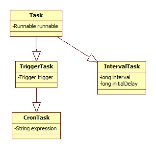
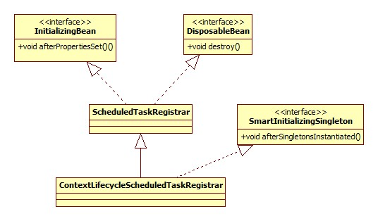
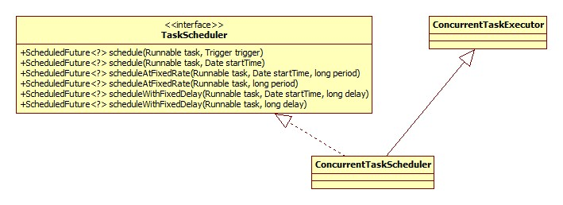
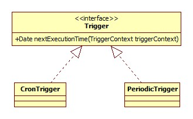
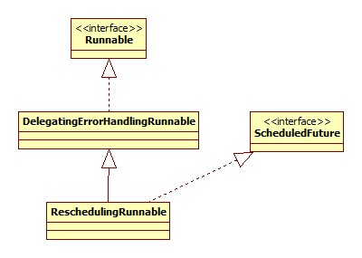

<!-- START doctoc generated TOC please keep comment here to allow auto update -->
<!-- DON'T EDIT THIS SECTION, INSTEAD RE-RUN doctoc TO UPDATE -->
**Table of Contents**  *generated with [DocToc](https://github.com/thlorenz/doctoc)*

- [开头](#%E5%BC%80%E5%A4%B4)
- [定时器](#%E5%AE%9A%E6%97%B6%E5%99%A8)
  - [用法](#%E7%94%A8%E6%B3%95)
  - [解析](#%E8%A7%A3%E6%9E%90)
    - [注册](#%E6%B3%A8%E5%86%8C)
    - [scheduler](#scheduler)
    - [scheduled-tasks](#scheduled-tasks)
  - [调度执行](#%E8%B0%83%E5%BA%A6%E6%89%A7%E8%A1%8C)
    - [scheduler初始化](#scheduler%E5%88%9D%E5%A7%8B%E5%8C%96)
    - [任务调度](#%E4%BB%BB%E5%8A%A1%E8%B0%83%E5%BA%A6)
      - [Trigger](#trigger)
      - [Cron解析](#cron%E8%A7%A3%E6%9E%90)
      - [调度](#%E8%B0%83%E5%BA%A6)
  - [总结](#%E6%80%BB%E7%BB%93)
- [异步执行](#%E5%BC%82%E6%AD%A5%E6%89%A7%E8%A1%8C)
  - [配置](#%E9%85%8D%E7%BD%AE)
  - [原理](#%E5%8E%9F%E7%90%86)

<!-- END doctoc generated TOC please keep comment here to allow auto update -->

# 开头

从功能上来说，spring-task这个组件主要包括了两个/两种功能:

- 任务的定时调度/执行，对应xml配置的task:scheduler和task:scheduled-tasks标签。
- 方法异步执行，对应xml配置的task:executor标签。

task:annotation-driven标签被以上两种功能共有。下面就这两种功能分别进行说明。

# 定时器

## 用法

以XML作为示例，基于注解的也是一样的。

```xml
<task:scheduler id="scheduler" pool-size="3" />
<bean id="task" class="task.Task"/>
<task:scheduled-tasks scheduler="scheduler">
    <task:scheduled ref="task" method="print" cron="0/5 * * * * ?"/>
</task:scheduled-tasks>
```

定义了一个定时任务，每隔5秒执行Task的print方法，Task:

```java
public class Task {
    public void print() {
        System.out.println("print执行");
    }
}
```

关于cron表达式可以参考:

[深入浅出Spring task定时任务](http://blog.csdn.net/u011116672/article/details/52517247)

## 解析

### 注册

此部分的解析器注册由TaskNamespaceHandler完成:

```java
@Override
public void init() {
    this.registerBeanDefinitionParser("annotation-driven", new AnnotationDrivenBeanDefinitionParser());
    this.registerBeanDefinitionParser("executor", new ExecutorBeanDefinitionParser());
    this.registerBeanDefinitionParser("scheduled-tasks", new ScheduledTasksBeanDefinitionParser());
    this.registerBeanDefinitionParser("scheduler", new SchedulerBeanDefinitionParser());
}
```

### scheduler

SchedulerBeanDefinitionParser源码:

```java
@Override
protected String getBeanClassName(Element element) {
    return "org.springframework.scheduling.concurrent.ThreadPoolTaskScheduler";
}

@Override
protected void doParse(Element element, BeanDefinitionBuilder builder) {
    String poolSize = element.getAttribute("pool-size");
    if (StringUtils.hasText(poolSize)) {
        builder.addPropertyValue("poolSize", poolSize);
    }
}
```

由于SchedulerBeanDefinitionParser是AbstractSingleBeanDefinitionParser的子类，所以Spring将task:scheduler标签解析为一个BeanDefinition。其beanClass为org.springframework.scheduling.concurrent.ThreadPoolTaskScheduler。

### scheduled-tasks

其解析的源码较长，在此不再贴出，解析之后形成的BeanDefinition结构如下图:


taskScheduler属性即指向task:scheduler标签，如果没有配置，此属性不存在。

Spring将每一个task:scheduled标签解析为一个Task(的子类)，其类图如下:



很明显可以看出，任务的类型是由cron, fixed-delay, fixed-rate, trigger四个属性决定的，fixed-delay和fixed-rate为IntervalTask。

注意一点: **四种任务集合并不是互斥的**。比如说一个task:scheduled标签同时配置了cron和trigger属性，那么此标签会导致生成两个beanClass分别为CronTask何TriggerTask的BeanDefinition产生，并分别被放到cronTasksList和triggerTasksList中。

从图中可以看出，task:scheduled的method和ref属性也被包装成了一个BeanDefinition, 其beanClass为org.springframework.scheduling.support.ScheduledMethodRunnable.

## 调度执行

入口便是ContextLifecycleScheduledTaskRegistrar，类图:



ContextLifecycleScheduledTaskRegistrar只实现了afterSingletonsInstantiated方法:

```java
@Override
public void afterSingletonsInstantiated() {
    scheduleTasks();
}
```

ScheduledTaskRegistrar.scheduleTasks:

```java
protected void scheduleTasks() {
     // shcheduler初始化
    if (this.taskScheduler == null) {
        this.localExecutor = Executors.newSingleThreadScheduledExecutor();
        this.taskScheduler = new ConcurrentTaskScheduler(this.localExecutor);
    }
    if (this.triggerTasks != null) {
        for (TriggerTask task : this.triggerTasks) {
            addScheduledTask(scheduleTriggerTask(task));
        }
    }
    if (this.cronTasks != null) {
        for (CronTask task : this.cronTasks) {
            addScheduledTask(scheduleCronTask(task));
        }
    }
    if (this.fixedRateTasks != null) {
        for (IntervalTask task : this.fixedRateTasks) {
            addScheduledTask(scheduleFixedRateTask(task));
        }
    }
    if (this.fixedDelayTasks != null) {
        for (IntervalTask task : this.fixedDelayTasks) {
            addScheduledTask(scheduleFixedDelayTask(task));
        }
    }
}
```

### scheduler初始化

可见，如果没有配置task:scheduler，那么在这里将会进行其初始化工作。

Spring定义了TaskScheduler接口，独立于jdk之外，这样做的目的在于能够同时支持JDK和quartz。对于默认来说，Spring将真正的逻辑全部委托给jdk的Executor。

TaskScheduler类图:



ConcurrentTaskExecutor来自另一个继承体系: TaskExecutor，这和spring-task的另一个重要功能，异步执行，这里暂且不表。

### 任务调度

以喜闻乐见的CronTask为例。ScheduledTaskRegistrar.scheduleCronTask:

```java
public ScheduledTask scheduleCronTask(CronTask task) {
    ScheduledTask scheduledTask = this.unresolvedTasks.remove(task);
    if (this.taskScheduler != null) {
        scheduledTask.future = this.taskScheduler.schedule(task.getRunnable(), task.getTrigger());
    }
    return (newTask ? scheduledTask : null);
}
```

#### Trigger

可见，Cron也是通过Trigger实现的，在Spring中，Trigger被定义为**决定一个任务的下一次执行时间**。其类图:



那么问题来了，字符串形式的cron表达式是在何时被解析为Trigger的呢?

#### Cron解析

CronTask构造器:

```java
public CronTask(Runnable runnable, String expression) {
    this(runnable, new CronTrigger(expression));
}
```

CronTrigger构造器:

```java
public CronTrigger(String expression) {
    this.sequenceGenerator = new CronSequenceGenerator(expression);
}
```

答案便在CronSequenceGenerator构造器了:

```java
public CronSequenceGenerator(String expression) {
    this(expression, TimeZone.getDefault());
}

public CronSequenceGenerator(String expression, TimeZone timeZone) {
    this.expression = expression;
    this.timeZone = timeZone;
    parse(expression);
}
```

具体是如何解析的，不再深入。

ConcurrentTaskScheduler.schedule:

```java
@Override
public ScheduledFuture<?> schedule(Runnable task, Trigger trigger) {
    ErrorHandler errorHandler = (this.errorHandler != null ? this.errorHandler : 			 				TaskUtils.getDefaultErrorHandler(true));
    return new ReschedulingRunnable(task, trigger, this.scheduledExecutor, errorHandler).schedule();
}
```

#### 调度

从上面的源码可以看出，调度是通过ReschedulingRunnable来完成的，其类图:



schedule方法:

```java
public ScheduledFuture<?> schedule() {
    synchronized (this.triggerContextMonitor) {
        this.scheduledExecutionTime = this.trigger.nextExecutionTime(this.triggerContext);
        if (this.scheduledExecutionTime == null) {
            return null;
        }
        long initialDelay = this.scheduledExecutionTime.getTime() - System.currentTimeMillis();
        this.currentFuture = this.executor.schedule(this, initialDelay, TimeUnit.MILLISECONDS);
        return this;
    }
}
```

可以看出，这里设置了在下一次执行窗口调用this(ReschedulingRunnable)，从类图可以看出，ReschedulingRunnable本身实现了Runnable接口，其run方法:

```java
@Override
public void run() {
    Date actualExecutionTime = new Date();
    super.run();
    Date completionTime = new Date();
    synchronized (this.triggerContextMonitor) {
        this.triggerContext.update(this.scheduledExecutionTime, actualExecutionTime, completionTime);
        if (!this.currentFuture.isCancelled()) {
             //下次调用
            schedule();
        }
    }
}
```

对我们自定义逻辑的调用是通过super.run实现的:

```java
@Override
public void run() {
    this.delegate.run();
}
```

delegate便是前面提到过的ScheduledMethodRunnable，其run方法:

```java
@Override
public void run() {
    ReflectionUtils.makeAccessible(this.method);
    this.method.invoke(this.target);
}
```

当然这只是针对CronTask的实现，而对于IntervalTask就要简单多了，ScheduledTaskRegistrar.scheduleFixedDelayTask部分源码:

```java
public ScheduledTask scheduleFixedDelayTask(IntervalTask task) {
    if (this.taskScheduler != null) {
        if (task.getInitialDelay() > 0) {
            Date startTime = new Date(System.currentTimeMillis() + task.getInitialDelay());
            scheduledTask.future =
            this.taskScheduler.scheduleWithFixedDelay(task.getRunnable(),
                                                      startTime, task.getInterval());
        } else {
            scheduledTask.future =
                    this.taskScheduler.scheduleWithFixedDelay(task.getRunnable(), task.getInterval());
        }
    }
    return (newTask ? scheduledTask : null);
}
```

## 总结

从上面的说明可以看出，Spring其实将核心逻辑委托给了JDK的Executors.newSingleThreadScheduledExecutor()来实现，那么JDK是如何用一个线程来定时执行多个任务的呢?

# 异步执行

## 配置

必须以注解的方式进行配置，xml:

```xml
<task:executor id="executor" pool-size="3"/>
<task:annotation-driven executor="executor"/>
```

这样在类或方法上加上注解即可:

```java
@Async("executor")
public void print() {
    System.out.println("print执行");
}
```

## 原理

猜测:

Spring会为带有@Async的组件生成代理子类实现对原生组件的替换，代理子类将异步执行的方法包装为Task(Runnable)提交到jdk的线程池即可。

