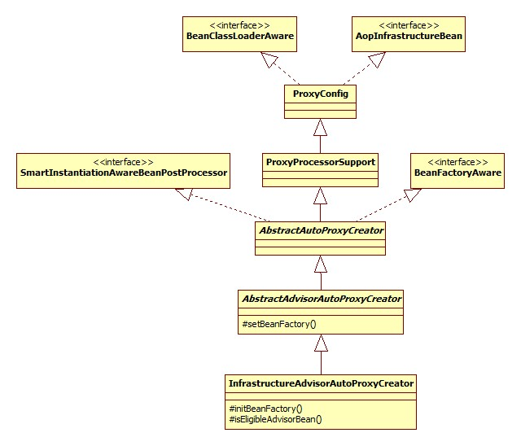
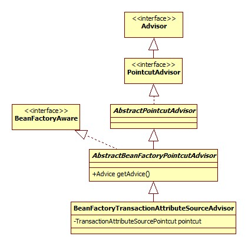
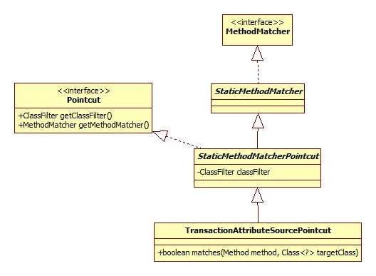
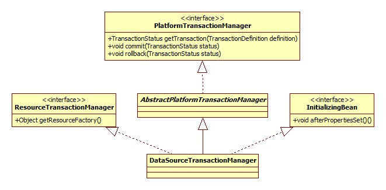
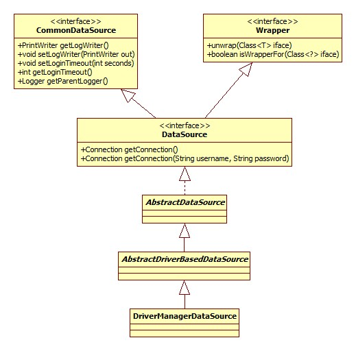
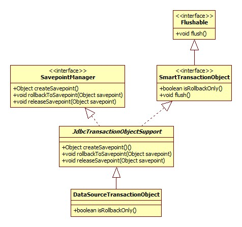
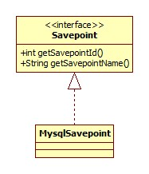

<!-- START doctoc generated TOC please keep comment here to allow auto update -->
<!-- DON'T EDIT THIS SECTION, INSTEAD RE-RUN doctoc TO UPDATE -->
**Table of Contents**  *generated with [DocToc](https://github.com/thlorenz/doctoc)*

- [配置](#%E9%85%8D%E7%BD%AE)
- [解析](#%E8%A7%A3%E6%9E%90)
  - [TransactionalEventListener](#transactionaleventlistener)
  - [主要组件注册](#%E4%B8%BB%E8%A6%81%E7%BB%84%E4%BB%B6%E6%B3%A8%E5%86%8C)
  - [代理类生成](#%E4%BB%A3%E7%90%86%E7%B1%BB%E7%94%9F%E6%88%90)
    - [Advisor寻找](#advisor%E5%AF%BB%E6%89%BE)
- [运行](#%E8%BF%90%E8%A1%8C)
  - [调用链生成](#%E8%B0%83%E7%94%A8%E9%93%BE%E7%94%9F%E6%88%90)
  - [调用链调用](#%E8%B0%83%E7%94%A8%E9%93%BE%E8%B0%83%E7%94%A8)
  - [TransactionInterceptor](#transactioninterceptor)
    - [事务管理器](#%E4%BA%8B%E5%8A%A1%E7%AE%A1%E7%90%86%E5%99%A8)
    - [DataSource](#datasource)
    - [事务开启](#%E4%BA%8B%E5%8A%A1%E5%BC%80%E5%90%AF)
      - [是否已存在事务](#%E6%98%AF%E5%90%A6%E5%B7%B2%E5%AD%98%E5%9C%A8%E4%BA%8B%E5%8A%A1)
      - [事务已存在](#%E4%BA%8B%E5%8A%A1%E5%B7%B2%E5%AD%98%E5%9C%A8)
        - [PROPAGATION_NEVER](#propagation_never)
        - [PROPAGATION_NOT_SUPPORTED](#propagation_not_supported)
          - [事务挂起](#%E4%BA%8B%E5%8A%A1%E6%8C%82%E8%B5%B7)
        - [PROPAGATION_REQUIRES_NEW](#propagation_requires_new)
        - [PROPAGATION_NESTED](#propagation_nested)
          - [debug环境搭建](#debug%E7%8E%AF%E5%A2%83%E6%90%AD%E5%BB%BA)
          - [事务对象](#%E4%BA%8B%E5%8A%A1%E5%AF%B9%E8%B1%A1)
          - [Savepoint](#savepoint)
        - [其它](#%E5%85%B6%E5%AE%83)
      - [事务创建](#%E4%BA%8B%E5%8A%A1%E5%88%9B%E5%BB%BA)
    - [事务提交 & 回滚](#%E4%BA%8B%E5%8A%A1%E6%8F%90%E4%BA%A4--%E5%9B%9E%E6%BB%9A)
- [总结](#%E6%80%BB%E7%BB%93)

<!-- END doctoc generated TOC please keep comment here to allow auto update -->

# 配置

以最简单的jdbc事务为例:

```xml
<!-- 数据源以Sping自带为例，每次请求均返回一个新的连接 -->
<bean id="dataSource" class="org.springframework.jdbc.datasource.DriverManagerDataSource">
    <property name="driverClassName" value="${jdbc.driverClassName}" />
    <property name="url" value="${jdbc.url}" />
    <property name="username" value="${jdbc.username}" />
    <property name="password" value="${jdbc.password}" />
</bean>
<bean id="transactionManager" class="org.springframework.jdbc.datasource.DataSourceTransactionManager">
    <property name="dataSource" ref="dataSource"/>
</bean>
<tx:annotation-driven transaction-manager="transactionManager"/>
```

# 解析

TxNamespaceHandler.init:

```java
@Override
public void init() {
    registerBeanDefinitionParser("advice", new TxAdviceBeanDefinitionParser());
    registerBeanDefinitionParser("annotation-driven", 
        new AnnotationDrivenBeanDefinitionParser());
    registerBeanDefinitionParser("jta-transaction-manager", new JtaTransactionManagerBeanDefinitionParser());
}
```

明显解析的入口便在AnnotationDrivenBeanDefinitionParser.parse:

```java
@Override
public BeanDefinition parse(Element element, ParserContext parserContext) {
    registerTransactionalEventListenerFactory(parserContext);
    String mode = element.getAttribute("mode");
    if ("aspectj".equals(mode)) {
        // mode="aspectj"
        registerTransactionAspect(element, parserContext);
    } else {
        // mode="proxy"
        AopAutoProxyConfigurer.configureAutoProxyCreator(element, parserContext);
    }
    return null;
}
```

下面分部分进行说明。

##  TransactionalEventListener

第一部分用于向Spring容器注册TransactionalEventListener工厂，TransactionalEventListener是Spring4.2引入的新特性，允许我们自定义监听器监听事务的提交或其它动作。

## 主要组件注册

即configureAutoProxyCreator方法，此方法的最终作用便是在Spring容器中加入这样的bean结构:

BeanFactoryTransactionAttributeSourceAdvisor->TransactionInterceptor->AnnotationTransactionAttributeSource

其中AnnotationTransactionAttributeSource用于解析@Transactional注解的相关属性。

## 代理类生成

与aop模块类似，入口位于configureAutoProxyCreator里注册的bean: InfrastructureAdvisorAutoProxyCreator，其类图:



此类的特殊之处从其名字上可以体现: **只考虑Spring内部使用的基础设施Advisor**。

为类创建代理的入口位于AbstractAutoProxyCreator.postProcessAfterInitialization:

```java
@Override
public Object postProcessAfterInitialization(Object bean, String beanName) throws BeansException {
    if (bean != null) {
        Object cacheKey = getCacheKey(bean.getClass(), beanName);
        if (!this.earlyProxyReferences.contains(cacheKey)) {
            return wrapIfNecessary(bean, beanName, cacheKey);
        }
    }
    return bean;
}
```

wrapIfNecessary核心逻辑:

```java
protected Object wrapIfNecessary(Object bean, String beanName, Object cacheKey) {
    // Create proxy if we have advice.
    Object[] specificInterceptors = getAdvicesAndAdvisorsForBean(bean.getClass(), beanName, null);
    if (specificInterceptors != DO_NOT_PROXY) {
        this.advisedBeans.put(cacheKey, Boolean.TRUE);
        Object proxy = createProxy(
            bean.getClass(), beanName, specificInterceptors, new SingletonTargetSource(bean));
        this.proxyTypes.put(cacheKey, proxy.getClass());
        return proxy;
    }
}
```

### Advisor寻找

getAdvicesAndAdvisorsForBean用于去容器中寻找适合当前bean的Advisor，其最终调用AbstractAdvisorAutoProxyCreator.findEligibleAdvisors:

```java
protected List<Advisor> findEligibleAdvisors(Class<?> beanClass, String beanName) {
    List<Advisor> candidateAdvisors = findCandidateAdvisors();
    List<Advisor> eligibleAdvisors = findAdvisorsThatCanApply(candidateAdvisors, beanClass, beanName);
    extendAdvisors(eligibleAdvisors);
    if (!eligibleAdvisors.isEmpty()) {
        //按照@Ordered排序
        eligibleAdvisors = sortAdvisors(eligibleAdvisors);
    }
    return eligibleAdvisors;
}
```

这个方法在spring-aop中已经详细说明过了，这里再强调一下具体的查找逻辑:

- 首先去容器找出所有实现了Advisor接口的bean，对应findCandidateAdvisors方法.
- 逐一判断Advisor是否适用于当前bean，对应findAdvisorsThatCanApply方法，判断逻辑为:
  - 如果Advisor是IntroductionAdvisor，那么判断其ClassFilter是否可以匹配bean的类.
  - 如果Advisor是PointcutAdvisor，那么首先进行ClassFilter匹配，如果匹配失败，那么再获得Advisor的MethodMatcher对象，如果MethodMatcher可以匹配任意方法，那么返回true，否则反射获取给定bean的所有方法逐一进行匹配，只要有一个匹配成功，即返回true.
  - 其它情况，直接返回true.

对于spring事务来说，我们有唯一的Advisor: BeanFactoryTransactionAttributeSourceAdvisor,其类图:



可以看出，BeanFactoryTransactionAttributeSourceAdvisor其实是一个PointcutAdvisor，所以**是否可以匹配取决于其Pointcut**。此Advisor的pointcut是一个TransactionAttributeSourcePointcut对象，类图:



**Pointcut的核心在于其ClassFilter和MethodMatcher**。

ClassFilter:

位于StaticMethodMatcherPointcut:

```java
private ClassFilter classFilter = ClassFilter.TRUE;
```

即: 类检查全部通过。

MethodMatcher:

TransactionAttributeSourcePointcut.matches:

```java
@Override
public boolean matches(Method method, Class<?> targetClass) {
    //如果已经是事务代理，那么不应该再次代理
    if (TransactionalProxy.class.isAssignableFrom(targetClass)) {
        return false;
    }
    TransactionAttributeSource tas = getTransactionAttributeSource();
    return (tas == null || tas.getTransactionAttribute(method, targetClass) != null);
}
```

getTransactionAttribute方法使用了缓存的思想，但其核心逻辑位于AbstractFallbackTransactionAttributeSource.computeTransactionAttribute:

```java
protected TransactionAttribute computeTransactionAttribute(Method method, Class<?> targetClass) {
    // Don't allow no-public methods as required.
    if (allowPublicMethodsOnly() && !Modifier.isPublic(method.getModifiers())) {
        return null;
    }
    // Ignore CGLIB subclasses - introspect the actual user class.
    Class<?> userClass = ClassUtils.getUserClass(targetClass);
    // The method may be on an interface, but we need attributes from the target class.
    // If the target class is null, the method will be unchanged.
    Method specificMethod = ClassUtils.getMostSpecificMethod(method, userClass);
    // If we are dealing with method with generic parameters, find the original method.
    specificMethod = BridgeMethodResolver.findBridgedMethod(specificMethod);
    // First try is the method in the target class.
    TransactionAttribute txAtt = findTransactionAttribute(specificMethod);
    if (txAtt != null) {
        return txAtt;
    }
    // Second try is the transaction attribute on the target class.
    txAtt = findTransactionAttribute(specificMethod.getDeclaringClass());
    if (txAtt != null && ClassUtils.isUserLevelMethod(method)) {
        return txAtt;
    }
    if (specificMethod != method) {
        // Fallback is to look at the original method.
        txAtt = findTransactionAttribute(method);
        if (txAtt != null) {
            return txAtt;
        }
        // Last fallback is the class of the original method.
        txAtt = findTransactionAttribute(method.getDeclaringClass());
        if (txAtt != null && ClassUtils.isUserLevelMethod(method)) {
            return txAtt;
        }
    }
    return null;
}
```

很明显可以看出，**首先去方法上查找是否有相应的事务注解(比如@Transactional)，如果没有，那么再去类上查找**。

# 运行

以JDK动态代理为例，JdkDynamicAopProxy.invoke简略版源码:

```java
@Override
public Object invoke(Object proxy, Method method, Object[] args) throws Throwable {
    List<Object> chain = this.advised.getInterceptorsAndDynamicInterceptionAdvice(method, targetClass);
    if (chain.isEmpty()) {.
        //没有可用的拦截器，直接调用原方法
        Object[] argsToUse = AopProxyUtils.adaptArgumentsIfNecessary(method, args);
        retVal = AopUtils.invokeJoinpointUsingReflection(target, method, argsToUse);
    } else {
        // We need to create a method invocation...
        invocation = new ReflectiveMethodInvocation(proxy, target, method, args, targetClass, chain);
        // Proceed to the joinpoint through the interceptor chain.
        Object retVal = invocation.proceed();
    }
}
```

## 调用链生成

即getInterceptorsAndDynamicInterceptionAdvice方法，其原理是:

**遍历所有使用的 Advisor，获得其Advice，将Advice转为MethodInterceptor**。那么是如何转的呢?

根据Spring的定义，Advice可以是一个MethodInterceptor，也可以是类似于Aspectj的before, after通知。转换由DefaultAdvisorAdapterRegistry.getInterceptors完成:

```java
@Override
public MethodInterceptor[] getInterceptors(Advisor advisor) throws UnknownAdviceTypeException {
    List<MethodInterceptor> interceptors = new ArrayList<MethodInterceptor>(3);
    Advice advice = advisor.getAdvice();
    if (advice instanceof MethodInterceptor) {
        interceptors.add((MethodInterceptor) advice);
    }
    for (AdvisorAdapter adapter : this.adapters) {
        if (adapter.supportsAdvice(advice)) {
            interceptors.add(adapter.getInterceptor(advisor));
        }
    }
    if (interceptors.isEmpty()) {
        throw new UnknownAdviceTypeException(advisor.getAdvice());
    }
    return interceptors.toArray(new MethodInterceptor[interceptors.size()]);
}
```

AdvisorAdapter接口用以支持用户自定义的Advice类型，并将自定义的类型转为拦截器。默认adapters含有MethodBeforeAdviceAdapter、AfterReturningAdviceAdapter和ThrowsAdviceAdapter三种类型，用以分别支持MethodBeforeAdvice、AfterReturningAdvice和ThrowsAdvice。

**对于我们的BeanFactoryTransactionAttributeSourceAdvisor来说，有且只有一个拦截器: TransactionInterceptor**.

## 调用链调用

ReflectiveMethodInvocation.proceed:

```java
@Override
public Object proceed() throws Throwable {
    if (this.currentInterceptorIndex == this.interceptorsAndDynamicMethodMatchers.size() - 1) {
        //拦截器执行完毕，调用原本的方法
        return invokeJoinpoint();
    }
    Object interceptorOrInterceptionAdvice =
            this.interceptorsAndDynamicMethodMatchers.get(++this.currentInterceptorIndex);
    if (interceptorOrInterceptionAdvice instanceof InterceptorAndDynamicMethodMatcher) {
        InterceptorAndDynamicMethodMatcher dm =
                (InterceptorAndDynamicMethodMatcher) interceptorOrInterceptionAdvice;
        if (dm.methodMatcher.matches(this.method, this.targetClass, this.arguments)) {
            return dm.interceptor.invoke(this);
        } else {
            // Dynamic matching failed.
            return proceed();
        }
    } else {
        //调用拦截器的invoke方法
        return ((MethodInterceptor) interceptorOrInterceptionAdvice).invoke(this);
    }
}
```

可以看出，这其实是一个**逐个调用拦截器的invoke方法，最终调用原本方法(被代理方法)的过程**。所以，事务添加的核心逻辑(入口)在TransactionInterceptor的invoke方法。

## TransactionInterceptor

invoke方法:

```java
@Override
public Object invoke(final MethodInvocation invocation) throws Throwable {
    Class<?> targetClass = (invocation.getThis() != null ? 
             AopUtils.getTargetClass(invocation.getThis()) : null);
    // Adapt to TransactionAspectSupport's invokeWithinTransaction...
    return invokeWithinTransaction(invocation.getMethod(), targetClass, new InvocationCallback() {
        @Override
        public Object proceedWithInvocation() throws Throwable {
            //事务执行完毕后调用链继续向下执行
            return invocation.proceed();
        }
    });
}
```

invokeWithinTransaction简略版源码(仅保留PlatformTransactionManager部分):

```java
protected Object invokeWithinTransaction(Method method, Class<?> targetClass, final InvocationCallback invocation){
    // If the transaction attribute is null, the method is non-transactional.
    final TransactionAttribute txAttr = getTransactionAttributeSource()
        .getTransactionAttribute(method, targetClass);
    final PlatformTransactionManager tm = determineTransactionManager(txAttr);
    //得到方法名
    final String joinpointIdentification = methodIdentification(method, targetClass);
    if (txAttr == null || !(tm instanceof CallbackPreferringPlatformTransactionManager)) {
        // Standard transaction demarcation with getTransaction and commit/rollback calls.
        TransactionInfo txInfo = createTransactionIfNecessary(tm, txAttr, joinpointIdentification);
        Object retVal = null;
        try {
            // This is an around advice: Invoke the next interceptor in the chain.
            // This will normally result in a target object being invoked.
            retVal = invocation.proceedWithInvocation();
        } catch (Throwable ex) {
            // target invocation exception
            completeTransactionAfterThrowing(txInfo, ex);
            throw ex;
        } finally {
            cleanupTransactionInfo(txInfo);
        }
        commitTransactionAfterReturning(txInfo);
        return retVal;
    }
}
```

### 事务管理器

determineTransactionManager方法用以确定使用的事务管理器:

```java
protected PlatformTransactionManager determineTransactionManager(TransactionAttribute txAttr) {
    //如果没有事务属性，那么仅从缓存中查找，找不到返回null
    if (txAttr == null || this.beanFactory == null) {
        return getTransactionManager();
    }
    String qualifier = txAttr.getQualifier();
    //如果@Transactional注解配置了transactionManager或value属性(用以决定使用哪个事务管理器):
    //首先查找缓存，找不到再去容器中按名称寻找
    if (StringUtils.hasText(qualifier)) {
        return determineQualifiedTransactionManager(qualifier);
    } else if (StringUtils.hasText(this.transactionManagerBeanName)) {
        return determineQualifiedTransactionManager(this.transactionManagerBeanName);
    } else {
        //去容器中按类型(Class)查找
        PlatformTransactionManager defaultTransactionManager = getTransactionManager();
        if (defaultTransactionManager == null) {
            defaultTransactionManager = this.beanFactory.getBean(PlatformTransactionManager.class);
            this.transactionManagerCache.putIfAbsent(
                    DEFAULT_TRANSACTION_MANAGER_KEY, defaultTransactionManager);
        }
        return defaultTransactionManager;
    }
}
```

对于我们使用的DataSourceTransactionManager，类图:



afterPropertiesSet方法只是对dataSource进行了检查。

### DataSource

DriverManagerDataSource类图:



其中CommonDataSource、Wrapper、DataSource均位于javax.sql包下。

### 事务开启

invocation.proceedWithInvocation()便是我们的逻辑，而createTransactionIfNecessary便是在逻辑执行前开启事务。

TransactionAspectSupport.createTransactionIfNecessary:

```java
protected TransactionInfo createTransactionIfNecessary(
    PlatformTransactionManager tm, TransactionAttribute txAttr, final String joinpointIdentification) {
    // If no name specified, apply method identification as transaction name.
    if (txAttr != null && txAttr.getName() == null) {
        txAttr = new DelegatingTransactionAttribute(txAttr) {
            @Override
            public String getName() {
                return joinpointIdentification;
            }
        };
    }
    TransactionStatus status = null;
    if (txAttr != null) {
        if (tm != null) {
            status = tm.getTransaction(txAttr);
        }
    }
    return prepareTransactionInfo(tm, txAttr, joinpointIdentification, status);
}
```

此部分的核心逻辑在getTransaction和prepareTransactionInfo方法，源码较长，下面依然按部分整理。

#### 是否已存在事务

目的在于支撑事务的传播性。

源码位于DataSourceTransactionManager.doGetTransaction，核心逻辑在TransactionSynchronizationManager.doGetResource:

```java
private static Object doGetResource(Object actualKey) {
    Map<Object, Object> map = resources.get();
    if (map == null) {
        return null;
    }
    Object value = map.get(actualKey);
    // Transparently remove ResourceHolder that was marked as void...
    if (value instanceof ResourceHolder && ((ResourceHolder) value).isVoid()) {
        map.remove(actualKey);
        // Remove entire ThreadLocal if empty...
        if (map.isEmpty()) {
            resources.remove();
        }
        value = null;
    }
    return value;
}
```

actualKey实际上是DataSource对象，resources是一个ThreadLocal对象，其声明源码:

```java
private static final ThreadLocal<Map<Object, Object>> resources =
            new NamedThreadLocal<Map<Object, Object>>("Transactional resources");
```

从这里可以得出结论:

**是否存在事务指的是在当前线程、当前数据源(DataSource)中是否存在处于活动状态的事务**。

#### 事务已存在

如果检测到已存在事务，那么就要考虑事务的传播特性(行为).此部分源码位于AbstractPlatformTransactionManager.handleExistingTransaction，下面按照不同的传播特性展开。

##### PROPAGATION_NEVER

即当前方法需要在非事务的环境下执行，如果有事务存在，那么抛出异常。相关源码:

```java
if (definition.getPropagationBehavior() == TransactionDefinition.PROPAGATION_NEVER) {
    throw new IllegalTransactionStateException(
        "Existing transaction found for transaction marked with propagation 'never'");
}
```

##### PROPAGATION_NOT_SUPPORTED

与前者的区别在于，如果有事务存在，那么将事务挂起，而不是抛出异常。

```java
if (definition.getPropagationBehavior() == TransactionDefinition.PROPAGATION_NOT_SUPPORTED) {
    Object suspendedResources = suspend(transaction);
    boolean newSynchronization = (getTransactionSynchronization() == SYNCHRONIZATION_ALWAYS);
    return prepareTransactionStatus(
        definition, null, false, newSynchronization, debugEnabled, suspendedResources);
}
```

###### 事务挂起

此部分的核心在于suspend方法，最终调用TransactionSynchronizationManager.doUnbindResource:

```java
private static Object doUnbindResource(Object actualKey) {
    Map<Object, Object> map = resources.get();
    if (map == null) {
        return null;
    }
    Object value = map.remove(actualKey);
    // Remove entire ThreadLocal if empty...
    if (map.isEmpty()) {
        resources.remove();
    }
    // Transparently suppress a ResourceHolder that was marked as void...
    if (value instanceof ResourceHolder && ((ResourceHolder) value).isVoid()) {
        value = null;
    }
    return value;
}
```

可以看出，**所谓的事务挂起其实就是一个移除当前线程、数据源活动事务对象的过程**。

同时注意getTransaction方法返回的是一个TransactionStatus对象，**被挂起的事务的各种状态都被保存在此对象中**。

那么挂起这个操作到底是如何实现(起作用)的呢?

DataSourceTransactionManager.doSuspend:

```java
@Override
protected Object doSuspend(Object transaction) {
    DataSourceTransactionObject txObject = (DataSourceTransactionObject) transaction;
    txObject.setConnectionHolder(null);
    ConnectionHolder conHolder = (ConnectionHolder)
            TransactionSynchronizationManager.unbindResource(this.dataSource);
    return conHolder;
}
```

其实玄机就在于将ConnectionHolder设为null这一行，因为**一个ConnectionHolder对象就代表了一个数据库连接，将ConnectionHolder设为null就意味着我们下次要使用连接时，将重新从连接池获取，而新的连接的自动提交是为true的**。

##### PROPAGATION_REQUIRES_NEW

```java
if (definition.getPropagationBehavior() == TransactionDefinition.PROPAGATION_REQUIRES_NEW) {
    SuspendedResourcesHolder suspendedResources = suspend(transaction);
    boolean newSynchronization = (getTransactionSynchronization() != SYNCHRONIZATION_NEVER);
    DefaultTransactionStatus status = newTransactionStatus(
            definition, transaction, true, newSynchronization, debugEnabled, suspendedResources);
    doBegin(transaction, definition);
    prepareSynchronization(status, definition);
    return status;
}
```

可以看出，这其实是一个**挂起当前活动事务并创建新事务的过程**，doBegin方法是事务开启的核心，将在后面进行说明。

##### PROPAGATION_NESTED

其意义:

> PROPAGATION_NESTED 开始一个 "嵌套的" 事务,  它是已经存在事务的一个真正的子事务. 嵌套事务开始执行时,  它将取得一个 savepoint. 如果这个嵌套事务失败, 我们将回滚到此 savepoint. 嵌套事务是外部事务的一部分, 只有外部事务结束后它才会被提交. 

摘自: [解惑 spring 嵌套事务](http://www.iteye.com/topic/35907)

核心源码(忽略JTA部分):

```java
if (definition.getPropagationBehavior() == TransactionDefinition.PROPAGATION_NESTED) {
    if (useSavepointForNestedTransaction()) {
        // Create savepoint within existing Spring-managed transaction,
        // through the SavepointManager API implemented by TransactionStatus.
        // Usually uses JDBC 3.0 savepoints. Never activates Spring synchronization.
        DefaultTransactionStatus status =
            prepareTransactionStatus(definition, transaction, false, false, debugEnabled, null);
        status.createAndHoldSavepoint();
        return status;
    }
}
```

关键在于如何创建SavePoint, AbstractTransactionStatus.createAndHoldSavepoint:

```java
public void createAndHoldSavepoint() throws TransactionException {
    setSavepoint(getSavepointManager().createSavepoint());
}
```

DefaultTransactionStatus.getSavepointManager:

```java
@Override
protected SavepointManager getSavepointManager() {
    if (!isTransactionSavepointManager()) {
        throw new NestedTransactionNotSupportedException(
            "Transaction object [" + getTransaction() + "] does not support savepoints");
    }
    return (SavepointManager) getTransaction();
}
```

可以看出，SavepointManager实际上从Transaction强转而来，Transaction在Spring都是用Object引用的，那么这到底是个什么东西?

###### debug环境搭建

- 安装Mysql数据库(或其它支持jdbc)并正确配置数据库连接.

- 定义两个bean，代表我们的业务逻辑:

  - TransactionBean:

    ```java
    @Component
    public class TransactionBean {
        private NestedBean nestedBean;
        public NestedBean getNestedBean() {
            return nestedBean;
        }
        public void setNestedBean(NestedBean nestedBean) {
            this.nestedBean = nestedBean;
        }
      
        @Transactional(propagation = Propagation.REQUIRED)
        public void process() {
            System.out.println("事务执行");
            nestedBean.nest();
        }
    }
    ```

  - NestedBean:

    ```java
    @Component
    public class NestedBean {
        @Transactional(propagation = Propagation.NESTED)
        public void nest() {
            System.out.println("嵌套事务");
        }
    }
    ```

- 配置文件:

  ```xml
  <bean id="nestedBean" class="base.transaction.NestedBean" />
  <bean class="base.transaction.TransactionBean">
    <property name="nestedBean" ref="nestedBean" />
  </bean>
  ```

- 入口:

  ```java
  public static void main(String[] args) {
    ClassPathXmlApplicationContext context = new ClassPathXmlApplicationContext("config.xml");
      TransactionBean bean = context.getBean(TransactionBean.class);
      bean.process();
  }
  ```

这样将断点打在合适的位置便可以得到事务对象究竟是什么。

注意:

**nest方法必须在一个单独的业务bean中**，否则对nest的调用并不会导致事务获取的触发。这是由JDK动态代理的实现机制决定的，**调用当前类的方法并不会触发代理逻辑(InvocationHandler)**。

这一点可以运行demo:test.proxy.JDKProxy看出。

运行debug可以发现，**对于DataSourceTransactionManager，事务对象其实是其内部类DataSourceTransactionObject**.

###### 事务对象

 DataSourceTransactionObject的类图如下:



###### Savepoint

位于java.sql包下，对于Mysql来说，由Mysql驱动提供实现，类图:



下面来看一下Savepoint到底是如何被创建的。

JdbcTransactionObjectSupport.createSavepoint简略版源码:

```java
@Override
public Object createSavepoint() throws TransactionException {
    ConnectionHolder conHolder = getConnectionHolderForSavepoint();
    return conHolder.createSavepoint();
}
```

ConnectionHolder.createSavepoint:

```java
public Savepoint createSavepoint() throws SQLException {
    this.savepointCounter++;
    return getConnection().setSavepoint(SAVEPOINT_NAME_PREFIX + this.savepointCounter);
}
```

我们可以得出这样的结论:

**Savepoint由java SQL标准定义，具体实现由数据库完成**。从mysql的客户端可以直接执行命令`savepoint xx`可以看出这一点。 

##### 其它

略。

#### 事务创建

如果之前不存在事务，那么就需要创建了，核心逻辑位于DataSourceTransactionManager.doBegin:

```java
@Override
protected void doBegin(Object transaction, TransactionDefinition definition) {
    //此时，txObject不为null，只是其核心的ConnectHolder属性为null
    DataSourceTransactionObject txObject = (DataSourceTransactionObject) transaction;
    Connection con = null;
    if (txObject.getConnectionHolder() == null ||
            txObject.getConnectionHolder().isSynchronizedWithTransaction()) {
        Connection newCon = this.dataSource.getConnection();
        //获得连接，可以看出ConnectionHolder是对Connection的包装
        txObject.setConnectionHolder(new ConnectionHolder(newCon), true);
    }
    txObject.getConnectionHolder().setSynchronizedWithTransaction(true);
    con = txObject.getConnectionHolder().getConnection();
    //设置是否只读和隔离级别
    Integer previousIsolationLevel = DataSourceUtils.prepareConnectionForTransaction(con, definition);
    txObject.setPreviousIsolationLevel(previousIsolationLevel);
    // Switch to manual commit if necessary. This is very expensive in some JDBC drivers,
    // so we don't want to do it unnecessarily (for example if we've explicitly
    // configured the connection pool to set it already).
    if (con.getAutoCommit()) {
        txObject.setMustRestoreAutoCommit(true);
        con.setAutoCommit(false);
    }
    txObject.getConnectionHolder().setTransactionActive(true);
    int timeout = determineTimeout(definition);
    if (timeout != TransactionDefinition.TIMEOUT_DEFAULT) {
        txObject.getConnectionHolder().setTimeoutInSeconds(timeout);
    }
    // Bind the session holder to the thread.
    if (txObject.isNewConnectionHolder()) {
        TransactionSynchronizationManager.bindResource(getDataSource(), txObject.getConnectionHolder());
    }
}
```

到这里便可以得出结论:

**Spring事务的开启实际上是将数据库的自动提交设为false**。

### 事务提交 & 回滚

其实就是对jdbc相应方法的封装，不再展开。

# 总结

事务的本质其实是对数据库自动提交的关闭与开启，传播特性是Spring提出、实现、控制的概念，而隔离级别是对数据库实现的封装。


